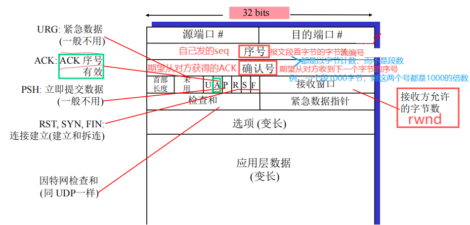
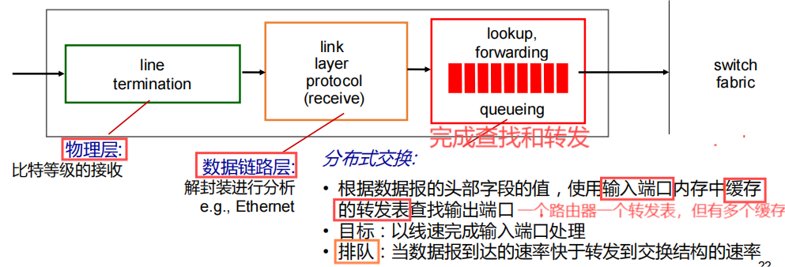
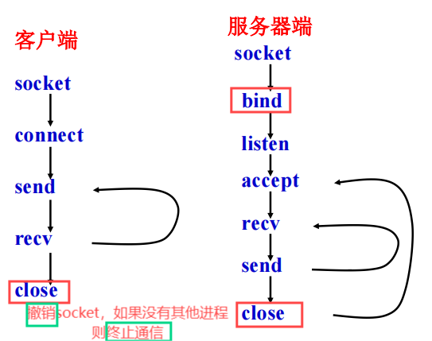
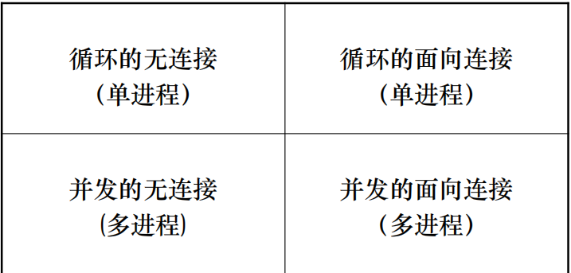

# 第1章 计算机网络和因特网

## **1** 什么是因特网

### 1.1具体构成描述

1.计算设备(主机(终端系统),服务器)

2.通信链路(光纤、同轴电缆、无线电、卫星)

3.中转设备(路由器和交换机)

### 1.2 服务描述

分布式应用程序:在端系统上运行，彼此可以通信。

应用程序仅运行在终端系统上，不运行在网络核心的分组交换机中，因此**因特网**是**为应用程序提供服务**的基础设施。 

由终端系统提供应用程序编程接口(API) 

### 1.3 什么是协议

由某些设备的硬件或软件执行。

一个协议定义了在两个或多个通信实体之间交换的**报文格式和次序**，以及报文**发送**和/或**接收**一条报文或其他事件**所采取的动作**。

**协议三要素**：**语义，语法，时序**

## 2 网络边缘

### 网络划分为两大部分： 

**网络边缘**（资源子网） 

  外围部件、主机（客户、服务器）  网络应用
**网络核心**（通信子网） 

 **路由器** **通信链路** 网络的网络

### 2.1 接入网

接入网：将**端系统**连接到其**边缘路由器**的物理链路。

 

三种接入网

#### 1、家庭接入（DSL、电缆、FTTH、拨号和卫星）

 

##### (1).数字用户线(DSL)

使用已有的**电话线**传送信号

DSL采用<u>***频分复用技术***</u>(可以同时打电话和上网的原因)

##### (2).混合光纤同轴电缆(HFC)

**同轴电缆**和**光纤**混合接入

采用特殊的电缆调制解调器
划分为两个信道
共享广播媒体(**频分复用技术**)

##### (3).光纤到户技术(FTTH)

##### (4).卫星链路接入

#### 2、企业（和家庭）接入

 

#### 3、广域无线接入(移动接入)

### 2.2 物理媒体

#### 1、双绞铜线(如电话线)

两根绝缘的铜线螺旋形式扭合在一起。**减少对邻近双绞线的电气干扰**。

双绞线**电缆**：多对(4对)双绞线捆扎成一根电缆，并在外面覆盖上防护层

#### 2、 同轴电缆(电缆)

套在一起的两个同心铜导体。

 **内导体**传递**数据**。
 **外导体**用作地线及**屏蔽干扰**。

抗干扰能力强、数据率高。

#### 3、光纤

#### 4、 陆地无线电信道

无线LAN，WAP、3G、4G技术

#### 5、卫星无线电信道

## 3 网络核心

网络内部：连接端系统的**分组交换机**和**链路**形成的网状网络

数据如何通过网络传送：分组交换

### 3.1分组交换(不需要资源预留)

1.**不需要资源预留**；

2.按需使用资源，可能要排队等待：同时有其它分组发送。如，因特网。

定义：主机将应用层消息分割为若干**分组/小包(packets）**，通过每个**路由器逐跳**的转发分组，每个分组以链路的**最大传输速率传输**

#### 存储转发机制 

#### 两个关键的网络核心功能

**路由**(routing): 确定分组从源-目的主机的路径

**转发**(forwarding): 将分组从路由器的输入端口转到适当的路由器的输出端口（每个分组都会包含接收终端的IP地址，路由器根据IP地址在自己的<u>转发表</u>中查找这个IP地址对应的输出链路）

### 3.2 电路交换(预留端到端资源)

1.**预留端到端资源**

2.发送方以**恒定速率**向接收方传送数据。如，电话网络

定义：通信双方必须先建立一个**专用的连接**（电路），一直维持，直到通信结束。如，电话网络。

缺点：

1.**效率较低**：静默期（无数据传输）专用电路空闲，网络资源被浪费

2.创建端到端电路及预留端到端带宽的过程复杂

#### 频分多路复用FDM

按频率划分若干频段，**每个频段**专用于一个连接

 

#### 时分多路复用TDM

时间划分为固定区间的帧，每帧再划分为固定数量的时隙，**每个时隙**专用于一个连接

 

### 3.3 几种交换技术对比

 

### 3.4 网络的网络

终端系统通过**ISP**s(**因特网服务提供商**)与因特网相连，接入**服务提供商必须相互连接**，最终形成非常复杂的**网络的网络**—因特网

 

## 4分组交换网中的时延、丢包和吞吐量

### 4.1四种时延：**节点处理时延**、**排队时延**、**传输时延**和**传播时延**

**节点处理时延**d<sub>proc</sub>：检测比特错误，确定输出链路

**排队时延**：在一段时间内，分组到达链路速率超过了链路的传输速率，分组将排队，在输出链路上等待传输；

**传输时延**d<sub>trans</sub>：发送需要的时间， *L*: 分组长度bits，*R*: 带宽(传输速率)bps，传输时延= **L/R**

**传播时延**d<sub>prop</sub>：将分组从传输链路的一端传输到另一端，d：物理链路长，s：光在真空中传播速度(传播速率)，传播时延=**d/s**

**丢包**：排队时如果缓存溢出，则会出现丢包

丢失的分组可以由**前一个节点重传**，也可以由**源终端系统重传**，或根据**不需要重传**

 

**端到端时延**：发送**分组的长度**为**L**比特，将分组发送到接入链路的**传输速率**为**R**(bits/sec)，那么发送需要的时间为**L/R**，**端到端时延2L/R**

单个分组端到端时延(单个报文端到端时延)：d<sub>end-end</sub> =N(d<sub>proc</sub>+d<sub>trans</sub>+d<sub>prop</sub>)(N条链路，N-1个路由器)

多个分组连续发送端到段时延:d<sub>end-end</sub> =(N+n-1)(d<sub>trans</sub>+d<sub>proc</sub>)+Nd<sub>prop</sub>(N条链路，n个分组)

 

 

#### Traceroute的原理(UDP)

• 从源地址发出一个**UDP探测包**到目的地址，并将**TTL设置为1**； 
• 到达路由器时，将**TTL减1**； 
• 当**TTL变为0时**，包被丢弃，路由器**向源地址发回**一个**ICMP超时通知**(ICMP信息),内含发送IP包的源地址，IP包的所有内容及路由器的IP地址；
• 重复1～5，并**每次设置TTL加1**； 
• 直至目标地址收到探测数据包，并返回**端口不可达通知**

### 4.2吞吐量(Throughput)

吞吐量：在发送方和接收方之间**传输的比特数**（位/时间单位） (注意与带宽的区别-**发送方发送**分组的传输速率-**发送方和接收方之间**单位时间传输比特数)(单位都是bps)

即时吞吐量：在给定时间点的传输速率 

平均吞吐量：在较长时间段内的传输速率

## 5 协议层次及其服务模型

### 5.1 分层的体系结构

#### 1.网络协议为什么要进行分层？

 **使复杂系统简化**：将一个大而复杂系统划分为若干个明确、特定的部分，分别讨论研究。

 **易于维护、系统的更新**：某层功能变化，**不会影响系统其余部分**。

#### 2.分层的特点

 每个层次实现一个相对单一的服务

 每层自己执行一些动作来完成服务

 每层可以使用相邻下一层提供的服务

上层调用下层提供的服务，下层为上层提供服务

**服务定义**：各层通过其SAP向上层提供的一组功能

#### 3.TCP/IP协议栈

 

5.应用层：支持**网络应用**（FTP, SMTP, HTTP，DNS）

4.运输层：完成**端到端的数据传输**（TCP, UDP）

3.网络层：**数据报**从源地址到目的地址的**路由**（IP, 路由协议(RIP,OSPF,BGF)，ICMP）

2.链路层：**相邻**网络元素间**数据传输**（Ethernet, 802.11 (WiFi), PPP）

1.物理层

**路由器**：实现**第一层到第三层**，能够实现IP协议；

**链路层交换机**：实现**第一层和第二层**，能够识别第二层地址，如以太网地址。

**主机**：实现**所有5个层次**

### 5.2 封装

源主机：由高层向低层逐层传递数据（封装）

 

目的主机：由低层向高层逐层传递（解封装）

如果报文很长，传输时，可先**分成多个报文段**，每个报文段在网络层再**分成多个数据报**。

## 6 面对攻击的网络

### 1.经因特网将有害程序放入你的计算机中

恶意代码：**病毒**，**蠕虫**

间谍软件

### 2.攻击服务器和基础设施

**Denial of Service (DoS):** 攻击者使资源(server/bandwidth)对于合法的流量不可用，通过使用虚假的流量来耗费资源

### 3.嗅探("Sniff)分组

### 4.伪装成你信任的人

IP哄骗

# 第2章 应用层

## 1 应用层协议原理

### 1.1 网络应用程序体系结构

两种体系结构

#### 1.client-server(**C/S**, B/S)  

(1)服务器(server): 

 **保持开机**状态 **固定的IP地址** 可以采用具有扩展性的数据中心

(2)客户端(client):

 主动与服务器进行通信 可以间断性连接 可以采用动态IP地址 客户端进程之间**相互不通信**

#### 2.peer-to-peer (**P2P**)

服务器**不需要总是开机状态**，任意的终端系统之间**可以直接通信**，对等节点可以间歇性互连和<u>改变IP</u>地址（管理非常复杂）

### 1.2 进程通信

**不同主机**上的**进程通信**可以采取**消息交换**

#### 1.套接字(socket)

进程发送/接收消息给/从它的套接字-------------(类似门，进出都通过它)

#### 2.进程寻址

**标识符**(identifier)包括与进程运行主机关联的**IP地址**和**端口号**(port numbers).

**IP地址**:唯一标识<u>*主机*</u>  **端口号**：唯一标识<u>*进程*</u>

### 1.3 可供应用程序使用的运输服务

 

### 1.4 应用层协议

交换**消息的类型**(e.g., request, response)，消息**语法**，消息**语义**，**规则**(在什么时候以及如何发送&响应消息)

## 2 Web和HTTP(使用TCP,port:80)

HTTP: 超文本传输协议

**网页**可以包括多个对象

**对象**可以是 HTML file, JPEG image, Java applet, audio file,…

### 2.1 HTTP概况

**使用TCP**：客户端进程发起TCP连接请求(通过创建socket), port 80

HTTP是**无状态**的：服务器**不维护历史的客户请求信息**

### 2.2 HTTP 连接

 

**1.非持续HTTP连接**：通过TCP连接**最多发送一个对象**，然后关闭TCP连接

每个对象要求2个RTTs，1个RTT用于建立TCP连接，1个RTT用于HTTP请求，响应时间 = 2RTT+ file transmission time

非持续无并行：**N*2RTT**+N file transmission time)

非持续n并行：**(2RTT)+(N-1)/n*(2RTT)**+N file transmission time

HTML文件用时+其他对象用时

**2.持续HTTP连接**：多个对象可以基于一个TCP连接发送

非流水线方式：客户机只能在前一个响应接收到之后才能发出新的请求。

流水线方式：客户机可一个接一个连续产生请求

持续流水：1RTT+1RTT+1RTT+N file transmission time=**3RTT**+N file transmission time

TCP(1)+HTML(1)+其他对象(1)

持续非流水：**(1+N)RTT**+N file transmission time

TCP(1)+所有对象(N)

### 2.3 HTTP报文格式

#### 1.请求：方法+URL路径+协议版本

 

**HTTP/1.0**:  GET  POST  HEAD

**HTTP/1.1**:  GET, POST, HEAD  PUT  DELETE

**POST**：输入**通过(entity body)**上传到服务器

**GET**(URL方法)： 输入**通过**请求命令行的**URL字段**上传

**HEAD**：请求返回对象响应报文**首部**

**PUT**：将entity body中的**文件上传**到URL字段指定的位置

**DELETE**：**删除**URL字段中指定的**文件**

#### 2.响应：协议版本+状态码+短语

 

**200 OK**

**301 Moved Permanently (永久的重定向)**

**400 Bad Request**

**404 Not Found**

**505 HTTP Version Not Supported**

### 2.4 用户与服务器的交互：cookies

四个组件：

1) HTTP**响应消息**中的一个**cookie首部行**

2) 下一个HTTP**请求消息**中的一个**cookie首部行**

3) 保存在用户**主机上的cookie文件**，由用户的**浏览器**管理

4) Web站点的后台**数据库**

应用场景：认证，购物车，推荐，用户会话状态

### 2.5 web 缓存(代理服务器)

目标: 不需要原始服务器就可以满足用户需求。

如果请求对象存在于缓存服务器：缓存服务器直接返回对象给客户。
如果请求对象不在缓存服务器中：缓存服务器向原始服务器请求，然后返回对象给客户。

代理服务器同时扮演客户端和服务端。

作用：**减少**对于客户端请求的**响应时间**。**减少**原始服务器接入链路的**流量**。

### 2.6 条件GET

条件GET：允许缓存服务器证实它的**对象是最新的**

具体方法:

• (C)发送包含上次更新的时间

• (S)如果没有发生修改(比对接收的和本地的上次更新时间是否相同)，则返回一个空数据的响应报文（304 Not Modified）

• (S)如果发生了修改，则返回一个最新的数据

## FTP: 文件传输协议(21/20)（不要求）

FTP 服务器：端口号(21/20)

## 3 因特网中的电子邮件

  

### 3.1 SMTP(使用TCP,port:25)

**<u>*服务器间使用，代理发邮件使用*</u>**

  

 HTTP: pull（拉模式）

 SMTP: push（推模式）

HTTP: **一个对象**对应**一个报文**
SMTP: **多个对象**封装在**一个报文**中

#### MIME（属于SMTP）

对于非ASCII字符文本，为了能够使用SMTP进行传输，引入了MIME协议

### 3.2 POP3(使用TCP,port:110)/IMAP

**<u>*代理收邮件使用*</u>**

简单、功能有限：在用户代理打开了一个到邮件服务器(服务器)端口110上的TCP连接后，开始工作。

### 3.3 HTTP

**<u>*代理收、发邮件使用*</u>**

## 4 DNS：因特网的目录服务(使用UDP,port:53)

### 4.1 DNS提供的服务

#### DNS作用

 **主机名到IP地址的转换**

 主机**别名**查询 

 **负载均衡** 

#### 为什么不使用单一的DNS服务器

 单一点失效

 流量负担

 远程的集中式数据库

 维护开销大

### 4.2 分布式、层次数据库

 **根服务器**：有13个，维护**顶级域名服务器**的**IP地址**
 **顶级域服务器**（TLD）：维护**顶级域名**的**IP地址**。顶级域名：com、org、net、edu、gov、jp、ca、cn
 **权威DNS服务器**：由组织机构维护的自己提供的服务器的域名到IP地址映射的DNS服务器。(每个学校，企业)
• 本地DNS服务器(默认DNS服务器)： 

### 4.3 DNS域名解析过程

#### 1.迭代查询

本地DNS服务器代表查询主机发送查询请求。

 

#### 2.递归查询

以DNS客户端自己的名义发出查询请求，来获得IP地址映射信息。

 

### 4.4 DNS 缓存

当某DNS服务器接收一个DNS回答时，它能将映射**缓存在本地存储器**中。

 **当TTL时间超时**，缓存的映射条目会**超时删除**（通常为2天）
 **顶级域服务器**(TLD)通常**会被本地**域名服务器**缓存**
• 从而**<u>*减少根域名服务器被访问的次数*</u>**

### 4.5 DNS记录和报文

#### 1.资源记录(RR)

RR format: (name, value, type, TTL(生存时间))

1)type=A（主机名/IP地址）

（**主机名**，**IP地址**，A）

 例子：(www.uestc.edu.cn, 1.2.3.4, A)

2)type=NS(域名/IP地址)

（**域名**，**DNS服务器名**，NS）

 例子：(uestc.edu.cn, dns.uestc.edu.cn, NS)

3)type=CNAME (别名/规范名)

（别名，规范名，CNAME）

4)type=MX(别名/规范名)邮件服务器

（邮件服务器名，规范名，MX）

 

 

#### 2.插入记录到DNS

 

TLD：**DNS服务器**的**A记录**，**主机到DNS服务器**的映射**NS记录**。

权威：**主机**的**A记录**。

#### 3.报文（不考）

## 5 P2P文件分发（不考）

## 6 视频流和内容分发网（CDN）

### 6.1 HTTP流和DASH

1.**HTTP流**：用户通过请求视频URL对应文件，服务器发送这个文件，客户**将收到的视频数据在应用缓存中缓存，如果缓存的数据量达到阈值，播放器就可以开始播放。**

优点：用户可以在**接收数据的同时播放视频**，不用等到所有数据完全接收

缺点：用户收到的视频流是**相同的编码速率**，不能根据用户的带宽差异，给出不同的视频编码速率选择(质量)

2.**DASH**：将视频文件分为**多个块**，每个区块都以不同的速率存储、编码

服务器**告示文件**：为不同的块提供URL

客户端根据当前的可用带宽智能决策

### 6.2 内容分发网络（CDN）

将**视频的多份拷贝**存储在地理上**分散的不同站点**来提供服务，将每个用户请求定位到能为用户提供最好服务的位置

#### 1.服务器放置原则

1）**深入**：目标是**靠近终端用户**，通过减少终端用户与CDN集群之间链路和路由器的数量，从而改善用户感受(减小时延，提升吞吐量)。

**高度分布式**设计，维护和管理集群困难。

2）**邀请做客**：在少量**关键位置**(例如IXP)，建造大集群，邀请到ISP做客。

只产生较低的维护和管理开销。

## 7 套接字编程：生成网络应用

socket: 位于应用进程和端到端传输协议之间的门

### 7.1 UDP套接字编程

UDP: 在客户端和服务器之间不建立连接

 发送数据前**不“握手”**

 **发送方**明确地**粘贴IP目的地址和目的端口号给每个发送的分组**

 **接收方**从收到的分组中**抽取发送方IP地址**

 

### 7.2 TCP套接字编程

客户端必须联系服务器

 服务器进程**必须首先运行**

 服务器必须**创建套接字**(socket)**用于**欢迎客户端进程的联系(**侦听**套接字)

 当收到客户端进程的联系，服务器TCP为服务器进程**创建新的套接字**，经过“三次握手” ，建立一个TCP连接

客户端进程联系服务器：

 **创建TCP套接字**，**指定服务器的IP地址和端口号**

 

# 第3章 运输层

## 1 概述和运输服务

网络层: **主机间**的**逻辑**通信.
运输层: **进程间**的**逻辑**通信.

因特网运输层协议:

可靠的、按序的交付 :TCP

不可靠、不按序交付: UDP

## 2 多路复用/多路分解

### 2.1分解工作过程

主机<u>接收IP数据报</u>，主机使用IP地址 &端口号将**段**<u>定向到适当的套接字</u>

 

### 2.2无连接分解(UDP)

 UDP套接字由二元组标识 :**(目的IP地址, 目的端口号)**

具有**不同源**IP地址和/或源端口号，但是具有**相同目的**IP地址和相同目的端口号的IP数据报将定向到**相同的套接字**

### 2.3面向连接的多路分解(TCP)

 TCP套接字标识是由四元组标识:**(源IP地址, 源端口号，目的IP地址, 目的端口号)**

具有**不同源**IP地址和/或源端口号，但是具有**相同目的**IP地址和相同目的端口号的IP数据报将定向到**不同的套接字**（为每个连接客户端进程创建不同的套接字）

## 3 UDP: 用户数据报协议

“尽力而为”服务，UDP段可能：

 **丢包**   对应用程序交付**失序**

为何要有 UDP协议?

 无连接创建(**减少了时延**)
 **简单**：在发送方、接收方无连接状态
 **段首部小**
 无拥塞控制: UDP能够**尽可能快地传输**

### 3.1 UDP报文段结构

 

### 3.2 UDP校验和

**经UDP的可靠传输** : **在应用层增加可靠性**（**验证校验和**）

发送方：将段内容处理成16比特序列(每16比特一组)，计算校验和，放入UDP报文段对应位置

接收方：计算接收到的段的校验和是否等于接收到的校验和

 

## 4 可靠数据传输的原则

### 4.1 rdt1.0

简单场景：经可靠信道传输-----无比特差错，无分组丢失

 

### 4.2   rdt2.x

较复杂场景：经有比特差错的信道传输-----分组中的某些比特可能反转，无分组丢失

机制设计：**检验和**机制检查差错，接收方通知发送方**重传**(ACK,NAK)

rdt2.0:

rdt2.1:处理冗余: 发送方对每个分组增加**序列号**

 

 

rdt2.2:仅使用ACK（回复时正确回复当次，错误回复上次(通知重传)）

### 4.3   rdt3.0

具有比特差错和丢包的信道-----分组中的某些比特可能反转，分组可能丢失

方法: 发送方等待ACK一段“合理的”时间，如在这段时间没有收到ACK则重传(timeout)

rdt3.0:多设置**计时器**，错误时不再重传，**只在超时时重传**

 

 

### 4.4 流水线协议

rdt3.0: 停等协议的运行**效率低下**

**流水线**: 发送方允许发送多个、“传输中的” ，还没有应答的报文段

**序号的范围必须增加**，发送方和/或接收方设有**缓冲**

#### 1）Go-Back-N（GBN）

分组首部需要**K比特序号**，只有**发送方有缓冲区(窗口)**

 

**对失序的分组: 丢弃** (不缓存) -> 没有接收缓冲区!

 

和rdt3.0较类似，只是发送方可以多发了，失序、冗余的判断变了点(**接收方对失序的会丢弃后面的所有**，但发送方对失序的会自动判断目前接收的回复的最大数字为基准(即便回复ACK丢失，发送方也能判断到接收方成功收到了))

#### 2）选择性重传（SR）

 

 

 

 注：**窗口长度小于等于序号空间的一半** ，否则可能接收方会将冗余的序号当作了新的序号接收

例：序号长8，窗口长就要<=4

## 5 TCP的数据可靠传输机制

### 5.1 TCP 报文段结构

 

### 5.2 TCP机制

在什么情况下，启动重传(判断数据报丢失)：
 **定时器超时**，则认为对应的数据报丢失，**立即重传**；
 **收到3个相同的ACK(n)确认**，则认为对应的数据报丢失，**立即重传**；

TCP的发送方**只维护一个定时器**(timer)：**是最早的发送且还未确认的**

（与SR区别：TCP和SR都是两个缓冲区，但SR有**N**个定时器，TCP只有**一**个定时器：SR回复**当前确认号**(无累计确认机制)，TCP回复最大的**前面全部确认的确认号**(有累计确认机制)）

 

###  5.3 TCP定时器超时时间设置

当次误差RTT：**DevRTT** = (1-β)×DevRTT' + β×|SampleRTT-EstimatedRTT'|   ------------(β = 0.25)(DevRTT':上次的误差RTT)(EstimatedRTT':上次的估计RTT(不是这次))

当次估计RTT：**EstimatedRTT** = (1- α)×EstimatedRTT' + α×SampleRTT   ------------(α **=** 0.125)(EstimatedRTT':上次的估计RTT)

超时时间：**TimeoutInterval** = EstimatedRTT + 4×DevRTT

简记：误差=0.75上次误差+0.25|样本-上次估计|

估计=0.875上次估计+0.125样本

### 5.4 TCP流水线机制(总结)

TCP采用了一种GBN和SR的混合机制
 **累计确认**
 **单个定时器**
 将失序达到的报文段**缓存**
 每次重传只发送一个报文段(无论是定时器超时，还是收到3个重复ACK)

### 5.5 TCP概述

**点到点**

**可靠、有序的字节流**

**流水线**

**发送和接收缓冲区**

**全双工数据**： 同一连接上的<u>双向数据流</u>  <u>MSS: 最大报文段长度</u>  <u>MTU:最大传输单元</u>

MSS(最大报文段1460**字节**)+TCP和IP头部的长度（40字节=20+20）= MTU(最大传输单元1500字节)(不包含链路层头部)

**面向连接**

**流量控制**： 发送方不能<u>淹没</u>接收方

**拥塞控制**： 抑止发送方速率来防止<u>过分占用网络资源</u>

### 5.6 TCP 流量控制(接收方溢出)

发送方不能发送太多、太快的数据让**接收方**缓冲区溢出

方法：接收方在报文段接收窗口字段中**通告其接收缓冲区的剩余空间**
 发送方要**限制**未确认的数据不超过RcvWindow(限制发送)
 保证接收缓冲区不溢出

TCP的**rwnd**表示接收窗口指针。它表示接收缓冲区还可以接收多少字节的数据

### 5.7 TCP连接管理

#### 1.建立连接---三次握手

**步骤 1**: 客户机向服务器发送 TCP <u>***SYN***</u>报文段

 指定初始序号（随机产生） 没有数据

**步骤 2**: 服务器收到SYN报文段, 用**<u>*SYNACK*</u>**报文段回复

 服务器为该连接分配缓冲区和变量 指定服务器初始序号

**步骤 3**: 客户机接收到 SYNACK, 用***<u>ACK</u>***报文段回复,可能包含**<u>*数据*</u>**

 

不使用二次握手的标准回答 （为什么使用三次握手）
 三次握手的第2步中，**服务器**端将自己选择的**初始序号**发送给客户端，因此客户端**需要**在**第3步**中**向服务器确认此序号**，可见二次握手是不够的； （为什么不<3）
 三次握手**已经达到建立可靠连接的目的**，更多次的握手就是多次重复确认，从效率来说已无必要。（为什么不>3）

  

#### 2.关闭连接---四次挥手

**任何一方都可以发送消息主动关闭连接**

步骤 1: 客户机向服务器发送TCP **<u>*FIN*</u>**控制报文段

步骤 2: 服务器收到FIN，用**<u>*ACK*</u>**回答。关闭连接，发送**<u>*FIN*</u>**

步骤 3: 客户机收到FIN, 用**<u>*ACK*</u>**回答

 进入 “超时等待” – 将对接收到的FIN进行确认

步骤 4: 服务器接收ACK，**<u>*连接关闭*</u>**

 

### 5.8 拥塞控制原理（不考）

### 5.9 拥塞控制方法（路由器溢出、排队）

**网络**来不及处理： 丢包 (**路由器**缓冲区溢出) 长时延 (**路由器**缓冲区中排队)

#### 1.端到端的拥塞控制（TCP所采用）

 不能从网络得到明确的反馈 (**没有网络辅助**)

 从端系统根据观察到的**时延和丢失**现象推断出拥塞

:one:**慢启动状态**(指数)

在连接开始时, 拥塞窗口值cwnd = **1 MSS**(报文段长)，后以**指数**倍增加速率(**每收到1个ack确认**，cwnd增加1个**MSS**)，直到第一个丢失事件发生

:two:**拥塞避免状态**(CA)(线性)

拥塞窗口cwnd达到**ssthresh**(cwnd'/2)值后，后以**线性**增加速率(cwnd在**每个RTT**，值增加一个**MSS**)

:three:**快速恢复状态**

收到**三个冗余**确认后，<u>*ssthresh设置*</u>为**cwnd/2**，且cwnd设置为**ssthresh+3*MSS**

 如果收到一个**重复的ACK**，cwnd = cwnd + 1 MSS（**+1后维持快速恢复状态**）--线性
 当收到一个**新的ACK**（即期望报文的ACK），TCP在降低拥塞控制窗口(cwnd = ssthresh)后**进入拥塞避免状态**；--线性
 当发生**超时事件**，说明已经发生拥塞，进入**慢启动状态**。--指数

:three:**回到慢启动状态**

当**超时**发生时（此时可以是拥塞避免或者快速恢复）， <u>*ssthresh设置*</u>为**cwnd/2**，并且cwnd设置为**1 MSS**.

 

 

#### 2.网络辅助的拥塞控制（没讲）

路由器为端系统提供反馈

### 5.10 TCP吞吐量

定义：如果窗口长度为 W，吞吐量是 W/RTT（**每RTT可以发送W字节的数据**）

### 5.11 TCP公平

:one:公平目标: 如果K个TCP会话共享带宽为R的链路瓶颈, 每个会话应有R/K的平均链路速率

:two:为什么TCP能保证公平性?

两个竞争会话:

 随着吞吐量的增加，按照斜率1**加性增加**(拥塞避免)

 等比例地**乘性降低**吞吐量(三个冗余)

# 第4章 网络层：数据平面 

## 1 网络层概述

### 1.0 概述

#### 1 网络层与运输层

网络层: **主机间**的**逻辑**通信.
运输层: **进程间**的**逻辑**通信.

#### 2 数据平面和控制平面

:one:**数据平面**

本地、每个**路由器的功能**

将数据报从路由器的输入端口**转发**到路由器的输出端口

转发功能

:two:**控制平面**

网络范围的**逻辑**

确定数据报从发送主机到接收主机的端到端**路径**上通过的路由器是哪些

两个**控制平面的方案**：传统路由算法，在路由器中实现；软件定义网络(SDN)，在远程的服务器上实现。

#### 3 路由器和链路层交换机

 链路层交换机：根据**链路层字段值**作转发决定的分组交换机。

 路由器：根据**网络层字段值**作转发决定的分组交换机。

#### 4 因特网网络层不建立连接

**因特网的网络层<u>*不*</u>建立连接**！路由器上不需要维护状态。

其他的网络模型有些会建立网络层连接：ATM、帧中继、MPLS(路由器之间相互握手，建立连接状态)

### 1.1 网络服务模型

:yum:**ATM**网络体系是基于**虚电路**网络，在发送数据前**需要**在网络层**建立连接**(路径上的路由器之间)；(确保按序时延、有界时延和确保最小带宽)

:yum:**因特网**是基于**数据报**网络，在发送数据前**不需要**在网络层**建立连接**。(**尽力而为**，定时不能被保证，分组到达顺序不保证，不保证交付)

:arrow_forward:任何网络中的网络层只提供两种服务之一，不会同时提供

:one:虚电路网络：提供连接服务。

不要求

:two: 数据报网络：提供无连接服务。

在网络层无呼叫的过程。
路由器： 不需要维护端到端连接的状态。
没有网络等级的“连接”的概念。
使用目的主机的地址进行分组转发。

## 2  路由器工作原理

**转发方法**：路由器根据到达**分组的首部值**在**转发表中查询**，找到相应的输出链路接口，并将分组转发出去。

路由器的**两个核心功能**：

:one:**路由**：运行路由算法/协议(RIP, OSPF, BGP)

:two:**转发**：将分组从路由器的输入链路传送到正确的输出链路。

### 2.1 输入端口处理和输出端口处理

#### 1 输入端口处理

 

 

#### 2 输出端口处理

 

### 2.2 基于目的IP地址的转发

根据分组的目的IP地址在**转发表中查询**，找到相应的输出链路接口，并将分组转发出去

**转发表**：每台路由器维护一张路由表，**目的地址**与**链路接口**的映射表。（**每个路由器一个转发表**）

:one:**最长前缀匹配规则**

即在**存在多个匹配时**，向与**最长前缀匹配的**链路接口转发分组。

 

:anger:例题

  

:two:**分布式交换**：

• 选路处理器计算转发表，给**每个输入端口**存放一份**转发表拷贝**。

• 在每个输入端口**本地**做出**交换决策**，**无须激活中央选路处理器**。

• 优点：可避免在路由器中某个单点产生转发处理瓶颈。

• 目的：以**线速**完成输入端口的处理

### 2.3 交换(转发)结构

#### 1 经内存交换（memory）

:yum:特点：交换由**CPU(选路处理器)控制完成**

:yum:过程：将分组拷贝到处理器**内存**中->**CPU**进行查找->将该分组拷贝到输出端口的**缓存**中

:yum:缺点：受**总线带宽**限制

 

#### 2 经总线交换（bus）

:yum:特点： 输入端口通过一条**共享总线**将分组**直接传送**到输出端口，不需要选路处理器的干预
 **每次只能有一个分组通过总线传送**

:yum:缺点：受**总线速率**的限制

 

#### 3 经互联网络交换（crossbar）

:yum:特点：纵横式(crossbar)交换机：由2n条总线组成，n个输入端口与n个输出端口连接。

:yum:过程：到达输入端口的分组**沿水平总线穿行**，**直至**与所**希望的**输出端口的垂直总线**交叉点**：若该条垂直总线空闲，则分组被传送到输出端口,否则在输入端排队

 

### 2.4 何时出现排队

:one:输入端口排队

当**交换结构的速度**慢于**输入端口的速度**，就会在输入端口的缓冲区发生排队

:two:输出端口排队

从**交换结构到达输出端口的速率**超过**输出端口的传输速率**，则需要缓存数据报

:three:线头阻塞(HOL blocking)

在**队列前面的被阻塞**(输出端口竞争)的数据报会**阻止队列中的其他数据报被转发**。

### 2.5 分组调度(调度输出端口上排队的队列)

#### 1 FIFO

#### 2 优先级

同优先级时按FIFO

#### 3 Round Robin(两队列轮作)

同队列里按FIFO

## 3 网际协议：IPv4、寻址、IPv6

### 3.1 IP 数据报格式（IPv4）

 

### 3.2 IPv4数据报分片和重组

MTU：数据**链路帧**的**数据区**的**最大字节数**（包含了网络层及以上头部）

**路由器**可能会将**数据报分片**成小的数据报 

 4000 字节数据报， MTU = 1500 字节

:anger:例题

 **MTU**=数据报=**IP头+报文段**=IP头+TCP头+报文

### 3.3 IPv4编址

:yum:**IP**v4**地址**: 分配给**主机**或**路由器<u>*接口*</u>**(interface)的<u>32</u>-bit **标识符**

:yum:**一个接口对应一个IP地址**（主机和路由器都可以有多个接口）

:yum:IP地址由两部分**组成**：

 **网络号**：指明主机所在网络的编号。 **主机号**：主机在物理网络中的编号。

#### 1 早期：五类地址

 

#### 2 **CIDR**技术（无类别域间路由选择）

 地址中的**网络部分可以任意长**
 地址格式: a.b.c.d/x, 这里 x 是地址网络部分的bit数

:yum:常用的特殊IP地址

 **127**.0.0.1/8-127.255.255.254/8 (127.0.0.0和127.255.255.255除外)**环回地址(localhost**:主机本身地址)
 169.254.0.0 /16 或 169.254.0.1 到 169.254.255.254  本地链路地址(自动专用IP地址)(在无可用 DHCP 服
务器时，使用它们进行自我配置)
 10.x.x.x, 172.16.x.x-172.31.x.x, **192.168**.x.x.   **私有的内网地址**
 0.0.0.0 来标识不清楚的网络和主机的
 **255**.255.255.255  **广播地址**(指一个网段内的所有主机)

#### 3 子网

IP地址具有同样的**网络部分**

**没有路由器的介入，物理上能够相互到达**(通过二层<u>交换机</u>)（<u>*故即使同一子网的两主机IP被错该，也能相互通信*</u>）

:yum:**定义**：为了确定子网，**分开<u>主机</u>和<u>路由器的每个接口</u>**，从而产生了几个分离的网络岛，这些独立网络中的每一个叫做一个子网（将路由器器去掉后的剩余每个区域）

  每片蓝色一个子网

**掩码**：网络号全1，主机号全0-------等同于声明**/24**之类的**网络前缀**----  255.255.255.0    =   /24

主机地址：一个主机的IP地址-----------------------------10.1.1.12/24

**网络号**（**网络地址**）：主机号全0的IP地址------------10.1.1.0/24

**广播地址**：主机号全1的IP地址---------------------------10.1.1.255/24

:yum:划分子网的**原因**:

形成<u>大型广播域</u>，导致：
 **网络**运行缓慢，原因是它导致的**流量太大**
 **设备**运行缓慢，原因是**设备**必须接受和处理**每个广播数据包**

:yum:子网的**划分**

从**ISP**那获得一个    **/24**   的的IP地址块，从地址的主机部分**借用若干位**来增加网络位**以划分子网**(位数越多可划分的子网就越多)，子网间用路由器隔开(路由器可以**隔绝广播域**)

:anger:例题：

 

#### 4 IP寻址

因特网中IP寻址的概念；

:yum:属于**相同子网**的主机通信，可以直接发送分组（经交换机），**不需要路由器**参与；

:yum:属于**不同子网**的主机通信，发送主机首先将分组发送到它的**网关路由器**，由路由器帮助它**转发**分组到接收主机；

:yum:路由器是根据分组携带的目的IP地址的**网络号**(子网地址)，在转发表中**查找**其对应的输出端口，然后将分组转发到该网络号对应的输出端口输出。

#### 5 配置主机IP地址

为主机获取信息：IP地址、子网掩码、默认网关、DNS地址

##### (1)手动获取

##### (2)DHCP(动态主机配置协议获取)(使用**UDP**)

:yum:过程（C/S模型）（使用**UDP**）

 主机广播“DHCP **<u>discover</u>**” msg [optional]-----------C 请求一个IP地址

 DHCP服务器响应“DHCP **<u>offer</u>**” msg [optional]------S 给出一个IP地址

 主机请求IP地址：“DHCP **<u>request</u>**” msg---------------C 接受该IP地址后请求分配

 DHCP服务器发送地址: “DHCP **<u>ack</u>**” msg------------S 同意分配

:yum:DHCP返回的不仅仅是IP地址：（**IP地址**）
 客户的**第一跳路由器**的地址（**默认网关**）
 DNS服务器的IP地址和域名（**DNS地址**）
 网络掩码（**子网掩码**）

### 3.4 网络地址转换(NAT)

#### 1 IPv4地址枯竭问题

方案1：动态分配IP地址:当主机不连接因特网时，IP地址可被路由器**收回**重新分配给其他主机使用

方案2：**网络地址转换(NAT)**:划分出私有地址段，配置**私有IP地址的主机**不能直接访问外部网络(因特网)，**只能在自己的内部网络中使用**，因此可以在不同的内部网络中重复使用，内网主机如果需要**与外部网络通信**，可以**共用一个全局IP地址**来解决

#### 2 NAT：使用**内网**实现复用地址

:yum:执行NAT路由器应该完成的：

**外出的分组**: **替换**每个外出的分组的 (源IP 地址, 端口号) 为 (NAT IP 地址, 新端口号)

**进来的分组**: 对每个进来的分组，用保存在NAT表中的对应的(源IP 地址, 端口号) **替换**分组中的目的域 (NAT IP 地址, 新端口号）

 

:anger:例题：

 

### 3.5 IPv6编址

IPv6数据报的格式: 

 固定长度的**40字节头部**（20+20）

 **不允许进行分片**

 

## 4 SDN（软件定义网络）

传统网络的问题：难以实现网络流量优化，即根据流量动态调整转发表。

希望应用**软件可以参与对网络的控制管理**

# 第5章 网络层：控制平面

## 1 概述

有两种方法构建网络控制平台:

 在**每个路由器上控制**(传统方法)

 在**逻辑上集中地控制**(**SDN**)

## 2 路由选择算法

路由选择算法**决定转发表内容**。

:yum: 数据报服务：在给定源和目的地之间传输不同分组可能采用不同的路由。
 虚电路服务：在给定源和目的地之间的所有分组采用同一路径。

:yum:**默认路由器**(default gateway)：与主机直接相连的一台路由器，又叫**第一跳路由器**

:yum: **源路由器**：源主机的默认路由器。

 **目的路由器**：目的主机的默认路由器。

### 2.1 网络的抽象图模型

:one:图**G = (N，E)**表示N个节点和E条边的集合----结点u,v：路由器，边(u,v)：物理链接

:two:**c(x, y**)表示**边(x,y)的权值（费用）**

:three: 若节点x与节点y直接相连，则c(x, y) = 链路费用
 若节点x与节点y不直接相连，则c(x, y) = ∞

:four:路径：节点序列(x1 ,x2 ,…,xp )

### 2.2 路由算法分类

全局算法：用完整的、全局性的网络信息来计算最低费用路径

**分布式**算法：以**迭代的**、分布式的方式计算最低费用路径

静态算法：路由确定后基本不再变化，除非人为改变

动态算法：当网络的流量负载或拓扑发生变化时，改变路径

:yum:因特网常用的两种选路算法:

 动态全局链路状态算法 动态分布式距离向量算法

### 2.3 链路状态选路算法LS

前提条件：**已知**网络拓扑和**所有链路的费用**(由**链路状态<u>*广播算法*</u>**实现，最终使<u>所有节点都有</u>一个相同且<u>完整的网络视图</u>)

#### Dijkstra算法

Dijkstra算法是一种**迭代**算法，即经第**k次迭代**后，可知道到**k个目的节点的最低费用路径**。

:yum:基本思想：以源节点为起点，**每次找出一个**到源节点**费用最低的节点**，直到把所有目的节点都找到为止。

 

:yum:算法的计算复杂性

需要搜寻的节点总数=n+(n-1)+......=n(n+1)/2。

算法复杂性为n平方阶序O(n<sup>2</sup>)。

#### LS算法的缺陷(不要求)

:yum:缺陷：**可能产生“振荡”**

:yum:原因：链路费用等于链路上的负载；
链路费用是非对称的;
c(u，v)与c(v，u)仅当在链路(u，v)**两个方向**的**负载相同时才相等**

:yum:解决方法：使链路费用不依赖于所承载的流量：不可行；
**避免所有的路由器同时运行LS算法**：比较合理。

### 2.4 距离向量选路算法DV

DV是一种**迭代**的、**异步**的和**分布式**选路算法

 

:anger:例题：

 

#### 链路费用改变与链路故障

当一个节点检测到从它到邻居的链路费用发生变化时，就**更新其距离向量**，如果最低费用路径的费用发生变化，**通知其邻居**

节点之间链路费用减少的“**好消息**”在网络中能**迅速传播**(迭代次数少)

链路费用增加的“**坏消息**”**传播很慢**(错误消息多次迭代后才能正确)

#### 增加毒性逆转

基本思想：如果 z 通过 y 选路到达目的地 x，则 z 将告诉 y，它到 x 的距离是无穷大（即 z 将告诉 y，Dz(x )= ∞）; y 认为 z 没有到 x 的路径，就不会试图经由z选路到 x。“毒性逆转”用来解决特定环路

初始：毒性逆转后的改变前的表

改变：改变的边的两边结点的表的自己那行改变

计算：和之前一样的传递，但是不是直接到的时候根据毒性逆转传输信息

### 2.5 LS算法与DV算法比较

**LS**算法：每个节点与**所有其他节点**广播交流

**DV**算法：每个节点**只与邻居互相交流**

:yum:报文复杂性

LS算法：需要知道网络**每条链路的费用**。当一条链路的费用变化时，必须**通知所有节点**；
DV算法：迭代时，在两个直接相连**邻居之间交换报文**。当链路费用改变时，只有该链路相连的节点的最低费用路径发生改变时，才传播已改变的链路费用。

:yum:收敛速度： 
LS算法：需要O(nE)个报文和O(n<sup>2</sup>)的搜寻。
DV算法：**收敛较慢**。

:yum:健壮性

LS算法：每个路由器独立计算自己的转发表，因此**提供一定的健壮**。
DV算法：一个不正确的计算值会**扩散到整个网络**。

## 3 ISP域内路由选择：OSPF

**自治系统**或**自治域**(**AS**)：将路由器聚合为若干的区域

**网关路由器**：位于AS的边缘，有链路连接到其他AS的路由器

intra-AS 路由(**域内**)，inter-AS 路由(**域间**)

**域内路由协议**也称为**内部网关协议**( **IGP**)，包含**RIP**(DV)，**OSPF**(LS)，**IGRP**(DV)

### OSPF（开放最短路径优先）

路由器**泛洪**OSPF link-state 公告给**所有**的位于同一个AS(同一区域)的路由器(**Dijkstra算法**计算路由)

OSPF消息**直接封装在IP报文中**(而不是TCP或UDP报文段)

:yum:优点：

1.安全: 所有OSPF消息都是**加密的**(以防止恶意入侵)。
2.**允许**多条有**相同开销**(cost)的路径(在RIP协议中只允许1条)。
3.对于每条链路，针对不同的TOS可以设置不同的cost(例如，对于best effort ToS 可以将cost设得较低，而对于real-time ToS 可以设得较高)。
4.支持在单个AS中的**层次结构**。

:yum:区域

OSPF自治系统的**区域**：一个OSPF **AS**可以**分层**次地配置成多个区域，每个区域都运行自己的OSPF链路状态路由算法(基于**可扩展性**考虑)（为一个大规模的OSPF AS建立一个分层路由）

**两个等级的层次**: local area, backbone.

 

## 4 ISP域间路由选择：BGP(会话：TCP)

:yum:BGP为每个AS提供如下**功能**:

1. **eBGP**(外部): 从其邻居AS获得子网的可达信息
2. **iBGP**(内部): 传播可达信息给AS内部的所有路由器

:yum:BGP协议运行在**每个路由器**上:

1.**域内路由器**运行**iBGP**

2.**网关路由器**同时运行**eBGP**和**iBGP**协议

:yum:BGP**会话**: 两个BGP路由器(peers)交换BGP消息，通过半永久的**TCP**连接

 

:yum:BGP**路由选择**

路由器可能**学习得到有多于1条路由**到达目的AS，可以基于以下原则选择路由：

1. 基于本地偏好值属性选择：策略决策

2. 最短的AS-PATH选择

3. 最近的NEXT-HOP路由器：hot potato routing（**热土豆路由**）

4. 额外的规则

:yum:**热土豆路由**

 

热土豆路由:选择有**最小域内花费**的**网关路由器** (例：2d选择2a，即使2a有更多的AS域间中转)

:anger:例题：

 

 

## 5 SDN控制平面

单个路由器的控制平面：**单个路由器**完成转发表的计算

SDN控制平面：由**远程控制器**计算转发表，并在每个路由器上**安装转发表**（集中式的控制平面）

:yum:**为什么**在逻辑上需要一个集中式的控制平面？

:one:更易于进行网络管理：避免路由器错误配置，**流量控制**更灵活

:two:基于表的转发允许对路由器“**编程**”.
 集中式的编程更容易：集中计算转发表，然后分发
分布式的编程更加困难：转发表是每个路由器上安装的分布式路由算法的计算结果

:three:**开放控制平面**的实现

 统一便捷wl管理

网络数据可视化

 

### OpenFlow

是SDN中**控制器**与**转发层**之间的通信**接口标准**，分离控制平面和数据平面，二者间使用标准的协议通信

OpenFlow网络由 **OpenFlow网络设备**（OpenFlow Switch）和**控制器**（OpenFlow Controller）通过**OpenFlow通道**（OpenFlowChannel）组成

## 6 ICMP协议

用于主机或路由器相互之间**交换网络层的信息**

**ICMP 信息被包含在 IP 数据报里**

**traceroute**就是利用发送的UDP报文段到路由器TTL为0时**返回的ICMP信息**来工作的

## 7 网络管理和SNMP（没讲）

# 第6章 链路层和局域网

## 1 链路层概述

**节点**(nodes)：主机和路由器

**链路**(links)：沿着通信路径连接相邻节点的通信信道

数据报可以在不同的链路上，通过不同的链路层协议发送（）

### 1.1 链路层提供的服务

:one:**封装成帧**，链路接入：在数据帧头部中，用MAC地址来标识源目的MAC地址

:two:在相邻节点之间可靠**传输数据帧**

:three:**流量控制**

:four:**差错检查**：接收方**检测**是否出现错误，通知发送方**重传**或丢弃数据帧

:five:**错误纠正**： 接收方标识和**纠正**比特错误，而**不需要请求重传**

:six:**半双工和全双工**：在**半双工**模式，链路的两个节点都可以发送数据，但是**不能同时发送**

### 1.2 链路层实现的位置

在**主机**和网络设备(**路由器**)上实现

在<u>主机上</u>，链路层的主体部分是在**网络适配器**上实现的(称为**网卡**)

**网络适配器(网卡)**：实现<u>链路层</u>和<u>物理层</u>的功能

## 2 差错检测和纠正技术

:yum:差错检测并非100%可靠 :
 协议可能**丢失一些错误**
 差错校验位越多，检测和纠正功能越好,但也开销越大

:yum:方法：

将**数据D**附加若干差错检测和纠错位**EDC**，一起发送到链路。

**数据D包括**网络层传来的**数据报**，以及**链路级寻址信息**、**序列号**和**其他字段**。

**保护范围包括数据D的所有字段**

### 2.1 **奇偶校验**：最基本的方法

#### 一比特奇偶校验

在要发送的信息D（d位）后面附加**一个奇偶校验位**，使**“1”的个数**是奇数（奇校验）或偶数（偶校验），一起传输发送（**d+1位**）。

:yum:特点：

可以查出任意**奇数个错误**，但不能发现**偶数个错误**。

• 若比特差错**概率很小**，差错**独立**发生，一比特奇偶校验可满足要求。

• 若差错**集中一起**“突发”（突发差错），一帧中未检测到的差错的概率达到**50%**。

#### 二维奇偶校验

将要传信息D（d比特）划分为**i行j 列**，对每行和每列分别计算奇偶值，结果的**i+j+1个奇偶比特**构成了帧的差错检测比特。（**d+i+j+1位**）

:yum:特点： 
:one:可以**检测并纠正<u>*单个*</u>**比特差错（数据或校验位中）。 
:two:能够**检测(但不能纠正)**分组中任意**<u>*两个*</u>**比特的差错。

### 2.2 **检查和方法**：常用于运输层

将数据的每两个字节当作一个16位的整数，可分成若干整数；将**所有16位的整数求和**(**回卷**)；对得到的和逐位**取反**，作为检查和，放在报文段首部，一起发送。（**d+16位**）

对**接收到的信息 (包括检查和)**按与发送方相同的方法**求和**。• **全“1”**：收到的数据无差错(信息和=数据和+检查和=全一)

:yum:特点：

:one:分组开销小：检查和位数比较少

:two:差错检测能力弱

:three:适用于运输层

### 2.3 **循环冗余检测CRC**：常用于链路层

发送方和接收方先共同选定一个**生成多项式G**（**r+1比特**），最高有效位(最左边)是1

发送方计算出一个**r位附加比特R**，添加到D的后面产生DR（**d+r 比特**），**DR能被生成多项式G<u>模2运算</u>整除**，一起发送（模2运算：按位**异或**，不借位和进位）

接收方用生成多项式G去除接收到的DR，**余数为0**：传输正确

:yum:附加比特R的运算

将数据**D后面添加r个0**，**除以**给定的**生成多项式G**，所得**余数即为R**（r位）。

 

:yum:特点：

能检测小于 r+1 位的**突发差错**、任何**奇数**个差错

## 3 多路访问链路和协议

:yum:两种网络链路

*点对点链路：*链路两端各一个节点

*广播链路：*多个节点连接到一个共享的广播信道

:yum:多路访问协议

目的：协调**多个节点**在**共享广播信道**上的传输

冲突：两个以上的节点同时传输帧

类型：信道划分协议，随机访问协议，轮流协议

**理想特性**：设广播信道的速率为R(b/s)
 只有一个节点发送数据时：该节点的吞吐量为**R** (b/s)；
 有M个节点发送数据时：每个节点吞吐量为**R/M** (b/s)；
 协议是**分散**的：不需要主节点协调传输；
 协议是**简单**的：实现方便、价格适中。

### 3.1 信道划分协议

#### 1 TDMA(时分多路接入)

将时间划分为时间帧，**每个时间帧再划分为N个时隙**（长度保证发送一个分组），分别分配给N个节点，**每个节点只在固定分配的时隙中传输。**

:yum:特点：

:one:**避免冲突、公平**：每个节点专用速率*R/N* b/s。

:two:**节点速率有限**：*<u>R/N</u>* b/s；

:three:**效率不高**：节点必须<u>等待</u>它的传输<u>时隙</u>。

#### 2 FDMA(频分多路接入)

将总信道**带宽*R*划分为*N*个较小信道**(**频段**，带宽为*R/N*)，分别分配给*N*个节点

:yum:特点：(和TDMA相同)

:one:**避免冲突、公平**：N个节点公平划分带宽；

:two:**节点带宽有限、效率不高**：节点带宽为<u>R/N</u>。

#### 3 CDMA(码分多路接入)

### 3.2 随机访问协议

:yum:基本思想：

发送节点以信道**全部速率**（R b/s）发送；
**发生冲突时**，冲突的每个节点分别等待一个随机时间，再**重发**，直到帧(分组)发送成功。

#### 1 ALOHA协议

采用**星型**拓扑结构，使地理上分散的用户通过**无线电**来使用中心主机.

 中心主机通过下行信道向二级主机广播分组；
 二级主机通过上行信道向中心主机发送分组（可能会冲突，无线电信道是一个公用信道）

##### 时隙ALOHA(S-ALOHA)

:arrow_right:时间被划分为若干等长的时隙（长度为一帧的传输时间 *L/R* s）；节点**只在<u>*时隙的开始点*</u>传输帧**

冲突：以概率*p*在**后续的每一个时隙重传**该帧，直到成功。

:yum:特点：

 当只有一个活动节点（有帧要发送）时，以全速*R*连续传输；

 **分散的**：每个节点检测冲突并独立决定何时重传；

 发送控制**简单**；

 有**多个活动节点**时**效率低**。

##### 纯ALOHA(ALOHA)

:arrow_right:节点有数据帧要发送，就立即传输(不划分时隙)

冲突：以概率 *p* **立即重传**该帧；或以概率 (1-*p*) **等待一个帧**的传输时间，再以概率 *p* 传输该帧

:yum:ALOHA协议的特点

:one:每个节点的传输与广播信道上其他节点的活动是**相互独立**的。

:two:一个节点开始传输时并**不知道**是否有其他节点**正在传输**；

:three:发生**冲突时不会停止**传输。

:four:**效率不高**。

#### 2 载波监听多路访问协议(CSMA)

:arrow_right:载波侦听：某个节点在发送之前，**先监听信道**。

 **信道忙**：有其他节点正往信道发送帧，该节点**随机等待**（回退）一段时间，然后**再侦听**信道。
 **信道空**：该节点开始传输整个数据帧。

:yum:特点：

:one:发前监听，可**减少冲突**。

:two:由于**传播时延**的存在，**仍有可能出现冲突**，并造成**信道浪费**。

节点没有进行冲突检测，既使发生了冲突，节点仍继续传输它们的帧。但该**帧已经被破坏**、是无用的帧，信道传输时间被浪费。

#### 3 带冲突检测载波监听多路访问(CSMA/CD)(以太网采用)

:arrow_right:载波侦听：传送前侦听

:arrow_right:冲突检测：发送同时进行冲突检测：一旦检测到冲突就**立即停止**传输， 尽快重发

##### 回退时间

以太网的**二进制指数回退**：该帧经历了**一连串**的n次碰撞后，结点随机地从**{0,1,2…. 2<sup>n</sup>-1}**(2<sup>n</sup>个)中选择一个K值， NIC 等待 

（**K×发送512bit的耗时**）例：K=4,带宽=10M bps,t=4×512/10×10<sup>6</sup>

### 3.3 轮流协议

**随机访问协议**的ALOHA和CSMA协议满足**理想特性**：只有一个节点活动时，吞吐量***R*** b/ s

**轮流协议**满足上述特性外，还满足：有*M*个节点活动时，吞吐量 ***R/M*** b/ s（**<u>*公平性*</u>**）

#### 1 轮询协议

主节点“邀请”从节点依次传送（**轮询**）

#### 2 令牌传递协议

控制令牌顺序从一个节点传递到下一个节点（**令牌传递**）

## 4 交换局域网

### 4.1 链路层寻址和ARP

#### 1 链路层地址和网络层地址

:one:网络层地址(**IP地址**)：节点在网络中分配的一个唯一地址。（**237.196.7.78**）

用于把分组送到目的IP网络，长度为**32比特**(IPv4)。

**层次结构**：当节点移动到不同网络时，IP地址会发生改变

:two:链路层地址(**MAC地址**或物理地址或LAN地址、局域网地址)：节点“**网卡**”本身所带的**地址**（唯一）（**1A-2F-BB-76-09-AD**）

用于把数据帧从一个节点传送到另一个节点(同一子网)，长度为**48比特**，用16进制表示，每个字节表示为一对16进制数

网卡的MAC地址是**永久的**（生产时固化在其ROM里）

**平面结构**：在任何网络中都有同样的MAC地址

#### 2 MAC地址分配

IEEE管理物理地址空间，负责分配六个字节中的**前三个字节**（**高24位，地址块**）

 

:yum:特殊帧：MAC广播地址：全1地址（FF-FF-FF-FF-FF-FF）

#### 3 MAC地址识别

:yum:**发送适配器**：将目的MAC地址封装到帧中，并发送。**所有其他适配器都会收到这个帧**。(广播传输)

:yum:**接收适配器**：检查帧的目的MAC地址是否与自己MAC地址相**匹配**：(点对点发送、接收)
 匹配：接收该帧，取出数据报，并传递给上层。
 不匹配：丢弃该帧。

#### 4 三种地址之间的转换

 

#### 5 ARP: 地址解析协议（同一局域网中）

**ARP**表:局域网上的每个节点(主机、路由器)都有这个表

**表项**：**< IP地址; MAC地址; TTL>**-----------------TTL (存活时间): 地址映射将被删除的时间

:yum:工作过程：

:one:主机A希望发送数据报给主机C；C的MAC地址**不在**A的ARP映射表中

:two:主机A**广播** ARP查询分组，其中包含C的IP地址（目的MAC地址：**FF-FF-FF-FF-FF-FF**，目的IP地址：111.111.111.112）

:three:主机C收到ARP查询分组，**返回**响应分组给主机A，返回的数据帧包含有C的MAC地址 (单播)

:four:主机A在它的ARP表中**缓存** IP-to-MAC 地址对，直到信息超时

#### 6 位于不同局域网的两台主机通信

:yum:工作过程：

:one:**主机A**构建IP数据报，再构建链路层数据帧（目的MAC地址是**路由器R1左边端口的MAC地址**）

:two:**路由器R1**收到数据帧，抽取出数据报递交到IP层

:three:R1**转发**数据报R2

:four:**路由器R2**将该数据报封装成链路层帧（目的MAC地址为**主机B的MAC地址**）

IP地址在传递过程中**始终不变**(A IP,B IP)

MAC地址需要**根据实际**链路的发送和接收端口进行设置(A MAC,R1左 MAC)->(R2右 MAC,B MAC)

### 4.2 以太网

**有线局域网技术**

#### 1 以太网物理拓扑结构

:one:总线(bus)：以前早期---使用**同轴电缆**

所有节点都属于**相同的冲突(碰撞)域**

 

:two:星形(star)：以前后期---用**双绞线**将节点连接到**集线器**（**物理层设备**）

仍然所有节点属于**相同冲突域**

:three:星形(star)：现在---用**双绞线**将节点连接到**交换机**（**链路层设备**）

**每个**交换机**端口**是**一个独立的共享信道**(冲突域)

 

#### 2 以太网帧结构

 

**前同步码**(8)：使接收方和发送方的**时钟同步**，收到后可确定有帧传过来，是“无效信号，不向上层传，CRC不检测

**目的、源地址**(6+6)：**MAC地址**

**类型字段**(2)：（*支持*）多种网络层协议

**数据字段**(46～1500 字节)：以太网最大为MRU=1500，最小为46

**循环冗余检测CRC**(4)

#### 3 以太网: **不可靠**的**无连接**服务

 **无连接**服务：通信时，发送方适配器不需要先和接收方适配器“握手”。
 **不可靠**的服务：接收到的帧可能包含比特差错。

以太网的MAC协议：无时隙的CSMA/CD协议

### 4.3 链路层交换机

:yum:特点：

链路层设备

透明：主机不关心是否存在交换机

即插即用和自学习：交换机不需要手工配置

#### 1 交换机表（交换表）

表项：<节点的**MAC地址**、到达该节点的**交换机接口**、节点表项**产生的时间**>

#### 2 交换机转发和过滤

:yum:交换机的核心功能

 **过滤**(filtering)：交换机判断一个帧是应该转发到某个接口还是丢弃。

 **转发**(forward)：交换机决定一个帧应该被指向哪个接口，并引导到该接口

:yum:原理：

1. **记录**到达链路和发送主机的MAC地址
2. 使用数据帧的目的MAC地址，在转发表中**检索**
3. 如果在转发表条目中**找到**对应的MAC地址

   执行{
   如果目的MAC地址对应的端口与数据帧的达到**端口相同**，则**丢弃**该数据帧
   **否则** **转发**该数据帧到条目指定的端口

   }
6. **否则**，向除到达端口之外的所有端口转发(**洪泛**)

 

A->B：交换机丢弃该帧(**过滤**)

A->D：交换机**转发**到2接口

#### 3 自学习：交换表的建立

 **当收到数据帧时**，交换机**“学习”发送主机的位置**

表的建立通过：**泛洪**和**自学习**

:anger:例题：

 

#### 4 比较：交换机，集线器，路由器

:yum:交换机和集线器

交换机：链路层设备，**侦听**，**隔离<u>冲突域</u>**，互联<u>不同技术</u>的以太网段

集线器：物理层设备，**不侦听**，**不隔离<u>冲突域</u>**，无法互联

:yum:交换机和路由器

交换机：链路层设备，通过**泛洪、自学习**来学习**交换表**，基于**MAC地址**转发，**不隔离<u>广播域</u>**

路由器：网络层设备，使用**路由算法**计算**转发表**，基于**IP地址**转发，**隔离<u>广播域</u>**

 


 

### 4.4 虚拟局域网(VLAN)

可以在一个支持VLAN的交换机上配置多个VLANs，实现流量隔离

**一个交换机**-->**虚拟成多个<u>独立</u>的交换机**

**主干端口**: VLAN可以跨越多个物理交换机，主干端口用于在**不同交换机之间转发数据帧**

:yum:必须**更改以太帧**的结构(必须要携带VLAN信息)

 

:one:单个交换机**同一VLAN**：(转发表中**找到**)直接转发(**没有VLAN ID**)

:two:单个交换机**不同VLAN**：(转发表中**找到**)丢弃

:three:两个交换机**同一VLAN**：(转发表中**未找到**)将以太帧中**加入VLAN ID等字段**，重新封装后转发给另一交换机(通过主干端口)，另一交换机**解封**后**转发**

注意：**主机收到**的是**普通的不包含VLAN ID的以太帧**

:four:**不同子网**不同VLAN：可以通信(通过路由器**重新封装**，**改变VLAN字段**)(路由器完成 -VLAN10,+VLAN20)

:yum:VLAN的**划分方法**

 按照**端口号**划分 按照**MAC地址**划分 按照**网络层地址**划分(IPv4)

#### 按端口号划分VALN

每个端口接入VLAN的模式有两种：**ACCESS模式**、**trunk模式**：表示该端口对应的链路是连接交换机和其他中转设备的(**路由器端口**)

:anger:例题：

 

情况1：
主机A和主机B对应的交换机端口属于**同一个VLAN**,则主机A和主机B能直接相互通信

情况2：
主机A和主机B对应的交换机端口属于**两个VLAN**（A vlan10，B vlan20）,则主机A和主机B不能直接通信

情况3：
主机A和主机B对应的交换机端口属于**两个VLAN**（A vlan10，B vlan20），**路由器**的端口以**access模式**接入交换机（例如设置交换机端口属于 VLAN10），则**主机A可以和路由器通信**；而**主机B不能和路由器直接通信**；因此192.168.4.1端口属于VLAN 10。

 

情况4：
路由器端口以**trunk链路**与交换机相连（交换机端口设置为trunk），则**A、B均不能与路由器通信**。因为普通**路由器端口不支持**802.1Q协议。需要进行虚拟子接口配置才行（参考单臂路由器）

 

情况5（为了**使不同VLAN的A、B主机能相互通信**，可以采用路由器支持的形式）：
交换机与路由器**通过两条链路相连**，每条链路仍然按照**ACCESS模式**接入，分别加入两个VLAN。

 

:yum:单臂路由器

用一个接口完成不同VALN间路由操作（使用虚拟子接口）

 

:yum:三层交换机虚拟路由器端口

三层交换机有一定的路由功能，可进行VLAN间路由

在第三层和第二层间设置为trunk

:anger:例题：

 A-----C(同一子网，同一VLAN)

 A----B(不同子网，不同VLAN)

## 5 链路虚拟化(不讲)

## 6 数据中心网络

## 7 回顾：web页面请求的历程

# 第7章 网络编程

## 1 网络编程基础

### 1.1 网络编程环境搭建-GCC编译工具(不考)

### 1.2 网络程序C/S架构

### 1.3 进程寻址

采用TCP协议的进程间寻址(源IP, 源port, 目的IP, 目的port)

采用UDP协议的进程间寻址(目的IP, 目的port)

### 1.4 主机字节序

字节：计算机上传输和存储信息的最小单位

**字节序**：指**多字节数据**在计算机内存中存储（或传输）时各字节的存储（或传输）顺序。

:yum:**小端（Little endian）**：将**低**序字节存储在**低**地址单元

:yum:**大端（Big endian）**：将**高**序字节存储在**低**地址单元

 

不同CPU和OS的主机字节序不同

在**X86**下，所有操作系统都采用**小端**字节序来存储和读取数据

### 1.5 网络字节序

网络字节顺序采用**大端**排序方式，总是从低位地址开始传输。与具体的CPU类型、操作系统等**无关**

**发送**数据包时，程序**将主机字节序转换为网络字节序**；接收数据包时，则将网络字节序转换为主机字节序。

### 1.6 数据对齐

:yum: **数据类型对齐值：** 

char型数据自身对齐值为1，short为2，int、float为4，double为8(windows)

解释：char变量只要有一个空余的字节即可存放；short要求首地址能被2整除；int、float要被4整除，double要被8整除

:yum:**结构体的对齐值：**其成员中自身对齐值**最大的**那个值。

 sizeof()返回的是**字节数**

### 1.7 DNS

DNS：通过socket API来设置服务器IP地址

 名字到IP地址的解析（gethostbyname）
 IP地址到域名的解析（gethostbyaddr）

### 1.8 客户端的参数化

通过客户端主函数的参数来传递这些信息   int main(int argc, char* argv[])

argv[0]-->程序名，argv[1]-->服务器IP，argv[2]-->服务器PORT

### 1.9 创建进程

```c
#include <sys/types.h>
#include <unistd.h>
pid_t fork(void)
```

fork后，父子进程共享数据空间、代码空间、堆栈、所有的文件描述字。

返回：**父进程中返回子进程的进程ID**, **子进程返回0**，-1－出错

 

## 2 套接字基础

### 2.1 套接字函数的设计

TCP/IP**套接字函数**运行于OS中，只为网络应用程序提供**调用接口**(API)，API参数中**不应该与硬件和OS相关**

### 2.2 TCP/IP协议的程序接口

TCP/IP**协议**存在于OS中，网络服务通过OS提供

TCP/IP尽量**避免**让接口使用某一个厂商的OS中可以**使用**的**特征**

TCP/IP和应用程序之间的**接口**应该是**不精确指明**的

### 2.3 将Linux I/O用于TCP/IP

扩展文件描述符：可以用于网络通信。
扩展read和write：可以用于网络标识符。

read类比于从网络接收数据/write类比于向网络发送数据

额外功能的处理，**增加**新**系统调用**

### 2.3 Berkeley套接字

在OS中**增加**支持TCP/IP的**系统调用**

如Socket，Connect，Send，Recv等函数

主动套接字：发起连接的套接字——如客户套接字

被动套接字：等待传入连接的套接字——如服务器套接字

类属**地址结构**：**通用的地址结构**：sizeof(**sockaddr**)=16字节，**IP专用的结构**：sizeof(**sockaddr_in**)=16字节

#### 套接字API的主要系统调用

:one:int **socket**(int domain, int type, int protocol)

功能：**创建一个新的套接字**，返回套接字描述符sockfd

s=socket(**PF_INET**, SOCK_STREAM, 0)   TCP/IP协议栈TCP协议

s=socket(PF_INET, SOCK_DGRAM, 0)    TCP/IP协议栈UDP协议

:two:int **close**(int sockfd); 

功能：

 **终止连接+撤销套接字**/**引用数减一**

 如果只有一个进程使用，立即终止连接并撤销该套接字，如果多个进程共享该套接字，将引用数减一，如果引用数降到零，则撤销它。

:three:int **bind**(int sockfd, struct sockaddr * my_addr, int addrlen)

功能：**为套接字指明一个本地端点地址**

服务端使用**INADDR_ANY**指明了一个通配地址，允许接收任何地址的请求

:four:int **connect**(int sockfd, struct sockaddr *server_addr, int sockaddr_len)

功能：同远程服务器**建立主动连接**，成功时返回0，若连接失败返回－1。

sockfd：套接字描述符，指明创建连接的套接字

<u>server_addr</u>：指明远程端点：<u>IP地址和端口号</u>

sockaddr_len：地址长度

:five:**shutdown**

功能：在一个或两个方向**终止TCP连接**

:six:int **listen**(int sockfd, int input_queue_size)

功能：面向连接的服务器使用它将一个**套接字置为被动模式**，并准备接受传入连接。

input_queue_size: 该套接字使用的队列长度，指定在请求队列中允许的**最大建立TCP连接数**

:seven:int **accept**(int sockfd, void *addr, int addrlen); 

 功能：获取传入连接请求，返回**新的连接的套接字描述符**。

:eight:int **send**(int sockfd, const void * data, int data_len, unsigned int flags)

功能：

 在**TCP连接上发送数据**，返回成功传送数据的长度，出错时返回－1。

 send会将外发数据复制到OS内核中，也可以使用send**发送面向连接的UDP报文**。

flags: 一直为0

:nine:int **sendto**(int sockfd, const void * data, int data_len, unsigned int flags, struct sockaddr *remaddr, int remaddr_len)

功能：基于**UDP发送数据报**，返回实际发送的数据长度，出错时返回－1

:keycap_ten:int **recv**(int sockfd, void *buf, int buf_len, unsigned int flags);

功能：

 **从TCP接收数据**，返回实际接收的数据长度，出错时返回－1。

 **服务器**使用其接收客户请求，**客户**使用它接受服务器的应答。如果没有数据，将阻塞，如果收到的数据大于缓存的大小，多余的数据将丢弃。

:one::one:int **recvfrom**(int sockfd, void *buf, int buf_len, unsigned int flags, struct sockaddr *from, int fromlen);

功能：从**UDP接收数据**，返回实际接收的字节数，失败时返回－1

 

 

### 2.4 用于整数转换的实用例程

分为短（short 16位)和长（long 32位)两种

 **htons**: 将一个短整数从本地字节顺序转换为网络字节顺序；

 **ntohs**: 将一个短整数从网络字节顺序转换为本地字节顺序；

 **htonl**: 将一个长整数从本地字节顺序转换为网络字节顺序；

 **ntohl**：将一个长整数从网络字节顺序转换为本地字节顺序。

#### 地址转换函数

仅在**处理网络参数(IP,PORT)时使用**。而在用I/O函数**接收发送数据时**，**不用考虑**字节序问题，OS自动处理

作用：将字符串"202.112.14.151"(**点分十进制**char*)和数值(32位的**网络字节序二进制**struct inet_addr)相互转化

 

:one:int **inet_aton**(const char *cp, struct in_addr *inp)

返回值：1-串有效，0-串有错

:two:in_addr_t **inet_addr**(const char *cp)

返回值：若成功，返回32位二进制的网络字节序地址，若有错，则返回**INADDR_NONE**

:three:char ***inet_ntoa**(struct in_addr in)

返回：指向点分十进制数串的指针

:one:int **inet_pton**(int family, const char \*src, void \*dst) 

返回：1-成功，0-输入无效，-1-出错

将src指向的字符串转换成二进制地址数值放到dst中。

:two:const char \***inet_ntop**(int family, const void \*src, char \*dst, size_t cnt)

返回：指向结果的指针－成功，NULL－出错

将二进制数值转换成字符串

family参数可以是**AF_INET**,也可以是**AF_INET6**。

### 2.5 参数使用的符号常量

使用何种服务：
 **SOCK_DGRAM**: 数据报服务，UDP协议---dgram
 **SOCK_STREAM**: 流服务，TCP协议---stream
 **PF_INET**：使用TCP/IP**协议族**——socket() 
 **AF_INET**: 使用TCP/IP**地址结构**---addr

需要include，引用出现这些定义的文本
 #include <sys/types.h>
 #include <sys/socket.h>

## 3 循环服务器/客户端

### 3.1 四种基本类型的服务器

**循环**的或者**并发**的

使用**面向连接**的或者**无连接**的传输

 

sockaddr_in结构指明服务器的地址

inet_addr: IP地址点分十进制到二进制的转换

#### 循环的面向连接

 

:yum:面向连接的服务的优点：
 易于编程
• 自动处理分组丢失，分组失序
• 自动验证数据差错，处理连接状态
:yum:面向连接的服务的缺点：
 对每个连接都有一个单独的套接字，耗费更多的资源
 在空闲的连接上不发送任何分组
 始终运行的服务器会因为客户的崩溃，导致无用套接字的过多而耗尽资源

#### 循环的无连接

 

UDP **ECHO服务**：接收整个数据报，根据数据报指明的端口号和地址，返回整个数据报

## 4 并发服务器

**循环**服务器：一个时刻只处理**一个请求**

**并发**服务器：一个时刻可以处理**多请求**

### 并发的无连接

反复调用**recvfrom**接收来自客户的下一个请求，创建一个**新的从线程**来处理响应

### 并发的面向连接

反复调用**accept**以便接收来自客户的下一个连接请求，并创建**新的从线程**或者**进程**来处理响应

:yum:两种形式的并发性：进程和线程

服务器创建**多个进程**，每个进程都有**一个执行线程**，为每个连接创建一个新从**进程**（**<u>*fork*</u>**）

服务器在**一个进程**中创建**多个执行线程**，为每个连接创建一个新从线程

 

#### 清除游离进程

Linux在一个子进程退出的时候，会给父进程一个信号（**signal**），正在退出的进程保持僵死状态

主服务器进程收到子进程退出信号的时候，执行函数**reaper**，调用函数**wait3**完成子进程的终止并退出

## 5 代码优化-实验相关