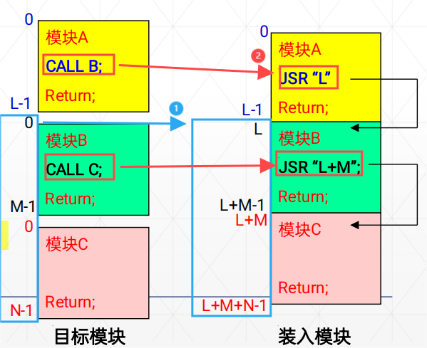
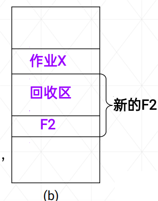
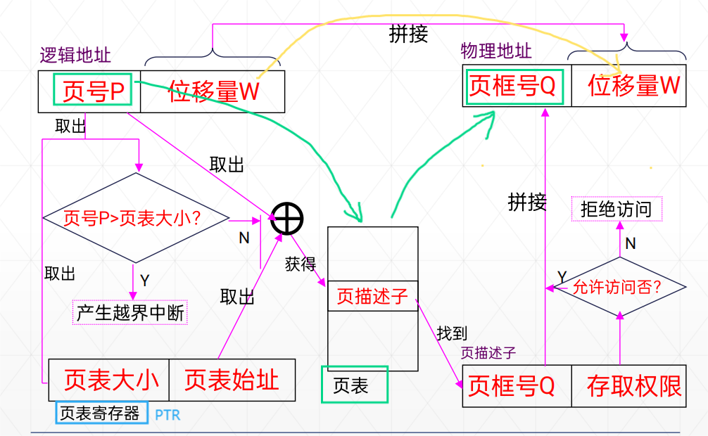
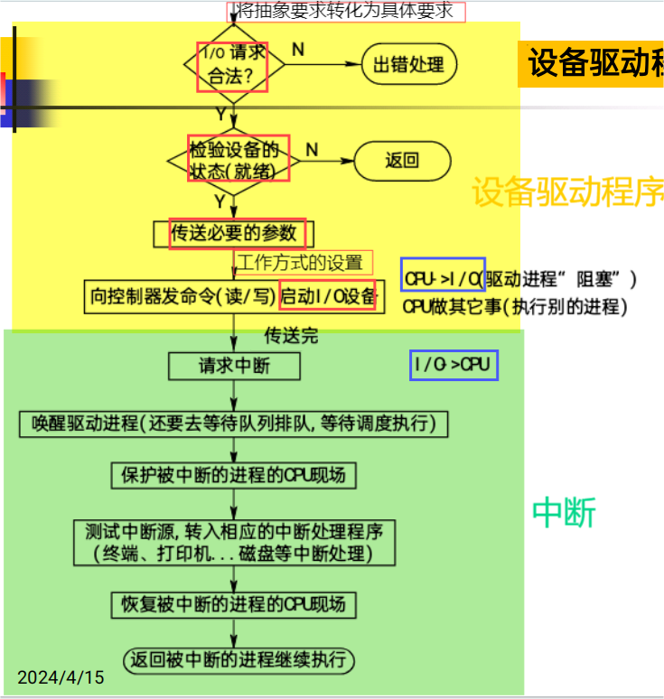
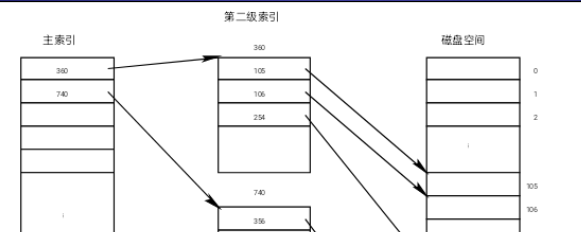

# 第一章 序论

## 1.操作系统定义：+

操作系统是一组控制和管理计算机软硬件资源、合理地对各类作业进行调度以及方便用户使用的程序集合

## 2.操作系统的目标：

**方便性**，**有效性**，**可扩展性**，**开放性**

## 3.OS的作用：

**（1）.OS作为用户与计算机硬件系统之间的接口**，

**（2）. OS作为计算机系统资源的管理者(软硬件资源)**：① 处理机管理② 存储器管理③ I/O设备管理④ 文件管理

**（3）. OS用作扩充机器**：在裸机上覆盖管理软件，实现对设备的操作，并向上提供一组操作命令。

## 4.操作系统发展

（1）**无操作系统**. ①人工操作方式：用户独占全机，CPU等待人工操作②脱机输入输出方式：解决了CPU与设备之间不匹配的矛盾，提高了I/O速度

（2）**单道批处理系统**：内存中始终仅存一道作业运行。（单道性、顺序性、自动性）

优：减少人工操作，解决了作业的自动接续；

缺：平均周转时间长，没有交互能力。

（3）**多道批处理系统**：在内存中存放多道作业运行，运行结束或出错，自动调度内存中的另一道作业运行。（多道性、无序性、调度性）

优：1、提高CPU的利用率。2、提高内存和I/O设备利用率。3、增加系统吞吐率

缺：平均周转时间长，没有交互能力

（4）**分时操作系统**：▪Multics (MIT)   ▪UNIX   ▪Linux

特点：

▪多路性：一个主机与多个终端相连；

▪独立性：彼此独立操作，互不干扰；

▪及时性：系统能在很短的时间得到回答；

▪**交互性**：能实现人机对话（区别于批处理系统）；

（5）**实时系统**：是计算机**及时响应**外部事件的请求，在**规定的时间内完成**对该事件的处理，并控制所有实时设备和实时任务协调一致的运行。

1、多路性：能对多个对象进行控制。

2、独立性：独立运行，不混淆，不破坏。

3、交互性：仅限于访问系统中某些特定的专用服务程序。

4、可靠性：高可靠性，应具有多级容错防护能力。

5、及时性：不同的系统要求不一样，控制对象必须在截止时间内完成。

## 5.操作系统基本特征+

现代OS的四个基本特征：

1、**并发性**（最重要的特征）： 并行性：是指两个或多个事件在**同一时刻**发生。并发性：是指两个或多个事件在**同一时间间隔**内发生。

2、**共享性**  ：互斥共享方式，同时访问方式

 3、虚拟性   ：把一个物理实体变为（映射为）若干个逻辑上的对应物（1.时分复用技术：虚拟处理机，虚拟设备2.空分复用技术：虚拟磁盘技术，虚拟存储器）

4、异步性：执行结果不确定，程序不可再现。

## 6.0操作系统的主要任务：

为多道程序的运行提供良好的运行环境，以保证多道程序能有条不紊地、高效地运行，

并能最大程度地提高系统中各种资源的利用率，

方便用户的使用。

## 6.1操作系统应的功能：+

1、处理机管理（CPU）

2、存储器管理

3、设备管理

4、文件管理

5、方便用户使用的用户接口。

## 7.OS结构设计

1. 无结构操作系统
2. 模块化结构（模块-接口法）：① 对模块的划分及对接口的规定要精确描述很困难。②从功能观点来划分模块时，未能将共享资源和独占资源加以区别
3. 分层系统结构：各层的实现不依赖其以上各层所提供的概念及其属性，只依赖其直接下层所提供的概念及属性；
4. 客户服务器模式：可扩充性，可靠性，可移植性。消息传递开销+模式切换开销
5. 面向对象技术：可扩充性，可靠性，继承性。
6. 微内核技术：**足够小的内核**，基于**客户/服务器**模式，应用“机制与策略分离”原理，采用**面向对象**技术。不仅运行在**核心态**，而且开机后常驻内存， 它不会因内存紧张而被换出内存

# 第二章 第1节 进程管理

## 1.进程概念+

（1）进程是**程序**的**一次执行**。

（2）进程是一个程序及其数据在处理机上顺序执行时所发生的活动。

（3）进程是程序在一个数据集合上运行的过程，它是系统进行**资源分配和调度的一个独立单位**。

## 2.进程实体构成（进程三要素）+

**<u>程序段、数据段和PCB</u>**

## 3.并发

程序顺序执行时的特征：顺序性，封闭性，可再现性

程序并发执行时的特征：间断性，失去封闭性（多个程序共享系统中的各种资源），不可再现性

 

## 4.进程的特征

1）动态性：动态性表现： “它由创建而产生，由调度而执行，由撤消而消亡”

2）并发性

3）独立性

4）异步性

## 5.进程的状态（五种状态）+

 

## 6.PCB（进程控制块）

### 1.进程控制块的作用

 进程控制块的作用是**使**一个在多道程序环境下不能独立运行的**程序**（含数据），**成为一个**能独立运行的基本单位—**进程**。

 在进程的整个生命期中，操作系统总是通过PCB**对进程进行控制**的。

 所以说，PCB是**进程存在**的**唯一标志**。

### 2.进程控制块的内容

1）进程标识符:唯一地标识一个进程

2）处理机状态：进程现场信息（通用寄存器，PC,PSW,SP）

3）进程调度信息:①进程状态②进程优先级③进程调度所需的其它信息。④事件(阻塞原因)

4）进程控制信息:①程序和数据的地址②进程同步和通信机制③资源清单④链接指针

### 3.进程控制块组织方式

线性，链接（链表数=状态数），索引（索引表数=状态数）


## 7.进程控制

### 1.处理器的两种执行状态：

**系统态**（内核态）和**用户态**。

### 2.原语种类：创建，撤销，阻塞，唤醒，挂起，激活+

### 3.创建（被动行为）

引起创建进程的事件

（1）用户登录。

（2）作业调度。

（3）提供服务。例如：I/O请求

（4）应用请求。

#### 调用进程创建原语步骤：

（1）**申请**空白**PCB**。

（2）为新进程**分配资源**。

（3）**初始化**进程控制块。①初始化标识信息。②初始化处理机状态信息。使程序计数器指向程序的入口地址，使栈指针指向栈顶；③初始化处理机控制信息：进程的状态、优先级。

（4）将新进程**插入就绪队列，启动调度**。

### 4.撤销（被动行为）

引起进程终止的事件

1）正常结束。

2）异常结束：①越界错误。②保护错。③非法指令。④特权指令错。⑤运行超时。⑥等待超时。⑦算术运算错、被0除：⑧I/O故障

3）外界干预：①操作员或**操作系统干预**。例如发生死锁②**父进程请求**终止该进程；③当**父进程终止**时，OS也将他的所有子孙进程终止。

#### 进程的终止过程

（1）根据被终止进程的PID找到它的PCB，从中**读出**该进程的**状态**。

（2）若被终止进程正处于执行状态，应立即**终止该进程的执行**，重新进行调度。

（3）若该进程还有子孙进程，立即**将其所有子孙进程终止**。

（4）将被终止进程所拥有的全部**资源，归还**给其父进程，或者归还给系统。

（5）将被终止进程的PCB从所在**队列中移出**。

### 5.阻塞（主动行为）

引起进程阻塞的原因

1）请求系统服务。

2）启动某种操作：如I/O操作。

3）新数据尚未到达。

4）无新工作可做

### 6.唤醒（被动行为）

### 7.挂起（主动行为）

### 8.激活（被动行为）

## 8.进程同步+

### (1).并发进程之间的关系

 进程**互斥**：多个进程**不能同时使用同一个资源**，某个进程使用该资源时，其他进程必须等待。

 进程**同步**：多个进程的调用存在**<u>时序关系</u>**，某些进程的执行必须先于另一些进程。

 进程通信：多个进程之间传递消息。

### (2).临界区使用原则（互斥条件）：+

(1) **<u>空闲让进</u>**。如果临界区空闲，则只要有进程申请就立即让其进入。

(2) **<u>忙则等待</u>**。每次**仅允许一个进程处于临界区**。

(3) **<u>有限等待</u>**。进程**只能在临界区内逗留有限时间**，不得使其他进程在临界区外无限期等待。

(4) **<u>让权等待</u>**。当进程**不能进入自己的临界区时**，**应立即释放处理机**，以免进程处于“忙等”状态。

### (3).信号量机制

#### 0.信号量种类

 互斥信号量：用于申请或释放资源的使用权，常初始化为1。

 资源信号量：用于申请或归还资源，可以初始化为大于1的正整数，表示系统中某类资源的可用个数

#### 1.整型信号量

#### wait(s)和signal(s）

s>=0,表示剩余资源量

仅能通过两个标准的原子操作 wait(s)和signal(s）来访问，又称为P、V操作。

#### 2.记录型信号量（无忙等）

#### wait(s)和signal(s）

s.value>0:剩余资源量

s.value<0:等待进程数

#### 3.AND型信号量 

#### Swait(s1,...)和Ssignal(s1,...）

基本思想：将进程在整个运行过程中需要的所有资源，**一次性全都地分配**给进程，待进程使用完后再一起释放。

#### 4.信号量集 

#### Swait(s1,t1,d1,...),Ssignal(s1,d1,...）

每次可以分配<u>多个单位的资源</u>

Si—现有数量；ti—分配**下限值**(表示si值不能<ti)；di—**申请数量**;

### (4).经典进程同步模型

#### 1.生产者消费者

信号量使用（记录型信号量）：互斥信号量 **mutex**：1，可用的空资源信号量 **empty**：n，可用的满资源信号量 **full**：0

var mutex,full,empty:semaphore:=1,0,n

1.Wait(empty);Wait(mutex);###wait操作的次序是重要的：先检查资源数目，再检查是否互斥.否则可能死锁

2.Swait(empty, mutex)；| Swait(full,mutex)；

#### 2.哲学家就餐

解决死锁方法：

(1)至多允许N-1个哲学家同时就餐（Semaphore room=N-1;）

wait(room); //请求进入房间进餐
wait(chopstick[i]);//请求左手边的筷子
wait(chopstick[(i+1) %5]); //请求右手边的筷子
eat();
singal(chopstick[i]);// 释放左手边的筷子
signal(chopstick[(i+1) %5]);//释放右手边的筷子
singal(room);

(2)利用AND信号量机制解决死锁问题

Swait(chopstick[(I+1) %5]，chopstick[I]);
eat();
Ssignal(chopstick[(I+1) %5]，chopstick[I]);

(3)规定奇数号的哲学家先拿起他左边的筷子,然后再去拿他右边的筷子;而偶数号的哲学家则相反.

#### 3.读者写者

1.信号量使用（记录型信号量）：互斥信号量 **rmutex**, **wmutex**：1（rmutex保护Readcount,wmutex保护资源）

var rmutex, wmutex: semaphore：=1,1;

**Readcount**:integer：=0; // **表示正在读的进程数目**

读者：

<u>wait(rmutex)</u>; // 保护Readcount变量同时只能被一个读者使用
if Readcount==0 then <u>**wait(wmutex)**</u>; //表示尚无Reader进程在读时， 允许读，互斥写者
*Readcount∶ =Readcount+1*;
<u>signal(rmutex)</u>;

perform read operation;

<u>wait(rmutex)</u>;
*Readcount∶=Readcount-1*;
if readcount==0 then <u>**signal(wmutex)**</u>; //以便让Writer进程写。
<u>signal(rmutex)</u>;

写者：

wait(wmutex);
perform write operation;
signal(wmutex);

2.利用信号量集

L:资源信号量(读用)；wmutex:互斥信号量(写用)

Reader进程
Swait(L,1,1);//最多允许RN个进程读
Swait(wmutex,1,0);//不消耗wmutex量，但要等没有使用wmutex，即等没有写
执行读操作；
Ssignal(L,1);
						//不用Ssignal mutex
Writer进程
Swait(Wmutex,1,1; L,RN,0);//等待没有其他写，且没有任何一个读
执行写操作；
Ssignal(Wmutex,1);

## 9.进程通信+

### (1).低级通信

进程之间的互斥和同步，由于其所交换的信息量少而被归结为低级通信。(如信号量机制)

(1) 效率低 (2) 通信对用户不透明。

### (2)高级通信+

#### 1.共享存储器系统+

共用数据结构或**共用存储区**

#### 2.管道通信+

用于连接一个读进程和一个写进程以实现他们之间通信的一个**共享文件**，又名**pipe文件**

**字符流**形式传送大量数据

管道机制必须提供以下三方面的协调能力：**互斥，同步，相互已知**

#### 3.消息传递系统+

数据交换**以格式化的信息为单位**

##### 1）直接通信

(1) 对称寻址方式
Send(Receiver, message); 发送一个消息给接收进程；
Receive(Sender, message); 接收Sender发来的消息；

(2) 非对称寻址方式
Send(P, message);发送一个消息给接收进程P；
Receive(id, message); 接收来自任何进程的消息，进程id不固定

**<u>*实例：消息缓冲队列通信机制*</u>**

 

 

//////发送消息
getbuf(a.size, i); //根据a.size申请缓冲区；
初始化缓冲区数据
getid(PCB set, receiver, j); 获得接收进程内部标识符；
wait(j.mutex);。。。。。消息队列是互斥资源
insert(j.mq, i); 将消息缓冲区插入消息队列；
signal(j.mutex);
signal(j.sm); //消息队列资源信号量加1
///////接收消息
wait(j.sm); //首先申请消息队列资源信号量
wait(j.mutex);
remove(j.mq, i); //将消息队列中第一个消息移出；
signal(j.mutex);// 将消息缓冲区i中的信息复制到接收区b;
赋值给接收区数据

##### 2）间接通信

**<u>*实例：信箱*</u>**

▪Send(mailbox, message); 将一个消息发送到指定信箱；

▪Receive(mailbox, message); 从指定信箱中接收一个消息；

调用send原语时应给出的参数是：信件存放地址D及指定的信箱N（文件名，邮箱名）

#### 4.客户机--服务器系统+

# 第二章 第2节 线程管理

## 1.线程概念

调度和分派的部分通常称为线程或轻型进程

## 2.线程的数据共享

 线程间共享的数据和资源：进程代码段、进程中的全局变量、进程打开的文件……

 每个线程私有的数据和资源：线程ID、**线程上下文（一组寄存器值的集合）**、**线程局部变量（存储在栈中）**

 

### TCB的组成

 

## 3.线程与进程的比较+

**1) 调度**

▪在传统的操作系统中，进程作为拥有资源和独立调度、分派的基本单位。而在引入线程的操作系统中，则把线程作为调度和分派的基本单位，而进程作为资源拥有的基本单位。

▪在同一进程中，线程的切换不会引起进程的切换；但从一个进程中的线程切换到另一个进程中的线程时，将会引起进程的切换

**2) 并发性**

▪在引入线程的操作系统中，不仅进程之间可以并发执行，而且在一个**进程中的多个线程之间亦可并发执行**，使得操作系统具有更好的并发性，从而能更加有效地提高系统资源的利用率和系统的吞吐量。

**3) 拥有资源**

▪一般而言，线程自己不拥有系统资源(也有一点必不可少的资源)，但它可以访问其隶属进程的资源，即一个进程的代码段、数据段及所拥有的系统资源，如已打开的文件、I/O 设备等，可以供该进程中的所有线程所共享。

**4) 独立性**

▪同一进程中的不同线程共享进程的内存空间和资源。

▪同一进程中的不同线程的独立性低于不同进程。

**5）系统开销**

▪ 线程的切换只需要保存和设置少量的寄存器内容，不涉及存储器管理方面的操作。

▪由于一个进程中的多个线程具有相同的地址空间，在同步和通信的实现方面线程也比进程容易。在一些操作系统中，线程的切换、同步和通信都无须操作系统内核的干预。

**6）支持多处理机系统**

▪一个进程分为多个线程分配到多个处理机上并行执行，可加速进程的完成。

## 4.线程的属性

（1）轻型实体
线程自己基本**不拥有系统资源**，只拥有少量必不可少的资源：TCB，程序计数器、一组寄存器、栈。
（2）独立调度和分派的基本单位
在多线程OS中,线程是独立运行的基本单位,因而也是**独立调度和分派的基本单位**。
（3）可并发执行
**同一进程中的多个线程之间可以并发执行**，一个线程可以创建和撤消另一个线程。
（4）共享进程资源
它可与同属一个进程的其它线程**共享进程所拥有的全部资源**

## 5.线程的状态（三种状态）

 

## 6.线程的同步

### 1）互斥锁(mutex)

<1>阻塞方式：线程将被**阻塞直到**其他线程对mutex解锁。
**lock(mutex)**
访问
**unlock(mutex)** 
<2>非阻塞方式：不会阻塞等待，而会**返回一个错误代码**。
**if（trylock）** then
else 

### 2）条件变量

单纯的互斥锁用于**短期锁定**，主要是用来保证对**临界区的互斥进入**。而条件变量则用于线程的**长期等待**， 直至所等待的**资源**成为可用的。

条件变量通常和互斥锁一起使用，互斥锁用于进入临界区，条件变量用于请求资源

Lock mutex；
check data structures;//查找用于描述资源状态的数据结构，了解资源的情况。
while(resource busy);
wait(condition variable);//所需资源R正处于忙碌状态，线程便转为等待状态，并对mutex执行开锁操作后，等待该资源被释放；
mark resource as busy;
unlock mutex;

### 3）信号量机制

(1) 私用信号量
实现**同一进程**中各线程之间的同步时。私用信号量属于特定的进程所有，OS并不知道私用信号量的存在
(2) 公用信号量
实现**不同进程**间或不同进程中各线程之间的同步。存放在受保护的系统存储区中，公用信号量是一种比较安全的同步机制

## 7.线程的实现方式

### 1）用户级线程

 用户级线程**仅存在于用户空间**中。对于这种线程的创建、撤消、线程之间的同步与通信等功能，都**无须内核**来实现。
 对于用户级线程的切换，通常是发生在**<u>一个</u>应用<u>进程</u>的<u>诸多线程</u>之间**，这时，也同样无须内核的支持。由于切换的规则远比进程调度和管理的规则简单，因而**使线程的切换速度特别快**。
 由应用程序完成所有线程的管理
**线程库**(用户空间)：通过一组管理线程的函数库来提供一个线程运行管理系统（运行系统）

**优点：**
(1) 线程**切换不调用内核**
(2) 调度是应用程序特定的：可以选择最好的算法
(3) **可运行在任何操作系统上**（只需要线程库），<u>可以在一个不支持线程的OS上实现</u>
**缺点：**
(1) 当线程执行一个系统调用时，该线程及其所属进程内的所有线程都会被阻塞。（**一个线程阻塞，与其同进程的线程全部被阻塞**）
(2) 多线程应用**不能利用多处理机进行多重处理**。（**一个进程虽有多个线程，但只能用单个处理机**）

 

### 2）内核支持线程

▪ 内核支持线程，是在**内核的支持**下运行的，即无论是**用户进程中**的线程，还是**系统进程中**的线程，他们的创建、撤消和切换等，是依靠内核实现的。
▪在内核空间中为每一个内核支持线程设置了一个线程控制块**<u>TCB</u>**， 内核是根据该控制块而感知某线程的存在的，并对其加以控制。

**优点**
(1) 在多处理器系统中，内核能够同时调度同一进程中**多个线程并行执行**；
(2) 如果进程中的**一个线程被阻塞**了，内核**可以调度该进程中的其它线程**占有处理器运行，也可以运行其它进程中的线程；
(3) 内核支持线程具有很小的数据结构和堆栈，线程的切换比较快，切换开销小；
(4) **内核本身也可以采用多线程技术**(可利用多cpu)，可以提高系统的执行速度和效率
**缺点**
▪对于**线程切换而言，其模式切换的开销较大**
在同一个进程中，从一个线程切换到另一个线程时，需要**从<u>*用户态*</u>转到<u>*内核态*</u>再转到<u>*用户态*</u>进行**，这是因为用户进程的线程在用户态运行，而线程调度和管理是在内核实现的，系统开销较大。

 

### 3）组合方式

使用用户级线程+lwp+内核级线程（见下）

## 8.线程的具体实现

### 1）内核支持线程

系统在创建一个新进程时，便为它分配一个**任务数据区PTDA**（Per Task Data area),其中**包括若干个**线程控制块**TCB**空间

### 2）用户级线程

用户级线程是在用户空间实现的。所有用户级线程都具有相同的数据结构，它们都运行在一个**中间系统**上。
 当前有两种方式实现的中间系统：

#### （1）运行时系统（又称为线程库）

用于管理和控制线程的函数的集合，包括创建、撤消线程函数、线程同步和通信函数、线程调度函数等。用户级线程不能直接利用系统调用，**必须通过线程库<u>*间接*</u>利用系统调用**。

#### （2）内核控制线程

 这种线程又称为轻型进程LWP（Light Weight Process）
 每个进程都可拥有多个LWP，每个LWP都有自己的TCB，其中包括线程标识符、优先级、状态、栈和局部存储区等
LWP可通过系统调用来获得内核提供的服务，当一个**用户级线程**运行时，只要将它**连接到一个LWP上**，它**便具有了内核支持线程的所有属性**。

 

# 第三章 处理机调度和死锁

## 1.作业的概念

概念：作业是用户在一次算题过程中或一次事务处理中，要求计算机系统所做的**工作的集合**

作业是比进程更广泛的概念，不仅包含了通常的程序和数据，而且还配有一份**作业说明书**，系统根据作业说明书对程序运行进行控制。

## 2.作业的状态

 

## 3.作业控制块（JCB）

作业提交给系统**进入后备状态**后，系统将为每个作业**建立**一个作业控制块**JCB**。只有当作业**完成并退出**系统时，**JCB**才被**撤消**。JCB是一个作业在系统中存在的**唯一标志**，系统根据JCB才感知到作业的存在

## 4.处理机调度分级

进程调度的级别

 **高级**调度(作业调度)：决定哪些程序可以**进入系统**。<u>**批处理系统需要有作业调度，分时和实时系统无需此调度**</u>。

 **中级**调度(中程调度)：决定**内存中**程序的**位置**和状态。三种类型OS都必须配置这级调度。（**最基本调度**）

 **低级**调度(进程调度)：决定**CPU资源**在就绪进程间的**分配**

 

多道程序**度**：即允许多少个作业同时在内存中运行。
**周转时间**：从作业被**提交**给系统开始，到作业**完成**为止的这段时间间隔。
吞吐量：是指在**单位时间**内系统所**完成**的**作业数**。
**响应比** =**(等待时间+要求服务时间)/要求服务时间**=响应时间/要求服务时间

### 1）.低级调度中的三个基本机制

 (1) **排队器**
为了提高进程调度的效率，应事先将系统中所有的就绪进程按照一定的方式排成一个或多个队列。
 (2) **分派器**(调度程序)
分派器把由进程调度程序所选定的进程从就绪队列中取出，然后进行上下文切换，将处理机分配给它。
 (3) **上下文切换机制**
当对处理机进行切换时，会发生两对上下文切换操作。

###  2）.低级调度的功能

(1)按某种算法**选取进程**（调度）。
(2)保存处理机的**现场信息**（上下文切换第一步骤）
(3)把处理器**分配**给进程（上下文切换第二步骤）。

### 3）.低级调度的两种方式

抢占和非抢占式

#### 抢占式优缺点

•优点：可以防止一个长进程长时间占用处理机，能为大多数进程提供更公平的服务，特别是能满足对响应时间有着较严格要求的实时任务的需求。
•缺点：抢占方式比非抢占方式调度所需付出的开销较大，且调度算法复杂。

### 4）.中级调度

主要目的：为了提高**内存利用率**和**系统吞吐量**。

具体实现：
使那些**暂时不能运行**的进程不再占用宝贵的内存资源，而将其**调至外存**去等待，把此时的进程状态称为就绪驻外存状态或**挂起**状态。当这些进程重又**具备运行条件、且内存又稍有空闲时**，由中级调度来决定把外存上的那些又具备运行条件的就绪进程，重新**调入内存**，并修改其状态为就绪状态，挂在就绪队列上等待进程调度。

### 5）.选择调度方式和调度算法的若干准则

#### 1.面向用户的准则

(1) 周转时间短.（评价批处理）
(2) 响应时间快。
(3) 截止时间的保证.（评价实时）
(4) 优先权准则。

#### 2. 面向系统的准则

(1) 系统吞吐量高。（评价批处理系统）
(2) 处理机利用率高。
(3) 各类资源的平衡利用。

### 6）.引起低级（进程）调度的因素

① 正在执行的进程**执行完毕**，或因发生某事件而**不能再继续执行**（包括：当前执行进程被中断、**时间片用完了**、**挂起**自己、退出等）；
② 执行中的进程因提出**I／O请求**而暂停执行；
③ 在进程通信或同步过程中执行了某种**原语操作**，如P、V操作原语，Block原语， Wakeup原语等。

## 5.调度算法

### 1）先来先服务调度算法(FCFS)--非抢

利于长作业

### 2）短作业(进程)优先调度算法 SJ(P)F--非抢

利于短作业

### 3）最短剩余时间优先调度算法(SRT)--抢

### 4）优先权调度算法 PSA--抢+非抢

（1) 静态优先权    2) 动态优先权：随进程的推进或随其等待时间的增加而改变

### 5）高响应比优先调度算法 HRRN--抢+非抢

 

利于长作业、短作业

### 6）基于时间片的轮转调度算法 RR--抢

按**先来先服务**原则，**排成一个队列**，每次调度时，把CPU分配给队首进程，并令其**执行一个时间片**，然后将其置于队尾

 

### 7）多级队列调度算法

前台的就绪队列是交互性作业的进程，采用时间片轮转。
后台的就绪队列是批处理作业的进程，采用优先权或短作业优先算法。
调度方式有两种：
▪ 优先调度前台，若前台无可运行进程，才调度后台。
▪ 分配占用CPU的时间比例，如：前台80%，后台20%

### 8）多级反馈队列调度算法 --抢占式

 

(1) 设置多个就绪队列，并为各个队列赋予不同的优先级。
(2)一个新进程进入内存后，首先将它放入第一队列的末尾，按FCFS原则排队等待调度；如果在一个
时间片内尚未完成，调度程序便将它转入第二队列末尾,重复（**掉级**）
(3) 仅当第一队列空闲时，调度程序才调度第二队列中的进程运行

补充：因**等待**或**被抢占**而放弃CPU后，进入阻塞队列，一旦等待的事件发生，则回到原来的就绪队列（**不掉级**）

### 9）基于公平原则的调度算法

1 保证调度算法
▪ 例如N个**进程平均**分配时间。
2 公平分享调度算法
▪ 按照**用户平均**分配时间。

## 6.实时调度

任务的结束时间有严格约束(Deadline) ，即任务执行必须在Deadline之前完成
前述算法不能很好地满足实时系统对调度的特殊要求，所以引入实时调度。

### 1）.实时操作系统RTOS

**软实时**（SRT）和**硬实时**（HRT）系统：软实时只能提供统计意义（例95%）上的实时，而硬实时要求100%

### 2）.实现实时调度的基本条件

1. 提供必要的调度信息：就绪时间，开始截止时间，处理时间，资源要求，优先级
2. 系统处理能力强
3. 采用抢占式调度机制
4. 具有快速切换机制：快速响应外部中断，快速任务分配

### 3）.实时调度算法

#### 1） 最早截止时间优先算法 EDF --抢+非抢

根据任务的**开始截止时间**来确定任务的优先级。截止时间愈早，其优先级愈高。

补充：<u>若超过截止时间，则进行舍弃</u>

#### 2） 最低松弛度优先算法 LLF --抢

松弛度=**完成截止时间**–剩余运行时间–当前时间

任务**执行结束后**或无任务执行时，**比较等待任务的松弛度值，较小的先执行**。（平时不抢占）

当等待任务的松**弛度值为0**时**<u>*才进行抢占*</u>**

### 4）.优先级倒置现象

高优先级进程(或线程)被低优先级进程(或线程)延迟或阻塞（**mutex被低优先级进程P3占用**）

 

解决办法：

1.规定进入临界区的进程不允许被抢占
仅适用于临界区较短情况
2.采用**动态优先级继承**方法
<u>防范中间优先级进程(P2)插入</u>（P3继承P1优先级，以便优先完成P3来释放mutex给P1用）

 

## 7.死锁

### 0）系统资源种类

1.**永久（可重用）性资源**
<u>可抢占性资源</u>: 主存，cpu
<u>不可抢占性资源</u>:磁带机，打印机
2.**临时性（消耗性）资源**
只可使用一次的资源

### 1）死锁定义

指多个进程因**竞争资源**或**相互通信**而造成的一种**僵局**，**都在等待**着对方释放出自己所需的资源，但同时又不释放出自己已经占有的资源，若无外力作用，这些进程都将永远无法向前推进。

### 2）死锁产生原因

1.**竞争资源**  ：竞争不可抢占性资源，竞争临时性(消耗性)资源

2.**进程间推进顺序不当**：进程推进顺序不当

### 3）资源分配图、联合进程图

              

### 4）产生死锁的必要条件

(1)**互斥条件** ：进程对分配到的资源进行排它性使用。
(2) **请求和保持条件** ：进程已经保持了至少一个资源，但又提出了新的资源要求，而该资源又被其他进程占有，请求进程阻塞，但对已经获得的资源不释放。
(3) **不剥夺条件** ：进程已获得的资源，使用完之前不能被剥夺，只能用完自己释放。
(4) **环路等待条件** ：发生死锁时，必然存在进程—资源的环形链。

### 5）处理死锁的基本方法

#### 1.**预防死锁**：

**设置某些限制条件，破坏四个必要条件中的一个或几个。（互斥条件除外）**

优点：容易实现。缺点:系统<u>资源利用率和吞吐量降低</u>。

（1）摒弃“请求和保持”条件：

法一：所有进程**一次性申请**所需的全部资源

法二：允许一个进程只获得运行**初期所需**的资源后**便开始运行**，运行过程中再逐步释放

（2）摒弃“不剥夺”条件

一个已经保持了某些资源的进程，再提出**新的资源要求**而**不能立即得到满足**时，必须**释放已经保持的所有资源**，待以后需要时再重新申请

（3）摒弃“环路等待”条件

系统将所有资源按类型进行线性排队（常用 不常用），并赋予不同的序号。所有进程对资源的**请求**必须严格**按资源序号递增的次序**提出，**按序号递减的次序释放**

 

#### 2.**避免死锁**：

**在资源的动态分配过程用某种方法防止系统进入不安全状态。**

优点：较弱限制条件可获得较高系统资源利用率和吞吐量。缺点：有一定实现难度。

##### 安全状态定义：

安全状态，是指系统**能按某种进程顺序**(P1 , P2 , …，Pn )(称〈P1 ,P2 , …, Pn〉序列为安全序列)，来**为每个进程**Pi**分配其所需资源**，直至满足每个进程对资源的最大需求，使每个进程都可顺利地完成。如果系统无法找到这样一个安全序列，则称系统处于不安全状态。

##### 银行家算法：

1.当前状态下，某进程申请资源；
2.系统假设将资源分给该进程，满足它的需求；
3.检查分配后的系统状态是否是安全的，如果是安全，就确认本次分配；如果系统是不安全的，就取消本次分配并阻塞该进程。（第三步又称安全算法）

 

 

 

#### 3.**检测死锁**：

**预先不采取任何限制，也不检查系统是否已进入不安全区，通过设置检测机构，检测出死锁后解除。**

死锁定理：S为死锁状态当且仅当S状态的**资源分配图是不可完全简化**的。

第一步：先看系统还剩下多少资源没分配，再看有哪些进程是不阻塞（**“不阻塞”即：系统有足够的空闲资源分配给它**）的
第二步：**把不阻塞的进程的所有边都去掉**，形成一个孤立的点，再**把系统分配给这个进程的资源回收回来**
第三步：看剩下的进程有哪些是不阻塞的，然后又把它们逐个变成孤立的点。（**重复第二步**）
第四步：最后，所有的资源和进程都变成孤立的点。这样的图就叫做“可完全简化”

如果一个图可完全简化，则不会产生死锁；如果一个图不可完全简化（即：图中还有“边”存在），则会产生死锁。这就是“死锁定理。

#### 4.**解除死锁**：

**常用撤消或挂起一些进程，回收一些资源。**

（法1）**剥夺资源**。**从<u>其它</u>进程剥夺**足够数量的资源**给死锁进程**，以解除死锁状态。
（法2）**撤消进程**。最简单的撤消进程的方法，是使全部死锁进程都夭折掉；或者按照某种顺序逐个地撤消进程，直至有足够的资源可用，使死锁状态消除为止。

##### 最小代价原则：

到目前为止，**花费处理机的时间最少**的进程；
到目前为止，产生**输出最少**的进程；
估计**未执行部分最多**的进程；
到目前为止，**已获得资源量最少**的进程；
**优先级最低**的进程。

# 第四章 存储器管理（内存）

## 1 存储器的层次结构

 

CPU的控制部件只能从主存中取得指令和数据到CPU寄存器

### 1）存储器管理的目的和功能

:one:主存储器的**分配**和**管理**

:two:提高主存储器的**利用率**

:three:“扩充”主存**容量**

:four:存储**保护**

:yum:存储分配机制应具有如下**功能**

:one:**记住**每个存储区域的**状态**

:two:实施**分配**

:three:**接受**系统或用户**释放**的存储区域

### 2）存储分配的三种方式

:one:**直接指定方式**：编程人员或对编译程序使用**实际存储地址**

:two:**静态分配方式**：**装入时**确定在主存的位置，作业装入时必须**分配**其要求的**全部**存储量，退出前一直占用，运行过程中不能在内存中“搬家” 、也**不能再申请**存储量

:three:**动态分配方式**：**装入时**确定在主存的位置，**执行**过程中可根据需要**申请**附加的存储空间，可以要求归还给系统，允许作业在内存中“搬家” 。

### 3）几个基本概念

**逻辑地址**（相对地址，虚地址）：用户的程序经过汇编或**编译后形成目标代码**，目标代码通常采用相对地址的形式，其**首地址为0**

**物理地址**（绝对地址，实地址）：内存中存储单元的地址，**可直接寻址**

:yum:**名空间，地址空间，存储空间**

 

## 2 程序的装入和链接

### 1）步骤：编译，链接，装入

 

### 2）装入的三种方法(根据存储空间的分配方式)

**重定位**：**装入**内存**时**，**相对地址**（数据、指令地址）要**作出相应的修改**以**得到**正确的**物理地址**

静态重定位：装入内存时**一次完成**的，且以后**不能移动**（静态分配）

动态重定位：地址转换**推迟到**程序**执行时进行**（动态分配）

:one:**绝对装入方式**：在编译时，**编译**程序**产生**实际存储地址（**绝对地址**）的**目标代码**，装入程序不需对程序和数据的地址进行修改

:two:**可重定位装入方式**：使用**静态重定位**（装入时完成转换）

物理地址=CPU给出的有效地址=**<u>*相对地址+内存中的起始地址*</u>**

:yum:优点：**不需硬件**支持

:yum:缺点：占用**连续**的内存空间，装入内存后**不能移动**，**不易**实现**共享**

:three:**动态运行时装入方式**：使用**动态重定位**（执行时才转换）

利用一个**重定位寄存器(RR)**，根据作业分配到的存储空间起始地址来设定的

不是根据CPU给出的有效地址去访问主存，而是将有效地址与重定位寄存器中的内容相加后得到的地址作为访问主存的地址

物理地址=**<u>*CPU给出的有效地址+RR*</u>**

:yum:优点：**不一定**要分配在一个**连续**的存储区，**不一定**把它的地址空间**全部装入**主存，**共享容易**

:yum:缺点：需要附加**硬件支持**，实现存储器管理的软件比较复杂

### 3）链接的三种方法(根据链接时间的不同)

:one:**静态链接**：**链接**时链接

链接时将目标模块及它们所需的库函数，链接成一个**完整的装入模块**（又称执行模块），以后**不再拆开**

步骤1：将相对地址进行修改：改变被链接的模块的相对地址

步骤2：变换外部调用符号：将外部调用符号，都变为相对地址

 

:two:**装入时动态链接**：**装入**时链接

链接时不进行链接，在装入的时候动态链接，**装入程序去找目标模块**

:yum:优点：便于软件版本的修改和更新（不必拆开装入模块）

便于实现目标模块共享（可以将一个目标模块链接到几个应用模块中）

:three:**运行时动态链接**：**运行**时链接

在执行过程中，若发现一个被调用模块尚未装入内存时，由**OS去找该目标模块**，将它装入内存，并链接到调用模块上

## 3 连续分配存储管理方式

连续分配有三种方式：单一连续分配方式，分区式分配方式，可重定位分区分配

### 1）单一连续分配

**内存中**仅驻留**一道用户程序**

内存分为两个区域：系统区，用户区

### 2）分区式分配方式

**分区**：将内存用户空间划分为若干个区域，**每个分区中只装入一道作业**

#### 1 固定分区

:yum:分区大小固定

**分区说明表**：指出可用于分配的分区数以及每个区的大小、起始地址及状态 

当有作业要装入内存时，内存分配程序**检索分区说明表**，从中找出一个尚未使用的满足大小要求的分区分配给该作业

:yum:缺点：

**内零头**造成浪费(内存中**<u>*已分配*</u>**给用户但**<u>*未被利用*</u>**的区域)

**分区总数固定**，限制了并发执行的程序数目。

存储空间的**利用率太低**

#### 2 动态分区

:yum:分区的边界可以移动，分区的大小是可变的

:one:分区的**数目固定**大小是可变

:two:分区的**数目**和大小都是**可变**

 

##### 分区分配算法+

基于顺序搜索：最佳适应算法(Best Fit)，最坏适应算法(Worst Fit)，首次适应算法(First Fit)，循环首次（下次）适应算法(Next Fit)

基于索引搜索：快速适应算法(Quick Fit)，伙伴系统

###### :one:最佳适应算法(Best Fit----BF)

总是寻找**大小最接近的**空白区

将存储空间中所有的空白区按其**大小递增的顺序链接**起来，组成一**空白区链**

:yum:缺点：

1.**外零头**（**太小而无法使用**的空白区）。改善：设置一参数G，如果选中的空白区与要求的大小之差**小于G**，则不再对它划分，而把**整个**这个空白区**分配**给申请的作业

2.**插入**到空白区链中合适的位置上也颇为**费时**

###### :two:最坏适应算法(Worst Fit----WF)

总是寻找**最大的**空白区，在划分后剩下的空白区也是最大，使其可能仍然是有用

空白块应以**大小递减**的顺序**链接**起来

:yum:缺点：当有大的作业时，其存储空间的申请往往得不到满足

###### :three:首次适应算法(First Fit----FF)

按其在存储空间中**地址递增**的顺序**链接**在一起，选择**第一个**足以满足请求的空白块

:yum:优点：**查找速度快**

:yum:缺点：

1.**外零头**

2.使**找**到合适空白区的**速度降低**

###### :four:下次适应算法(循环首次)(Next Fit----NF)

带**旋转指针**的**首次适应**算法(FF)

###### :five:快速适应算法(Quick Fit----QF)

**多个**空闲分区**链表**+索引表，将空闲分区**根据其容量大小进行分类**

根据进程的长度，**寻找**到能容纳它的最小空闲**分区链表**，并取下**第一块**进行分配（**<u>*整个分区分配*</u>**）

:yum:优点：**查找效率高**；<u>***不会进行分割***</u>，故没有内零头

:yum:缺点：分区**归还**时算法**复杂**；以进程为单位，**一个分区**只属于**一个进程**

###### :six:伙伴系统

内存块的大小设置为2<sup>k</sup>(1<=k<=m)(2<sup>m</sup>为可供分配的整个内存空间的大小)

对空闲区**按照大小分类**，相同大小的分区链接为一个**双向空闲链表**；最多可形成 k（0 ≤k≤m ）个链表

进程请求大小为n的存储空间时， 首先计算一个 i 值，使 2<sup>i－1</sup> < n ≤ 2<sup>i</sup> 
在空闲分区大小为 2<sup>i</sup> 的空闲分区链表中查找,找不到就在2<sup>i+1</sup>中找，依次类推（**<u>*整个分区分配*</u>**）

 

:yum:**合并条件**
**大小相同**
**地址相邻**
低地址空闲块起始地址的位数为2<sup>i＋1</sup>(**是伙伴**)

 

##### 分区分配操作（基于顺序搜索）(空闲表)

:yum:**分配内存**：不要求特定的位置，但区域必须是连续的

 

:yum:**回收内存**+

F1,F2为空闲表的项

    


#####  哈希算法

可以将依块大小分类得到的多个链表的**索引表替换为哈希表**（以空闲分区大小为关键字），提高查找效率

#### 3 可重定位分区分配

**动态分区**消除了固定式分区分配造成的“**内零头**”，但会存在“**外零头**”

**可重定位分区**分配使用**紧凑**技术消除“**外零头**”

**紧凑**：把原来分散的多个小分区合成一个大分区（移动）

##### :yum:动态重定位(使用动态运行时装入的方式)

有效地址+重定位寄存器RR=物理地址

 

## 4 离散分配方式的引入

**连续分配**方式会产生**内/外零头**

为解决零头问题又要进行**紧凑等高开销活动**

根据离散时的基本单位不同，可分为三种：

:one:**分页**存储管理

:two:**分段**存储管理

:three:**段页式**存储管理

:yum:**离散分配的优点**

1.**没有外零头**（因为没有碎片）

2.**仅有小于一个页面的内零头**(程序长度不是页的整数倍导致的)

## 5 基本分页存储管理方式

### 1）基本思想

分页(Pages)：将程序**地址空间分页**（逻辑）（页、页面）

分块(Frames)：将**内存空间分块**（物理）（页框、物理块）

内存**一块**可以装入程序**一页**

连续的多个页不一定装入连续的多个块中

:yum:注意：

⑴从0开始编制页号，**页内地址是相对于0编址**；

⑵在进程调度时，必须把它的所有页**一次装入**到主存的页框内；如果当时页框数不足，则该进程必须等待，系统再调度另外的进程。（纯分页方式）

**页面大小**由机器的地址结构决定。**某一机器只能采用一种大小的页面**

### 2）数据结构

:one:**页表**：<页号、物理块号、存取控制字段>  **PT**

每个进程对应 1 个页表，页号从0开始

:two:**作业表**<进程号、页表长度、页表始址、状态>  **JT**

整个系统1张，记录页表情况，进程号从0开始

:three:**空闲块表**<主存空闲块>

整个系统1张

### 3）地址结构

**逻辑地址**可表示为**页号+页内位移量**，转换由**硬件**完成

设有一逻辑地址A，页面大小为L，则在分页存储管理方式中，它的地址被转换

页号 P=INT[A/L]------**页号=逻辑地址 \ 页面大小**

页内位移量 W=A MOD L------**页内偏移量=逻辑地址 mod 页面大小**

### 4）地址变换机构（装入：动态重定位）

**地址变换机构**的功能是将用户的**逻辑地址**转变为内存中的**物理地址**

一般系统，将**页表存储在内存中**

设置一个**页表寄存器（PTR）**，记录当前运行的进程的**页表**在内存中的**始址**和页表长度。（平时存于PCB中，要运行时才装入PTR中）

:yum:过程：

（1）根据**逻辑地址**,计算出**页号和页内偏移量**；

（2）从**PTR**中得到**页表首址**，然后**检索页表**，查找指定页面对应的**页框号**；

（3）用**页框号乘以页面大小**获得其对应的起始地址，并将其送入**物理地址的高端**。

（4）将**页内偏移量**送入**物理地址低端**，形成完整的物理地址。

 

:anger:例题：

1.每个**作业的最大大小**为多少？

答：作业的最大长度为**逻辑地址大小**(逻辑地址长10位，则大小为2<sup>10</sup>B=1KB)(默认按字节编址)

2.系统的**内存空间大小**为多少？

答：系统的内存空间大小为**物理地址大小**

3.每页大小为1K，则

 

 

### 5）具有快表的地址变换机构

分页系统中处理机每次存取指令或数据至少需要访问**两次**物理内存（访问页表，访问物理地址）

**快表TLB**(联想存储器)：为进程页表设置一个专用的**高速缓冲存储器**，专门保存当前进程最近访问过的一组页表项

**命中**(hit)：若快表中存在该表项

 

### 6）访问内存的有效时间EAT

定义：从进程发出指定**逻辑地址**的访问请求，经过地址变换，再到内存中找到对应的**物理单元**并取出数据，所花费的总时间。

**EAT**=HitR×(TLB+MA) + (1-HitR)×(TLB+2MA) （即计算**期望**）----HitR:命中率,MA:内存访问时间,TLB:TLB时间

### 7）两级和多级页表

对于大页表，找不到这么大的连续空间，解决办法为采用**离散分配方式存储页表**

只将当前需要的**部分页表项调入内存**， 其余的页表项仍驻留在磁盘上，需要时再调入

**外层页表**：为离散分配的页表再建立一张页表

#### 1 二级页表

把页表本身按固定大小分成为一个个页面(页面大小为 2<sup>12</sup>=4KB)，每页有2<sup>10</sup>=1K个页表项(**每个页表项4Byte**)，最多允许有2 <sup>10</sup>=1K个页表分页。(页面大小(4KB)/页表项大小(**4B**)=页表项个数(1K))

 二级页表项**32位（4B）**(10+10+12)

 

#### 2 多级页表

64位的机器，采用的是多级（4级以上）页表结构

### 8）反置页表IPT

逻辑地址空间增长速度快于物理地址空间

反置页表的**思路**：**不让**页表**与逻辑地址空间的大小相对应**（**避免一个进程一个页表**），让页表**与物理地址空间的大小相对应**

IPT是为主存中的**每一个物理块建立一个页表项**并按照块号排序<进程标识、页号、特征位>

 

IPT都大，常采用**部分装入**，所以必须为每个进程建立一个**外部页表**。当该页**不在主存**时，需要**访问**外部页表。

:yum:过程：

给出**进程标识pid和页号page**,用它们去比较IPT，若整个反置页表中未能找到匹配的页表项,说明该页不在主存,产生**请求调页中断**,请求操作系统调入;否则，该**<u>*表项的序号便是物理块号*</u>**,块号加上位移,便形成物理地址

 

#### Hash反置页表

 

### 9）对换（磁盘交换区）

分类：**整体对换**（以整个进程为单位），**页面对换/分段对换**（以页、段为单位）

为实现对换，系统需要三方面的功能：

:one:**对换空间的管理**:

**外存：文件区（离散）+对换区（连续）**

**对换区**：使用空闲分区表/链，分配**和动态分区相同**，可用FF,NF,BF

:two:**进程的换入**

查找“**就绪且换出**”的进程,则选择**换出时间最长**的

:three:**进程的换出**

首先选择**阻塞或睡眠**状态的进程,若没有此状态进程，则选择**就绪**状态的,换出**优先级最低**的或**驻留时间长的**

## 6 基本分段存储管理方式

### 1）分段式存储管理方式的引入

:yum:优点(引入原因)

:one:**方便编程**

编程时使用**模块化程序设计**的**分段结构**

:two:分段**共享**

段是信息的**逻辑单位**，可以为共享过程建立一个独立的段，更便于实现程序和数据的共享

页本身并无完整意义

:three:分段**保护**

对内存中的信息的保护，同样也是对信息的**逻辑单位**进行保护

:four:**动态链接**

当**运行**过程中又需要调用某段时，**才将该段调入**内存并进行链接

:five:**动态增长**

应付动态增长的不确定性

:yum:优点：

**没有内碎片**，**外碎片**可以通过内存**紧凑**来消除。

便于改变进程占用空间的大小

:yum:缺点：

进程**全部装入**内存

### 2）分段式存储管理的基本原理

作业地址空间按**逻辑信息**的完整性被划分为若干个段，每段**从0开始编址**

对所有地址空间的访问均要求两个成分：**(1)段的名字**(段号)； **(2)段内地址**。

例： 

#### 地址变换机构（装入：动态重定位）

**段表**：<**段号，基址**，长度，保护>------页表：<**页号、物理块号**、存取控制字段>

 

:yum:过程：

①根据**段表寄存器**的内容找到该作业的段表地址

②利用有效地址中的**段号S**作为检索段表的索引，得到该段在主存的**起始地址b**

③将段的主存**起始地址b**和**位移量d**相加，即得访问主存的**物理地址**

 

### 3）段的共享和保护

**可重入代码**（ **纯代码**）:一种允许多个进程同时访问的代码（**可共享**），且是一种**不允许**任何进程对其进行**修改**的代码

**分页共享**：共享代码所在的**地址空间必须重叠**（作业在运行前必须链接好，而链接后，一个例程的所占<u>***页号就确定***</u>了）（**运行前链接**）

**分段共享**：一个公共过程不一定也**无需赋相同的段号**（由于**<u>*段号*</u>**是在**<u>*动态*</u>**链接过程中**分配**的，而且，系统不可能事先知道某个过程将为哪些作业所调用）（**运行时链接**）

 

## 7 段页式存储管理

先将用户程序分段，每段内再划分成若干页，每段有段名（段号），每段内部的页有一连续的页号

 

段表：<**段号，<u>*页面始址*</u>**，页面大小，状态>---------原来：<**段号，<u>*基址*</u>**，长度，保护>

页表：<**页号，物理块号**，状态>---------------原来：<**页号、物理块号**、存取控制字段>

### 地址变换机构

:yum:过程：

① 首先，从**段表寄存器**从获得进程**段表的起始地址**，根据该地址，查找进程的段表。

② 然后，根据逻辑地址指定的**段号检索**段表，找到对应段的**页表起始地址**。

③ 再根据逻辑地址中指定的**页号检索**该页表，找到对应页所在的**物理块号**。

④ 最后，用物理块号加上逻辑地址中指定的页内偏移量，形成**物理地址**。

 

需**<u>*访问三次内存*</u>**

## 8 虚拟存储器

### 1）引入

常规存储器管理方式的特征：**一次性，驻留性**

:yum:**逻辑扩充**：

**覆盖**：应用程序**手动**把**需要的**指令和数据保存在内存中---解决**一次性**

**对换**：操作系统**自动**把暂时不能执行的程序保存到外存中---解决**驻留性**

**虚拟存储**：**自动**装入更多更大的程序

:yum:**局部性原理**：程序的执行总是呈现局部性。即，在一个较短的时间段内，程序的**执行仅限于某个部分**；

时间：某条指令一旦执行，则**不久以后**该指令可能**再次执行**；如果某数据被访问过， 则不久以后该数据可能再次被访问（循环）

空间：一旦程序访问了某个存储单元，在**不久之后**，其**附近的**存储单元也将被访问（顺序执行）

 

### 2）定义

**虚拟存储器**：是指具有**请求调入**功能和**置换**功能，能从**逻辑上**对内存容量加以**扩充**的一种**存储器系统**

### 3）工作情况

当进程运行时，先将当前要运行的**部分**程序**装入**内存，其他部分暂留外存；(基于局部性原理)
当要执行的指令不在内存时，处理器发生**中断**，通知操作系统将所缺部分从外存**调入**内存，保证程序继续执行；
当**内存不足**时，允许程序部分**换入、换出**

### 4）逻辑容量

其容量**不是无限大**，主要受两个方面的限制：

:one:指令中表示**地址的字长**：虚存容量<=2<sup>地址字长</sup>B

:two:外存的容量（**对换区**）

逻辑容量由**内存和外存之和决定。**

### 5）实现方式

请求分页系统，请求分段系统，段页式虚拟系统

### 6）虚拟存储器主要特征

**多次性**：一个作业被分成多次调入。（以离散分配为基础）

**对换性**：换入换出。（以离散分配为基础）

**虚拟性**：看到的内存容量远大于实际内存容量。(以多次性和对换性为基础)

### 7）典型问题：抖动

**抖动**：程序和数据**频繁地换入和换出**内存而不是执行用户指令

## 9 请求分页系统(虚拟存储器实现方式一)

### 1）两大功能：**请求调页**、**页面置换**

### 2）硬件支持：

#### 请求分页的**页表机制**

页表：<页号，页框号Q，**状态位D**，**访问位A**，**修改位M**，**外存地址**>

**状态位**(存在位)D：页是否已调入内存

**访问位**A：一段时间内是否被访问

**修改位**M：调入内存后是否被修改

**外存地址**：指出该**页在外存上的地址**，供调入的时候使用

#### **缺页中断**机构

:yum:缺页中断是一种特殊的中断，与一般中断相比，**区别**：

①在**指令执行期间产生和处理**中断信号。通常，CPU只能在指令之间接受中断；然而，一个缺页中断要求在指令执行中间得到服务

②**一条指令**可能引起**多次不同的页面故障**

:yum:过程：

（1）操作系统接收到进程产生的缺页中断信号，启动中断处理例程，**保留处理机现场**；

（2）操作系统通知处理机**从外存读取指定的页面**；

（3）处理机激活I/O设备；

（4） 检查**内存有无足够的空闲空间**装入该页面？若有，转（6），否则，执行（5）；

（5） 利用页面置换算法，选择内存中的某个页面，**换出内存**；(如果要换出的页**被修改过**，则先要写入外存)

（6） 将指定页面从外存**装入内存**；

（7） **更新**该进程的**页表**；

（8） **更新快表**；

（9）计算物理地址。

 

#### **地址变换**机构

### 3）内存分配策略和分配算法

#### 最小物理块数的确定

所分配**物理块数目越少**，则进程执行中的**缺页率越高**

如果分给的**物理块数增加**，则**缺页率应该减少**。但这个结论并**不普遍成立**

**最小物理块数**：是指能保证进程**正常运行**所需的最少物理块数

#### 物理块的分配策略

##### :one:固定分配局部置换

为每个进程分配一定数目的物理块，在整个运行期间都**不再改变**

##### :two:可变分配全局置换

分配**一定数目**的物理块，而OS自身也保持一个空闲物理块队列

现**缺页**时，由系统从空闲物理块队列中，取出一个物理块**分配**给该进程，并将欲调入的（缺）页**装入**其中

仅当空闲物理块队列中的物理块**用完**时，OS才能从内存中选择一页**调出**(**<u>*可以是其他的进程*</u>**)，该页可能是系统中任一进程的页

##### :three:可变分配局部置换

某进程发现缺页时，只允许从**该进程**在内存的页面中选出一页**换出**(**<u>*只能是自己进程的*</u>**)，这样就不会影响其它进程的运行

如果缺页率高，则为其增加一定的内存页，否则适当减少其内存的页面数

#### 物理块的分配算法

##### :one:平均分配算法

平均分配给各个进程

##### :two:按比例分配算法

根据**进程的大小**按比例分配

##### :three:考虑优先权的分配算法

一部分**按比例**地分配给各进程；另一部分则根据各进程的**优先权**

### 4）调页策略

#### 何时

##### :one:预调页

将那些预计在不久之后便会被访问的页面，预先调入内存

缺页中断时，系统为进程装入指定的页面以及**与之相临的多个页面**(预测)

##### :two:请求调页

仅当进程执行过程中，通过检查页表发现相应页面不在内存时，才请求装入该页面

#### 何处

##### :one:系统拥有足够的对换区空间

这时可以**全部从对换区**调入所需页面，以提高调页的速度

##### :two:系统缺少足够的对换区空间

这时凡是**不会被修改的**文件，都直接**从文件区**调入

##### :three:UNIX方式

凡是**未运行过的**页面，都应从**文件区**调入。而对于曾经运行过但又**被换出的**页面，由于是被放在**对换区**，因此在下次调入时，应从对换区调入

### 5）置换算法

#### :one:最佳(优)置换算法（OPT）

选择**最长时间不需要访问**的页面（仅具有**理论上**的意义---未来不可预测）

#### :two:先进先出页面置换算法（FIFO）

总是选择作业中**驻留时间最长**(即最老)的一页淘汰（先进先出）

#### :three:最近最久未使用置换算法（LRU）

选择在最近一段时间内**最久不用**的页面予以淘汰

实现：硬件（移位寄存器/栈）

:yum:**移位寄存器**R=Rn-1Rn-2Rn-3 ···R2R1RO

当进程**访问**某物理块时，要将相应寄存器的**最高位Rn-1位置成1**。系统**每隔一定时间**（例如100 ms）将寄存器**右移一位**

如果我们把n位寄存器的数看作是一个整数，那么，具有**最小数值**的寄存器所对应的页面，就是最近**最久未使用**的页面

:yum:**栈**

每当进程**访问**时某页面时，便将该页面号从**栈中移出**，**压入栈顶**。这样**栈底**则是最近**最久未使用**页面的页面号

#### :four:最少使用置换算法（LFU）

记录每个页面的**访问次数**(移位寄存器)，**最少**访问的页面首先考虑淘汰

:yum:**移位寄存器**R=Rn-1Rn-2Rn-3 ···R2R1RO

与LRU不同，**选1数量最少**的换出

 

#### :five:简单的Clock置换算法（最近未用算法）（NRU）

使用一个**循环链**，当某页被**访问时**，其**访问位被置1**，置换程序从***<u>上次停止位+1</u>(<u>指针指向</u>)***检查页面的访问位A。**如果是0，就选择该页换出**；**若为1，则重新将它置0**

 

#### :six:改进型Clock置换算法

首选：在最近没有被使用过(A=0)；在驻留内存期间没有被修改过的页面(M=0)，由**访问位A**和**修改位M**组合

（1）从指针所指示的当前位置开始，扫描循环队列，**寻找A=0且M=0的第一类页面**，将所遇到的第一个页面作为所选中的淘汰页。在第一次扫描期间**不改变访问位A**。

（2）如果第一步失败，即查找一周后未遇到第一类页面，则开始第二轮扫描，**寻找A=0且M＝1的第二类页面**，将所遇到的第一个这类页面作为淘汰页。在第二轮扫描期间，将所有扫描过的页面的**访问位A都置0**。

（3）如果第二步也失败，亦即未找到第二类页面，则将指针返回到开始的位置，并将**所有的访问位复0**。然后**重复第一步**，如果仍失败，必要时再重复第二步，此时就一定能找到被淘汰的页

### 6）有效访问时间EAT++

**有效访问时间**EAT是指访问存储器所需时间的平均值：**内存读写**周期为**t**+**查找快表**时间为**λ**+**缺页中断处理**时间为**ɛ**

**缺页中断处理**时间ɛ**：缺页**中断服务**时间(次)+**页面传送**时间(**主**)(包括读写页)+进程**重新执行**时间(次)

在快表中：EAT= λ + t=查+访

在内存中，不在快表中：EAT= λ + t + t + λ=2(λ + t)=查+查+访+**写快表**

不在内存中：EAT= λ + t +ɛ + λ + t = ɛ + 2(λ + t)=查+查+调+**写快表**+访

快表命中率为α，缺页中断率为f：EAT= λ + α t + (1- α)[t + f(t +ɛ +λ) + (1-f)(t +λ)]=查+α访+(1- α)[访+f(查+调+写快表)+(1-f)查+(写快表)]=λ+t+(1- α)(t+λ+fɛ)=**查快表+访+(1-α)(查内存+写快表+f调)**

### 7）抖动与工作集

#### 抖动

抖动(颠簸)：如果运行进程的大部分时间都用于页面的换入/换出，而几乎不能完成任何有效的工作，则称此进程处于抖动状态

:yum:抖动产生的**原因**有：

:one:进程**分配的物理块太少**

:two:置换**算法**选择**不当**

:three:**全局置换**使抖动传播

#### 工作集

只要分配的**帧空间**能覆盖**整个局部**就不会出现太多的缺页!

工作集模型就用来计算一个**局部的宽度**(帧数)

工作集：**WS<sub>i</sub>** = 在最近的Δ时间内访问的页面集合，其中Δ为工作集窗口

WS<sub>i</sub>的用法: (1)计算D= ∑|WS<sub>i</sub> |; (2)如果D>m，则选择一个**进程换出**; (3)如果D<m，可以选一个**进程换入**(中程调度---**调度进程而不是页**)

#### 抖动预防

:one:采取**局部置换**策略

:two:引入**工作集**的算法

:three:**L=S准则**：L缺页之间的平均时间，S平均缺页服务时间

:four:选择**暂停**的**进程**

## 10 请求分段系统(虚拟存储器实现方式二)

### 1）两大功能：**请求调段**、**分段置换**

### 2）硬件支持：

#### 请求分段的段表机制。

**段表**<段名，段长，段的基址，存取方式，**状态位P，访问位A，修改位M，增补位，外存地址**>

增补位：说明该分段<u>是否允许扩展</u>，此外如该段<u>已被增补</u>，则在写回辅存时，需<u>另选择辅存空间</u>

#### 缺段中断机构

 

#### 地址变换机构

### 3）分段的共享与保护

#### 共享

配置一张共享段表，所有共享段都在共享段表中占有一个表项

 

对同一**共享段**，不同进程有**不同的操作权限**，有**不同的<u>*段号*</u>**

分配：对**第一个**请求使用该共享段的进程，为该共享段**分配**一物理区；又有**其它**进程调用该共享段时，**增加一表项**，count＝count＋1

回收：**撤消**所对应的**表项**，count:=count-1；若**count结果为0**，则须由系统**回收**该共享段的物理内存

#### 保护

:one:**越界检查**：检测**段号**是否等于或大于**段表长度**,保证每个进程只能在自己的地址空间内运行

:two:**存取控制检查**

:three:**环保护机构**

**低编号**的环具有**高优先权**(内核编号最低，优先权最高)

一个程序可以**<u>*访问*</u>**驻留在**相同环或较<u>*低*</u>特权环**中的数据（访问-低）

一个程序可以**<u>*调用*</u>**驻留在**相同环或较<u>*高*</u>特权环**中的服务（调用-高）

 

# 第五章 IO系统

## 0 设备相关体系结构

 

**设备管理**的**基本任务**是完成用户提出的I/O请求，提高I/O速率以及改善I/O的利用率

**设备管理**的**主要功能**有缓冲区管理、设备分配、磁盘管理、虚拟设备及实现设备独立性

## 1 I/O系统的功能、模型

### 1）I/O系统的功能

1、隐藏物理设备的细节

2、与设备的无关性

3、提高处理机和I/O设备的利用率（并行操作）

4、对I/O设备进行控制（四种控制方式）

5、确保对设备的正确共享（设备的共享属性）

6、错误处理

### 2）I/O系统(软件)的层次结构

 

## 2 I/O系统接口（一->二）

### 1）块设备接口

以**数据块**为单位，I/O采用**DMA**方式。

例:<u>磁盘</u>

### 2）字符设备接口（流设备接口）

基本单位是**字符**，I/O采用**中断**驱动方式

例:交互式终端、<u>打印机</u>

### 3）网络通信接口

## 3 I/O设备和设备控制器（五）

### 1）I/O设备

:one:**按使用特性分类**

**存储设备**：磁带、磁盘、光盘等

**输入/输出设备**：键盘、鼠标、扫描仪、视频摄像、传感器等

:two:**按传输速率分类**

**低速设备**：键盘、鼠标、语音输入输出设备等（个-百字节）

**中速设备**：行式打印机、激光打印机等（千-10K字节）

**高速设备**：磁盘机、磁带机、光盘机等（100K-10M字节）

:three:**按设备的共享属性分类**

**独占设备**：如打印机

**共享设备**：如磁盘

**虚拟设备**：通过虚拟技术将一台独占设备变换为若干个逻辑设备，供若干个进程同时使用

### 2）设备控制器

设备控制器是一个**可编址**的设备，可控制多个设备并为它们编址

功能：接收CPU命令，控制I/O设备工作，解放CPU

**组成**：**设备控制器与处理机的接口**，**设备控制器与设备的接口**，**I/O逻辑**

 

**设备**与控制器之间的接口三种信号：（1）**数据信号**（2）**控制信号**（3）**状态信号**

设备控制器与**处理机**的接口三种信号线：（1）**数据线**（2）**控制线**（3）<u>*地址线*</u>

三种寄存器：**数据**、**控制**、**状态**

### 3）I/O通道

是一种**特殊处理机**（特殊"CPU"），为了建立独立的I/O操作，**CPU向通道发送命令**，由**通道执行**程序

:yum:通道与一般处理机的区别

指令类型单一，**局限于与I/O操作有关命令**。

**没有独立的内存**，通道与CPU共享内存

#### :one:字节多路通道

一个主通道**连接多个子通道**，以**时间片轮转**方式**共享主通道**。

**每个子通道每次**只传送**一个字节**，连接**中低速设备**

:yum:**分时共享**：允许**多个设备同时**操作，而且也允许它们**同时**进行**传输**型操作

 

#### :two:数组选择通道

以数组方式工作，高速传输数据。可以**连接多台高速设备**。

:yum:**独占**：每次只有**一台设备**进行数据传送，形成**独占**，如果它不传数据，别的设备也传不了。通道利用率较低

#### :three:数组多路通道

其数据传送是按数组方式。

:yum:**分时并行(并发)**：采用**分时并行**传送多个非分配型**子通道**，因而这种通道既具有很高的数据传输速率，又能获得令人满意的通道利用率

**允许多个设备同时工作**，但**只允许一个**设备进行**传输**型操作，**其他**设备进行**控制**型操作

:anger:例题：

1.在Ⅰ、Ⅱ、Ⅲ各类通道中支持通道程序**并发执行**的通道是(**只有Ⅲ**)。

Ⅰ．字节多路通道 Ⅱ．数组选择通道 Ⅲ．数组多路通道

2.外部设备**打印机**(中低速)适合于连接的通道是(**字节多路通道**)

3.

#### 单通路瓶颈

解决瓶颈：采用**复联**的**多通路**方式

  

### 4）设备寻址形式

**独立编址**：需要独立的命令,in,out

**内存映像编址**：不区分内存单元地址和设备控制器中的寄存器地址，直接使用mov

### 5）总线系统

**微机I/O系统**（三级结构）

总线**1**―――**n**设备控制器**1**――― **n**设备

**主机I/O系统**（四级结构）

总线――I/O通道――I/O控制器――设备

I/O**通道**相当于对**总线的扩展**，即**多总线**方式，且通道有一定的智能性，能与**CPU并行**，解决其负担

## 4 中断机构和中断处理程序（四）

 :yum:流程：

设备启动－>I/O完成－>发送中断－>CPU调用中断处理过程

:yum:中断处理过程

唤醒被阻塞的驱动程序进程

保护被中断进程CPU环境

转入相应的设备处理程序

中断处理(特性)

恢复被中断进程的现场

## 5 设备驱动程序（三）

### 概述

为**每一类设备**配置**一种驱动程序**

:yum:设备驱动程序**功能**

(1)**接收**由I/O进程发来的**命令**和参数, 并将命令中的抽象要求**转换为具体要求**。

(2)检查用户I/O请求的合法性,了解I/O设备的状态,**传递有关参数**,设置设备的工作方式。

(3)**发出I/O命令**并检查设备状态。

(4)及时**响应**由**控制器或通道**发来的**中断请求**并处理

:yum:设备驱动程序的**特点**

(1)驱动程序主要是指在**请求I/O的进程**(CPU)与**设备控制器**之间的一个通信和转换程序。

(2)驱动程序与设备控制器和I/O设备的硬件特性紧密相关,因而对**不同类型的设备**应配置**不同的驱动程序**。

(3)驱动程序与I/O**设备**所采用的I/O控制方式紧密相关，常用**中断**驱动和**DMA**方式。

(4)由于驱动程序与**硬件**紧密相关,因而其中的一**部分**必须用**汇编语言书写**。

(5)驱动程序**允许可重入**。

:yum:设备处理方式

为每**一类设备**设置**一个进程**

在**整个系统**中设置**一个**I/O**进程**

**不设置**专门的设备处理**进程**，为各类设备设置相应的设**备处理程序(模块)**

### 处理过程

 **驱动查状态：设备**

启动I/O设备的命令发送完后：（和下面的I/O控制方式一样）

:one:原地踏步等待(轮询)

:two:设备就绪了告诉CPU一声(中断)：CPU可以去干其他事

:three:简单任务自己做，完成了告诉CPU一声(DMA)

## 6 I/O控制方式

### :one:程序I/O(查询)方式(轮询)

CPU需花代价不断查询I/O状态

 **CPU查状态：设备控制器**

### :two:中断方式(每字节)

CPU向I/O发命令—返回—**执行其它任务**。

I/O完成---I/O中断产生—CPU转相应中断处理程序

中断I/O比程序I/O方式高效，但**以字/字节为传输单位**。**每**完成一个**字/字节**的传输，设备均要向CPU**请求一次中断**

 **CPU查状态：设备控制器**

### :three:直接存储器访问方式DMA(每块)(适于块设备)

:yum:DMA方式的**特点**

① 数据传输的基本单位是**数据块**

② 所传送的**数据**是从设备**直接送入内存**的，或者相反

③ 仅在传送一个或多个数据块的**开始和结束时**，**才需CPU干预**，整块数据的传送是在控制器的控制下完成的(**传输过程中不需要CPU**)

:yum:**DMA控制器**的**组成**：

1.DMA控制器与**主机**的**接口**；

数据计数器**DC**:字(节)数，数据寄存器**DR**:暂存数据，内存地址寄存器**MAR**:到内存的起始目标/源地址，命令/状态寄存器**CR**:I/O命令或有关控制和状态信息

2.DMA控制器与块**设备**的**接口**；

3.I/O**控制逻辑**

 

### :four:通道方式(一组块)

对**一组数据块**的读(写)及有关的控制和管理为单位

一个通道**控制多台设备**

实现CPU、通道和I/O设备三者的并行操作

**通道程序**与**设备控制器**共同实现对I/O设备的控制的。指令中含:操作码,内存地址,计数,通道程序结束位,记录结束标志

 

## 7 设备独立性软件（二）

### 1）概念

含义：应用**程序独立于**具体使用的物理**设备**，即是指用户在编程序时所使用的设备与实际设备无关

在应用程序中,使用**逻辑设备**名称来请求使用某类设备;而系统在实际执行时,还必须使用**物理设备**名称

### 2）优点

(1)设备**分配**时的**灵活性**：逻辑设备类中的任一台分配给进程

(2)易于实现I/O**重定向**：用于I/O操作的设备可以更换,而不必改变应用程序

### 3）主要功能

(1)**执行**所有设备的**公有操作**

对独立设备的分配与回收，将逻辑设备名映射为物理设备名，缓冲管理，差错控制

(2)向用户层(或文件层)软件提供**统一接口**

### 4）设备分配(DCT,COCT,CHCT,SDT)

多道程序环境下，系统中的设备**所有进程共享**

#### 设备分配中的数据结构

:one:**设备控制表DCT**

为**每个设备**配置一张DCT

:two:**控制器控制表COCT**

**每个控制器**配置一张表

:three:**通道控制表CHCT**

**每个通道**配置一张表

:four:**系统设备表SDT**

**整个系统**配置一张，**每个**物理**设备**占**一个表目**（包括DCT，驱动程序入口，设备标识符）

 

#### 设备分配时应考虑的因素

:one:**设备的固有属性(设备类别)**：独占性，共享性，可虚拟性(独占虚拟成共享)

:two:**设备分配算法**：先来先服务，优先级高者优先

:three:**安全性**：安全：进程发出I/O请求后，便进入阻塞状态；不安全：发出I/O请求后仍继续运行(可能**死锁**)

#### 独占设备的分配程序

基本的**设备分配程序**：过程：**分配设备**->**分配控制器**->**分配通道**

设备分配程序的**改进**：方案：增加设备**独立性**，考虑**多通路**情况

### 5）逻辑设备名到物理设备名映射的实现(LUT)

**逻辑设备表(LUT)**：<**逻辑设备名**，**物理设备名**，驱动程序入口>

整个系统中设置一张LUT / 为每个用户设置一张LUT

## 6 用户层软件（一）

I/O软件**大部分都在操作系统内部**，只有**一小部分在用户层**。

**用户层软件**必须通过一组**系统调用**来取得操作系统服务

### 1）假脱机技术（Spooling）

#### 概念

**多道程序**技术将一台**物理CPU**虚拟为多台**逻辑CPU**，从而允许多个用户**共享**一台主机

**SPOOLing**技术将一台**物理I/O设备**虚拟为多台**逻辑I/O设备**，同样允许多个用户**共享**一台物理I/O设备（将独占设备改造为共享设备）

(1) **脱机输入、输出**技术

(2) 在主机的直接控制下，实现脱机输入、输出功能，此时的**外围操作**(用一道<u>程序</u>来模拟外围<u>设备控制器</u>的功能)与CPU对**数据的处理**同时进行（同时外围操作）

#### 组成

输入**井**和输出井（磁盘）

输入**缓冲区**和输出缓冲区（内存）

输入**进程SP**i和输出进程SP0

**井管理程序**

#### 过程

(1)输入

a. 进程n**请求**――> SPi为进程n在**输入井中分配空间**——>设备数据**由输入缓冲区送输入井**——>生成输入请求表挂输入**请求队列**。

b. **CPU空**——取请求表中的任务,**送进程缓冲区**。

（2）输出：（打印）

a.进程n**请求**——>SPo为进程n在**输出井中分配空间**——>将数据**由进程缓冲区转到输出井**——>生成一打印请求表挂打印**请求队列**。

b.**打印机空**——>查打印请求表中的任务——> 取输出井中对应的数据——>**输出缓冲区** ——>打印

 

#### 特点(优点)

:one:**提高了I/O的速度**（模拟脱机输入输出）

:two:将独占设备改造为**共享**设备

:three:实现了**虚拟**设备功能

## 7 缓冲区管理（软件缓冲区）

### 1）引入

(1)缓和CPU与I/O设备间**速度不匹配**的矛盾。

(2)**减少**对CPU的**中断频率**,放宽对CPU中断响应时间的限制。

(3)解决数据**粒度不匹配**的问题。

(4)提高CPU和I/O设备之间的**并行**性

**提前读**：从 I/O缓冲区中**取走前一个数据**以后，**立即**发出对下一个数据的**输入请求**（**加工前一个**数据的工作与操作系统**读入下一个**数据的工作可以同时进行）

**延后写**：请求输出时**立即取走**并将其暂时存放在I/O缓冲区中，直到输出设备空闲时，才写入输出设备（**生成下一个**输出数据的工作与操作系统**输出前一个**输出数据的工作可以同时进行）

**硬件缓冲区**配置在设备中，**软件缓冲区**是内存空间的一部分。其目的是为了**弥补硬件缓冲区的不足**，操作系统中介绍的缓冲区都是指软件缓冲区

### 2）形式

#### 专用缓冲

仅适用于某种**特定的I/O进程和计算进程**

##### :one:单缓冲   MAX(C,T)+M

 

##### :two:双缓冲   MAX(C+M,T)

 一般T是很慢的

##### :three:循环缓冲

多个I/O缓冲区常常被组织成一个环形队列

R:空缓冲；G:满缓冲；C:当前缓冲；**Nexti**:指向**空**缓冲；**Nextg**:指向**满**缓冲

  

输入进程：将指针**Nexti**所指示的缓冲区提供给输入进程使用，同时将Nexti指针**移向下一个R**缓冲区

计算进程：将指针**Nextg**所指示的缓冲区提供给计算进程使用，把它改为现行工作缓冲区，并**令Current**指针**指向该缓冲区**的第一个单元，同时将Nextg**移向下一个G**缓冲区

#### 公共缓冲池(缓冲池)

三种类型的缓冲区:① 空(闲)缓冲区；② 装满输入数据的缓冲区；③ 装满输出数据的缓冲区。

三个队列：（1）空缓冲队列**emq**。（2）输入队列**inq**。（3）输出队列**outq**

对**缓冲区进行操作**的两个过程：**Getbuf**(type) //type指队列类型，**Putbuf**(type,number) //number指缓冲区的编号

信号量设置：**MS：互斥信号量**，每个队列一个MS(type)，**RS：资源信号量**，每个队列一个RS(type)

**队列操作**过程：**Takebuf**(type) //取type类型队列的首缓冲区，**Addbuf**(type,number) //将number所指的缓冲区加到队列的队尾

```python
def Getbuf(){
Wait(RS(type));#资源
Wait(MS(type));#互斥
Takebuf(type);
Signal(MS(type));
}
def Putbuf(){
Wait(MS(type));
Addbuf(type, number);
Signal(MS(type));
Signal(RS(type));
}
```

```python
#对缓冲区操作：getbuf,putbuf(使用)
#对队列操作：takebuf,addbuf(被包含在上面的函数)
#
hin=getbuf(emq);#获得空队
I/O in 装满hin
putbuf(inq,hin);#入队（in）
#
sin=getbuf(inq);#获得in队
CPU 处理完sin
putbuf(emq,sin);#入队（emq）
```

## 8 磁盘存储器的性能和调度

### 1）磁盘构成

  

1）固定头磁盘：–**每个磁道**上有**一个磁头**，快

2）移动头磁盘：–**每个盘面**仅有**一个磁头**，慢

片数=磁头数（移动头磁盘）

柱面数=单片上磁道数

### 2）磁盘的访问时间

#### 访问过程

**寻道**(磁头移到磁道)，**旋转**(等待扇区到达磁头下)，**数据传输**

#### 访问时间


$$
1）寻道时间：T (S) =m×n+s=m×磁道数+磁臂启动时间
$$

$$
2）旋转延迟时间：T (r)＝\frac{1}{2r}（均值）=\frac12×\frac1{每秒转数}
$$

$$
3）数据传输时间：T(t) ＝\frac{b}{rN}=\frac{要读的字节数}{每转字节数}×\frac1{每秒转数}
$$

$$
T (a) =T (s) + \frac1{2r}+ \frac{b}{rN}
$$

影响磁盘I/O性能的主要技术指标是**平均寻道时间**T(S)和**转速**r

连续访问一个磁道上的扇区，则1->2(平均)->3->2(确切)->3.......

:anger:例题：

 

 

要提高I/O速度：**数据的合理组织**，**磁盘的调度算法**，提前读，延后写，虚拟盘

### 3）磁盘调度算法

#### :one:先来先服务FCFS

#### :two:最短寻道时间优先SSTF

优点：改善了磁盘平均服务时间；

 缺点：造成某些访问请求**长期等待得不到服务**（老进程饥饿）

#### :three:扫描算法SCAN

– 磁头**按一个方向移动**，在移动过程中对遇到的访问请求进行服务，然后判断该方向上是否还有访问请求，如果有则继续扫描；

– 否则**改变**移动**方向**

优点：既能获得**较好的寻道性能**，又能**防止“饥饿”现象**

缺点：刚越过了某一磁道时，恰好又有一进程请求访问此磁道，请求就会被大大地推迟

#### :four:循环扫描算法CSCAN

**总是自里向外移动**。移动臂到达最后个一个柱面后，立即带动读写磁头快速**返回**到最里的欲访问磁道。返回时**不为任何的等待访问者服务**（要算磁道数）

#### :five:N-Step-SCAN算法

请求队列分成若干个长度为N的**子队列**，磁盘调度程序按照**FCFS算法**依次处理这些子队列，而**处理**每一个子队列时，则按照**SCAN**算法

 

#### :six:FSCAN算法

只将磁盘请求队列分成**两个子队列**

 

:anger:例题：（最短寻道时间优先SSTF）

 

### 4）磁盘高速缓存

磁盘高速缓存：利用**内存**中的存储空间，来**暂存**从磁盘读出的**盘块中的信息**。逻辑上属于磁盘，物理上驻留在内存

1.形式：内存中固定大小，内存中可变大小

2.数据交付：(将**磁盘高速缓存**中的数据传送给**进程**)数据交付，指针交付

3.置换算法

4.周期性地写回磁盘

### 5）廉价磁盘冗余阵列(没讲)

# 第六章 文件管理（磁盘文件区）

## 1 文件和文件系统

### 1）文件系统

定义：操作系统中的**各类文件**、**管理文件的软件**，以及管理文件所涉及到的数据结构等信息的集合

三个层次：

  

### 2）文件系统的功能

:one:有效地管理**文件的存储空间**； 

:two:管理文件**目录**； 

:three:完成文件的**读/写**操作； 

:four:实现文件**共享与保护**； 

:five:为用户提供交互式命令**接口**和程序调用接口。

### 3）数据项，记录，文件

:one:.**数据项**：

1）基本数据项：可以命名的**最小数据单位**， 包括**数据名**和**数据类型**两个属性

2）组合数据项：若干基本数据项的组合

:two:.**记录**：**一组相关<u>*数据项*</u>的集合**

定长记录：每个**记录长度相同**

变长记录：**记录长度可以不同**，每个记录**长度**存于**记录前的单元**中

:three:.**文件**：具有文件名的**一组相关<u>*记录*</u>的集合**，是文件系统中**最大的数据单位**

### 4）文件

:yum:文件的**属性**可以包括：

(1) 文件**类型**。

(2) 文件**长度**。

(3) 文件的**物理位置**。

(4) 文件的**建立时间**

:yum:文件**类型**

按用途分类：**系统文件**(允许用户调用，不允许用户读、修改)，**用户文件**，**库文件**(允许用户调用，不允许修改)

按文件中数据的形式分类：**源文件**(.c)，**目标文件**(.obj)，**可执行文件**(.exe)

按存取控制属性分类：**只执行文件**(不允许读、写)，**只读文件**，**读写文件**

按组织形式和处理方式分类：**普通文件**，**目录文件**，**特殊文件**(将I/O设备视为文件)

按逻辑结构类型：**有结构文件**（文件由若干相关<u>记录</u>组成），**无结构文件**(流式文件)（看作<u>字符流</u>的集合）

### 5）对文件的操作

#### 对整个文件的操作

:one:**创建文件**：为新文件**分配**必要的**外存空间**，为之建立一个**目录项**

:two:**打开文件**：查找目录，系统将指定文件的属性(包括该文件在外存上的物理位置)**从<u>*外存*</u>拷贝到<u>*内存*</u>打开文件表**的一个表目中，并将**该表目的编号**(或称为索引)**返回**给用户

:three:**关闭文件**：将该文件的**文件控制块FCB**中的有关信息**写入外存**的目录信息中；**删除**该文件在**打开文件表的表目**

:four:**撤消文件(删除文件)**：查找目录，**删除**文件的**目录**项，使之成为空项，然后**回收**该文件所占用的**存储空间**

:five:**复制文件**：查找目录，拷贝**文件**内容及其**目录**项，

:six:**修改文件名**：查找目录，修改目录项的文件名

:seven:**读操作**：查找目录，从**外存**该文件读指针所指位置开始，读取指定长度的字节数**到缓冲区**，同时该文件的读指针顺延指定长度的位置，返回新读指针位置

:eight:**写操作**：系统从**缓冲区**中将指定长度的信息写入指定**文件**写指针位置；将文件的写指针顺延指定长度的位置

#### 对数据项的操作

:one:**更新操作**：首先从文件中查找指定**<u>*数据项*</u>**值，若找到，则用替换值更新原值

:two:**插入操作**：在文件的指定位置添加新的**<u>*数据项*</u>**

:three:**删除操作**：删除文件中指定的**<u>*数据项*</u>**

## 2 文件的逻辑结构（记录）（文件内部管理）

按逻辑结构类型：**有结构文件**（文件由若干相关<u>记录</u>组成），**无结构文件**(流式文件)（看作<u>字符流</u>的集合）

### 1）有结构文件

#### 顺序文件

**串结构**：记录按**存入时间**的先后排列

**顺序结构**：记录按**关键字**(词)排列

:yum:优点：

常用于**批量数据处理**，这时文件的访问效率最高。

是**唯一、同时适合**在**磁盘**和**磁带**中存储的文件。

**访问效率比堆文件高**。当文件较小，可以将文件全部装入内存，利用某种**快速的查找算法**，如折半查找法、插值查找法等快速查找指定的记录

:yum:读写指针变化：

假定有i个定长记录，每个长L


$$
定长记录：A_i =i×L
$$
假定有i个变长记录，在每个变长记录前用一个字节指明该记录的长度（多读1×i个字节）


$$
变长记录：\sum_{i=1}^{i}L_i+i
$$

#### 索引文件

可为**变长记录文件**建立一张**索引表**，对主文件中的**每个记录**，在索引表中设有**一个表项**

记录**长度*L***及指向该记录的**指针**

索引表本身是一个定长记录的顺序文件

 

#### 索引顺序文件

将**顺序文件**中的所有记录**分为若干个组**(例如，50 个记录为一个组)；

为顺序文件建立一张**索引表**.在索引表中为**每组中的第一个记录**建立**一个索引项**

 

:yum:检索过程：查找该**组**对应的表项，再利用顺序查找法查找对应分**组中**找到要求的记录

:yum:检索效率：

设文件含有的记录数为*N*


$$
顺序文件效率：\frac{N}2（平均）
$$

$$
索引顺序文件效率:\sqrt{N}（平均）（分\sqrt{N}个组后：\frac{\sqrt{N}}2+\frac{\sqrt{N}}2）
$$

#### 直接哈希和文件

可**根据**给定的**关键字**值，**直接获得**指定记录的物理地址

 

### 2）无结构文件

## 3 文件的物理结构（数据块）（文件内部管理）

从**逻辑**组织的角度看，文件由若干**记录构成**；

从**物理**组织的角度看，文件由若干**数据块组成**

### 1）外存的分配方式（数据块）

#### 连续分配

要求为每一个文件分配**一组相邻接的盘块**

**文件分配表FAT**(**目录表**)中为每个文件建立一个表项，其中记载文件的**第一个数据块地址**及**文件长度**

 

:yum:优点：顺序访问容易、速度快

:yum:缺点：

要求有**连续**的存储空间。

必须事先知道文件的**长度**。

不能灵活地**插入和删除**记录

不适应**动态增长**的文件

#### 链接分配

将同属于一个文件的多个离散的盘块链接成一个**链表**

##### 隐式链接

**文件分配表FAT**（文件目录）的每个**目录项**中，都须含有指向链接文件**第一个**盘块和**最后一个**盘块的指针

 

:yum:缺点：对随机访问是极其低效

##### 显式链接

把用于*链接文件各物理块的指针*，**显式**地存放在**内存**的一张**链表**(在FAT中)

整个磁盘仅设置一张**文件分配表FAT**

:yum:优点：是在**内存中进行**的，因而不仅显著地提高了检索速度，而且大大**减少**了**访问磁盘的次数**

 

#### 索引分配

##### 单级索引分配

为每个文件专门分配一个**索引块**(表)

目录项中填上指向**该索引块的指针**

 

:yum:优点：索引分配方式**支持直接访问**（乱序访问），可直接从索引块中找到第i个盘块的盘块号；

不会产生外部碎片

:yum:缺点：

可能要花费较多的外存空间（分配额外的索引块）（对小文件）

可能使一个数据块**容纳不了**一个文件的所有分区的索引（对大文件）

##### 两级索引分配

为大文件分配磁盘空间

 

##### 增量式索引分配

索引结点中设有13个地址项：直接地址，一次间接地址，多次间接地址

##### 混合索引方式

 

## 4 文件存储空间的管理（空闲块管理）

### 1）空闲块登记表

#### 连续分配：空闲表

属于连续分配方式

 

在回收盘区时，要将回收区与**相邻接**的空闲**盘区相合并**

#### 空闲链表

空闲**盘块链**：以**盘块**为单位拉成一条链

空闲**盘区链**：每个**盘区**可包含**若干个盘块**

 

在回收盘区时，同样也要将回收区与**相邻接**的空闲**盘区相合并**

缺点：一段时间以后，可能会使空闲分区链表中包含**太多小分区**

#### 位示图法

利用二进制位0、1表示存储空间中存储块的使用状态

优点：可以容易地找到一个或一组连续的空闲分区

缺点：很难一次性将该位示图全部装入内存

#### 成组链接法

设置**空闲盘块号栈**，存放当前可用的**一组**空闲盘块的盘块号和栈中尚有的空闲盘块总数；

**后一组**的所有盘块号以及盘块总数登记在**前一组**的**第一个盘块中**（**栈底**）……依次类推，组与组之间形成链接关系

分配：从**栈顶**取出一空闲盘块号，若该盘块号**已是栈底**，将栈底盘块号所**对应盘块的内容读入栈中**，作为新的盘块号栈的内容，并把原栈底对应的盘块**分配出去**

回收：将回收盘块的盘块号记入空闲盘块号栈的**栈顶**，当栈中空闲盘块号数目已达100时，表示**栈已满**，便将**现有栈**中的100个盘块号，**记入新回收的盘块中**，再将其盘块号作为**新栈底**

  

  

## 5 目录管理（文件集管理）

:yum:目录管理的要求：

(1) 实现“**按名存取**” 。

(2) 提高对目录的检索**速度**。

(3) 文件**共享**。

(4) 允许文件**重名**

### 1）文件控制块FCB

FCB存放了**管理文件所需的所有信息**,与文件一一对应，是文件存在的唯一标志

:yum:FCB**内容**：

**基本信息类**：文件名，物理位置，逻辑结构

**存取控制信息类**：各种用户的存取权限

**使用信息类**：建立日期和时间，上一次修改的日期和时间，当前使用信息

### 2）文件目录

**文件目录**：把所有的FCB组织在一起，就构成了文件目录，即文件控制块**FCB的有序集合**

**目录项**：**即FCB**

文件目录**存储在目录文件**中，即开始时在**外存**

:yum:<u>为缩小文件目录的大小</u>，将**文件名**和**文件的描述信息**(形成i结点)**分开**，每个目录项中，<u>仅包含</u>**文件名**和指向该文件的 **i 结点的指针**

 （将FCB拆分，目录项里只保留FCB文件名、FCB信息指针）

文件被打开时，将**磁盘索引结点**拷贝到**内存索引结点**中以备将来使用

:anger:例题：

 

 

### 3）目录结构

#### 单级目录结构

整个系统中只建立一张目录表，为每个文件分配一个目录项

  

性能分析

1）实现了按名存取  2）查找速度**慢 ** 3）**不允许重名 ** 4）**不便于**实现**共享**

#### 二级目录结构

将目录分为两级：

**主文件目录（MFD）**:**用户名**和指向**该用户目录文件的指针**

**用户文件目录（UFD）**：用户所有文件的 **FCB** 组成（只能是数据文件的FCB，不能是目录文件的FCB，即不能再套娃）

 

优缺点

**提高了检索目录的速度**：由n×m提高到n+m

在**不同的 UFD** 中，可以使用**相同的文件名**

不同用户可以使用不同的文件名访问系统中的同一个共享文件

用户间的隔离使**文件共享不方便**

#### 树型目录结构

**三级或三级以上**的目录结构称树型目录

目录文件中的目录项，既可作为目录文件的FCB，也能作为数据文件的 FCB，可由目录项中的属性位来表示（**UFD的FCB可以是目录文件的FCB**，即UFB下可以**套娃**，二级目录结构就只能是数据文件的FCB）

 

在**同一个子目录**下创建新文件时，必须保证**不同名**

:yum:优点

**层次结构清晰**，便于管理和保护

有利于文件**分类**

**解决重名**问题

提高文件**检索速度**

能进行**存取权限的控制**

:yum:缺点

查找一个文件按路径名逐层检查，由于每个文件都放在外存，多次访盘影响速度

### 4）目录查询技术

**按名存取**的实现步骤：**根据文件名查询**文件目录，找到该文件的**FCB或i 结点**，根据 FCB或 i 结点中的起始盘块号，计算文件在磁盘上的物理位置

查询目录的方法：线性检索法，Hash 方法

#### 线性检索法

#### Hash 方法

建立一张Hash索引文件目录（例：**文件名字符**的ASCII码异或值作为**Hash表的索引**）

Hash冲突：**多个文件名**变换成**同一个Hash**索引（使用**位移常数法**：冲突时将其Hash值再加上一个常数）

## 6 文件共享与访问控制

### 1）文件共享控制

控制**同时存取**：允许多个用户**同时读**文件内容；但不允许**同时修改**，或同时**读且修改**文件内容（以文件或记录为单位加锁）

控制**存取权限**：执行，读，追加，更新，更改权限，删除

### 2）文件共享的实现

#### 基于**索引结点**的共享方式

将**共享文件**或子目录**链接**到**两个(或多个)用户**的目录中，使目录结构已不再是树型结构，而是个**有向非循环图**（DAG）

实现：通过**共享文件索引节点**来共享文件

在索引结点中还应有一个**链接计数count**

 

所有者删除文件后，分享者还是可以访问文件，即**所有者只是去掉了自己的链接**，没有实际删除文件

#### 利用**符号链**实现文件共享

共享某文件时，**创建一新文件**，并加到用户目录中，该文件**仅包含**被链接文件F的**路径名**，称该链接方法为**<u>*符号链接*</u>**

**只有文件主**才拥有**指向其的索引结点**的指针，**其它共享**的用户**只有**该文件的**包含路径名的索引结点**

 

缺点

访问共享文件时开销大（**多次读盘**，消费盘空间）

每一共享文件都要**增加一文件名**（因路径名各不相同）（每次**创建新文件**）

#### 利用**URL**实现文件共享

将文件保存在主机的某个目录下，当超链被触发时，用户的计算机将与URL指定的服务器建立连接，然后该**服务器**将URL指定地址的超文本文件**传输到用户计算机**中，通过浏览器解释执行超文本文件的逐条语句

## 7 文件保护

系统为所有对象设置一个**允许进程实施操作的操作集**，任何对对象的操作必须**符合操作集中的规定**，防止未授权进程访问对象

:anger:例题：

 

 

# 第七章 UNIX LINUX 入门


## 1 Linux操作系统的简介

### 简介

Linux操作系统是**类Unix**操作系统，是一个基于POSIX和UNIX的多用户、多任务、支持多线程和<u>多CPU</u>的操作系统

Linux操作系统功能强大，与其他操作系统相比，其具有下述主要的功能特征。
1、<u>开放性</u>
2、**多用户**（核心特征）
3、**多任务**（核心特征）
4、<u>良好的用户界面</u>：字符界面和图形界面
5、<u>设备独立性</u>：操作系统把所有外部设备统一当作文件来看待，内核具有高度适应能力。
6、提供了<u>丰富的网络功能</u>：完善的内置网络是Linux操作系统的一大特点。
7、<u>可靠的安全系统</u>
8、<u>良好的可移植性</u>

### 组成

:one:**Linux内核**

操作系统的核心，提供了操作系统最基本的功能

:two:**LinuxShell**

Shell是系统的**用户界面**，提供了用户**与内核进行交互操作**的一种**接口**

①Shell是一个**命令语言解释器**

②Shell是一个解释型的**程序设计语言**。

:three:**Linux文件系统**

:four:**Linux应用程序**

## 2 Linux操作系统的基本操作

用户登录系统：输入密码

用户退出：**exit**，logout，Ctrl+d

切换用户： **su** root(临时root,环境变量不变)，su -root(切换为root用户,环境变量改变)，su -user

增加新用户：user**add**   选项  用户名

删除用户：user**del** 选项 用户名(将系统文件中的该**用户记录删除**)(  -r  **主目录一起删除**)

修改用户：user**mod** 选项 用户名

## 3 Vi编辑器

**vi编辑器**是 Linux 世界里使用非常普遍的全屏幕**文本编辑器**

三种工作模式：**命令模式，末行模式，编辑模式**

键入Esc进入命令模式，在命令模式下发出:wq或:q命令

 

# 第八章 shell交互功能和shell程序设计

UNIX系统中的Shell具有**两大功能：命令解释器，程序设计语言**

## 1.输入输出重定向

 

## 2.标准错误输出重定向

​        command   **2>**   filename   ( **2和>之间没有空格** )

作用：进程运行中的错误信息重定向到文件filename

## 3.管道

管道用于连接两个命令, 它把**前一个命令的标准输出重定向给后一个命令作为标准输入**,  其格式为:

​                                command1  |   command2

## 4.命令1

```shell
$ cat   file1   #单条命令
$ pwd; who; date    #多条命令
$ ps –e | grep student2        #复合命令
$ (ls ; pwd ; ps)  >  run_log        #复合命令
 
```

```shell
 $ ls –lR  >  file_list  &
  [1]   7981
 $ 
         
```

普通命令行的行尾加上**&符号**，就表示该命令在**后台执行**。

[1]  :   当前shell的后台作业（进程）序号

 7981: 当前这个后台进程（ls进程）的进程号（PID）。


**echo命令**的基本功能就是在标准输出上显示后面的字符串，或变量的值。当字符串中带空白符或其它控制字符时，用引号将其括起来。

## 5.变量

 

**局部变量(用户变量)**

```shell
$ AA=123                                                                 #定义变量AA
$ echo  $AA                                                               #引用变量AA的值
123                                                                          #(变量AA的值)
```

## 7.引号

shell规定**单引号禁止变量替换**, 元字符$和*等保持其符号**本身**; 而**双引号允许**元字符变量替换.

```shell
$ b=`date`                             #(反撇号中的字符串作为命令名)
$ echo $b
Sat Feb 1 16:28:19 Beijing 2003 
                                 #(变量b的值是反撇号中命令的执行结果)
                                 
$ echo "${c}er reading room"
There is a teacher reading room 
#(花括号将变量名和后面的字符串区分开)

```

## 6.命令2

**变量输出命令 export**

新的shell变量定义后或已有的shell变量修改值后, 如果未经export命令输出, 则**只在当前的shell中起作用**, 对其各个子shell不产生任何影响. 经过 **export 命令输出**的变量才能对当前shell的各个**子shell、以及子shell的子shell起作用**。

```shell
$ PATH=$PATH:./ 
$ export  PATH
```

说明:  
1.    export后面的变量名前不加$符号
2.    经export输出给子shell的变量如果在子shell中被修改, 则只影响子shell, 不影响父shell; 如果在子shell中被输出,则只影响子shell的子shell
3.    export命令常用在.profile文件中

**Shell的内部命令**

cd       改变当前工作目录

pwd    显示当前工作目录

time  显示当前shell运行命令所花费的时间

**获取进程状态信息:   ps 命令**

不带参数的ps命令运行时, 显示该用户当前活动进程的基本信息

 ps命令的常用任选项 -e  (或-a)     显示系统中所有活动进程的信息

暂停进程运行:   sleep 命令

​                     sleep  time

**kill 命令的三种常用格式为:**

​          kill         PID
正常结束进程, 自动完成所有善后工作, 作用类似于按 Del 键.

​          kill   -1   PID
先挂起该进程, 终止子进程, 完成善后工作, 再终止该进程.

​          kill   -9   PID
立即强行终止该进程, 不作任何善后工作.  可能出现资源浪费和"孤儿"进程. 

```shell
#! /bin/sh             
#告诉OS用哪种类型的shell来解释执行该程序
```

 **read**从标准输入读入一行, 并赋值给后面的变量

**expr**主要用于进行简单的整数运算，包括加(+)、减（-）、**乘（\\*)**、整除（/）和求模（%）等操作。

**tput**命令主要用于设置终端工作模式,  或读出终端控制字符。  tput命令与终端控制代码数据库terminfo相连, 根据shell环境变量TERM的值, 读出这种终端的指定功能控制代码。

 

## 8.结构语句

### if-then-fi / if-then-else-fi

应用实例:    shell程序prog3,  用法为: 
                prog3   file

prog3的内容如下:

```shell
#The statement of if…then…else…fi
if [  -d  $1  ]
then
		echo "$1  is  a  directory"
		exit                                                #(立即退出当前的shell程序)
else 
		if  [  -f   $1  ]
		then
			echo  "$1  is  a  common  file"
		else
			echo  "unknown"  
		fi
fi
```

### test

test  "$answer"  =  "yes"

变量answer的值是否为**字符串**yes

 test  $num –eq  18   .................–ne不相等

变量num的值是否为**整数**18

 test  -d  tmp    

测试tmp是否为一个目录名(**文件属性**)

```shell
if   test   -f   $filename

通常简写为:       if  [   -f  $filename  ]


if  [  !  -d  $HOME/backup  ]  #用！取反

```

### case

case语句**只能检测字符串**变量

```shell
case  $1  in
		file1)
			echo  "User selects file1"
			;;
		file2)
			echo  "User selects file2"
			;;
		*)
			echo  "You must select either file1 or file2!"
			;;
esac

```

### for…do…done

```shell
for   变量名   in   单词表
do
			命令表
done
```

### while…do…done

```shell
while     命令或表达式
do
    	    命令表
done

```

```shell
until   命令或表达式
do
			命令表
done
```

### break 和 continue

## 9.函数

```shell
function_name ( )
    {
            command1
            ……
            commandn
            return  0
     }
 value_name=`function_name  arg1 arg2`

```

## 10.sed

```shell
#打印文件内容:   p命令
sed  -n  ‘22, 35p’  file1
               #打印file1的第22~35行
sed  -n  ‘/string/p’ file2
               #打印file2中包含string的行
sed  -n  ‘9, /^uestc/p’  file3
               #打印file3中第9行到以uestc开头的行
sed  -n  ‘/[Cc]hina/p’  file4
               #打印file4中包含China或china的行
               
#删除文件内容:   d命令       
sed   ‘76d’  file5
              # 删除file5中的第76行
sed  ‘9,$d’   file6
               #删除file6中第8行以后的所有行
sed   ‘/co*ool/d’  file7
               #删除file7中包含cool, coool, cooool, ……等等的行

#替换文件内容: s命令
sed  -n  ‘s/beijing/shanghai/g’  table1
        将table1中所有的beijing替换为shanghai
sed  -n  ‘s/^ *uid/username/p’  ulist
        #将ulist中以零至多个空格开头后跟uid
        #的字符串替换为username

#多次编辑: e命令
sed  -e  ‘1,5d’  -e  ‘s/good/bad/’  report
        #将report中的第1~5行删除, 同时将good替换为bad   
        
#添加行:  a命令
sed  ‘/^operation/a\
     this  is  an  inserted  line’  course
        #在course中的以operation开头的行后加入this is an inserted line一行。


```

## 11.awk

```shell
awk   ‘pattern   {action}’   filename
 #awk扫描filename中的每一行,  对符合模式pattern的行执行操作action。
```

