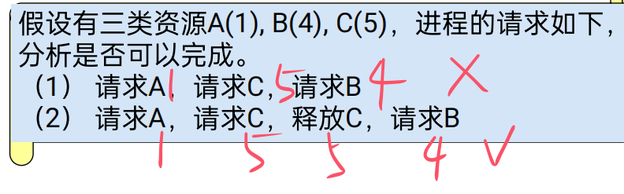

# 一。 序论

## 1.操作系统定义：

操作系统是一组控制和管理计算机软硬件资源、合理地对各类作业进行调度以及方便用户使用的程序集合

## 2.操作系统的目标：

**方便性**，**有效性**，**可扩展性**，**开放性**

## 3.OS的作用：

**（1）.OS作为用户与计算机硬件系统之间的接口**，

**（2）. OS作为计算机系统资源的管理者(软硬件资源)**：① 处理机管理② 存储器管理③ I/O设备管理④ 文件管理

**（3）. OS用作扩充机器**：在裸机上覆盖管理软件，实现对设备的操作，并向上提供一组操作命令。

## 4.操作系统发展

（1）**无操作系统**. ①人工操作方式：用户独占全机，CPU等待人工操作②脱机输入输出方式：解决了CPU与设备之间不匹配的矛盾，提高了I/O速度

（2）**单道批处理系统**：内存中始终仅存一道作业运行。（单道性、顺序性、自动性）

优：减少人工操作，解决了作业的自动接续；

缺：平均周转时间长，没有交互能力。

（3）**多道批处理系统**：在内存中存放多道作业运行，运行结束或出错，自动调度内存中的另一道作业运行。（多道性、无序性、调度性）

优：1、提高CPU的利用率。2、提高内存和I/O设备利用率。3、增加系统吞吐率

缺：平均周转时间长，没有交互能力

（4）**分时操作系统**：▪Multics (MIT)   ▪UNIX   ▪Linux

特点：

▪多路性：一个主机与多个终端相连；

▪独立性：彼此独立操作，互不干扰；

▪及时性：系统能在很短的时间得到回答；

▪**交互性**：能实现人机对话（区别于批处理系统）；

（5）**实时系统**：是计算机**及时响应**外部事件的请求，在**规定的时间内完成**对该事件的处理，并控制所有实时设备和实时任务协调一致的运行。

1、多路性：能对多个对象进行控制。

2、独立性：独立运行，不混淆，不破坏。

3、交互性：仅限于访问系统中某些特定的专用服务程序。

4、可靠性：高可靠性，应具有多级容错防护能力。

5、及时性：不同的系统要求不一样，控制对象必须在截止时间内完成。

## 5.操作系统基本特征

现代OS的四个基本特征：

1、**并发性**（最重要的特征）： 并行性：是指两个或多个事件在**同一时刻**发生。并发性：是指两个或多个事件在**同一时间间隔**内发生。

2、**共享性**  ：互斥共享方式，同时访问方式

 3、虚拟性   ：把一个物理实体变为（映射为）若干个逻辑上的对应物（1.时分复用技术：虚拟处理机，虚拟设备2.空分复用技术：虚拟磁盘技术，虚拟存储器）

4、异步性：执行结果不确定，程序不可再现。

## 6.0操作系统的主要任务：

为多道程序的运行提供良好的运行环境，以保证多道程序能有条不紊地、高效地运行，

并能最大程度地提高系统中各种资源的利用率，

方便用户的使用。

## 6.1操作系统应的功能：

1、处理机管理（CPU）

2、存储器管理

3、设备管理

4、文件管理

5、方便用户使用的用户接口。

## 7.OS结构设计

1. 无结构操作系统
2. 模块化结构（模块-接口法）：① 对模块的划分及对接口的规定要精确描述很困难。②从功能观点来划分模块时，未能将共享资源和独占资源加以区别
3. 分层系统结构：各层的实现不依赖其以上各层所提供的概念及其属性，只依赖其直接下层所提供的概念及属性；
4. 客户服务器模式：可扩充性，可靠性，可移植性。消息传递开销+模式切换开销
5. 面向对象技术：可扩充性，可靠性，继承性。
6. 微内核技术：**足够小的内核**，基于**客户/服务器**模式，应用“机制与策略分离”原理，采用**面向对象**技术。不仅运行在**核心态**，而且开机后常驻内存， 它不会因内存紧张而被换出内存

# 二。 进程管理

## 1.进程概念

（1）进程是**程序**的**一次执行**。

（2）进程是一个程序及其数据在处理机上顺序执行时所发生的活动。

（3）进程是程序在一个数据集合上运行的过程，它是系统进行**资源分配和调度的一个独立单位**。

## 2.进程实体构成（进程三要素）

**<u>程序段、数据段和PCB</u>**

## 3.并发

程序顺序执行时的特征：顺序性，封闭性，可再现性

程序并发执行时的特征：间断性，失去封闭性（多个程序共享系统中的各种资源），不可再现性

 

## 4.进程的特征

1）动态性：动态性表现： “它由创建而产生，由调度而执行，由撤消而消亡”

2）并发性

3）独立性

4）异步性

## 5.进程的状态（五种状态）

 

## 6.PCB（进程控制块）

### 1.进程控制块的作用

 进程控制块的作用是**使**一个在多道程序环境下不能独立运行的**程序**（含数据），**成为一个**能独立运行的基本单位—**进程**。

 在进程的整个生命期中，操作系统总是通过PCB**对进程进行控制**的。

 所以说，PCB是**进程存在**的**唯一标志**。

### 2.进程控制块的内容

1）进程标识符:唯一地标识一个进程

2）处理机状态：进程现场信息（通用寄存器，PC,PSW,SP）

3）进程调度信息:①进程状态②进程优先级③进程调度所需的其它信息。④事件(阻塞原因)

4）进程控制信息:①程序和数据的地址②进程同步和通信机制③资源清单④链接指针

### 3.进程控制块组织方式

线性，链接（链表数=状态数），索引（索引表数=状态数）

## 7.进程控制

### 1.处理器的两种执行状态：

**系统态**（内核态）和**用户态**。

### 2.原语种类：创建，撤销，阻塞，唤醒，挂起，激活

### 3.创建（被动行为）

引起创建进程的事件

（1）用户登录。

（2）作业调度。

（3）提供服务。例如：I/O请求

（4）应用请求。

#### 调用进程创建原语步骤：

（1）**申请**空白**PCB**。

（2）为新进程**分配资源**。

（3）**初始化**进程控制块。①初始化标识信息。②初始化处理机状态信息。使程序计数器指向程序的入口地址，使栈指针指向栈顶；③初始化处理机控制信息：进程的状态、优先级。

（4）将新进程**插入就绪队列，启动调度**。

### 4.撤销（被动行为）

引起进程终止的事件

1）正常结束。

2）异常结束：①越界错误。②保护错。③非法指令。④特权指令错。⑤运行超时。⑥等待超时。⑦算术运算错、被0除：⑧I/O故障

3）外界干预：①操作员或**操作系统干预**。例如发生死锁②**父进程请求**终止该进程；③当**父进程终止**时，OS也将他的所有子孙进程终止。

#### 进程的终止过程

（1）根据被终止进程的PID找到它的PCB，从中**读出**该进程的**状态**。

（2）若被终止进程正处于执行状态，应立即**终止该进程的执行**，重新进行调度。

（3）若该进程还有子孙进程，立即**将其所有子孙进程终止**。

（4）将被终止进程所拥有的全部**资源，归还**给其父进程，或者归还给系统。

（5）将被终止进程的PCB从所在**队列中移出**。

### 5.阻塞（主动行为）

引起进程阻塞的原因

1）请求系统服务。

2）启动某种操作：如I/O操作。

3）新数据尚未到达。

4）无新工作可做

### 6.唤醒（被动行为）

### 7.挂起（主动行为）

### 8.激活（被动行为）

## 8.进程同步

### (1).并发进程之间的关系

 进程**互斥**：多个进程**不能同时使用同一个资源**，某个进程使用该资源时，其他进程必须等待。

 进程**同步**：多个进程的调用存在**<u>时序关系</u>**，某些进程的执行必须先于另一些进程。

 进程通信：多个进程之间传递消息。

### (2).临界区使用原则（互斥条件）：

(1) **<u>空闲让进</u>**。如果临界区空闲，则只要有进程申请就立即让其进入。

(2) **<u>忙则等待</u>**。每次**仅允许一个进程处于临界区**。

(3) **<u>有限等待</u>**。进程**只能在临界区内逗留有限时间**，不得使其他进程在临界区外无限期等待。

(4) **<u>让权等待</u>**。当进程**不能进入自己的临界区时**，**应立即释放处理机**，以免进程处于“忙等”状态。

### (3).信号量机制

#### 0.信号量种类

 互斥信号量：用于申请或释放资源的使用权，常初始化为1。

 资源信号量：用于申请或归还资源，可以初始化为大于1的正整数，表示系统中某类资源的可用个数

#### 1.整型信号量

#### wait(s)和signal(s）

s>=0,表示剩余资源量

仅能通过两个标准的原子操作 wait(s)和signal(s）来访问，又称为P、V操作。

#### 2.记录型信号量（无忙等）

#### wait(s)和signal(s）

s.value>0:剩余资源量

s.value<0:等待进程数

#### 3.AND型信号量 

#### Swait(s1,...)和Ssignal(s1,...）

基本思想：将进程在整个运行过程中需要的所有资源，**一次性全都地分配**给进程，待进程使用完后再一起释放。

#### 4.信号量集 

#### Swait(s1,t1,d1,...),Ssignal(s1,d1,...）

每次可以分配<u>多个单位的资源</u>

Si—现有数量；ti—分配**下限值**(表示si值不能<ti)；di—**申请数量**;

### (4).经典进程同步模型

#### 1.生产者消费者

信号量使用（记录型信号量）：互斥信号量 **mutex**：1，可用的空资源信号量 **empty**：n，可用的满资源信号量 **full**：0

var mutex,full,empty:semaphore:=1,0,n

1.Wait(empty);Wait(mutex);###wait操作的次序是重要的：先检查资源数目，再检查是否互斥.否则可能死锁

2.Swait(empty, mutex)；| Swait(full,mutex)；

#### 2.哲学家就餐

解决死锁方法：

(1)至多允许N-1个哲学家同时就餐（Semaphore room=N-1;）

wait(room); //请求进入房间进餐
wait(chopstick[i]);//请求左手边的筷子
wait(chopstick[(i+1) %5]); //请求右手边的筷子
eat();
singal(chopstick[i]);// 释放左手边的筷子
signal(chopstick[(i+1) %5]);//释放右手边的筷子
singal(room);

(2)利用AND信号量机制解决死锁问题

Swait(chopstick[(I+1) %5]，chopstick[I]);
eat();
Ssignal(chopstick[(I+1) %5]，chopstick[I]);

(3)规定奇数号的哲学家先拿起他左边的筷子,然后再去拿他右边的筷子;而偶数号的哲学家则相反.

#### 3.读者写者

1.信号量使用（记录型信号量）：互斥信号量 **rmutex**, **wmutex**：1（rmutex保护Readcount,wmutex保护资源）

var rmutex, wmutex: semaphore：=1,1;

**Readcount**:integer：=0; // **表示正在读的进程数目**

读者：

<u>wait(rmutex)</u>; // 保护Readcount变量同时只能被一个读者使用
if Readcount==0 then <u>**wait(wmutex)**</u>; //表示尚无Reader进程在读时， 允许读，互斥写者
*Readcount∶ =Readcount+1*;
<u>signal(rmutex)</u>;

perform read operation;

<u>wait(rmutex)</u>;
*Readcount∶=Readcount-1*;
if readcount==0 then <u>**signal(wmutex)**</u>; //以便让Writer进程写。
<u>signal(rmutex)</u>;

写者：

wait(wmutex);
perform write operation;
signal(wmutex);

2.利用信号量集

L:资源信号量(读用)；wmutex:互斥信号量(写用)

Reader进程
Swait(L,1,1);//最多允许RN个进程读
Swait(wmutex,1,0);//不消耗wmutex量，但要等没有使用wmutex，即等没有写
执行读操作；
Ssignal(L,1);
						//不用Ssignal mutex
Writer进程
Swait(Wmutex,1,1; L,RN,0);//等待没有其他写，且没有任何一个读
执行写操作；
Ssignal(Wmutex,1);

## 9.进程通信

### (1).低级通信

进程之间的互斥和同步，由于其所交换的信息量少而被归结为低级通信。(如信号量机制)

(1) 效率低 (2) 通信对用户不透明。

### (2)高级通信

#### 1.共享存储器系统

共用数据结构或**共用存储区**

#### 2.管道通信

用于连接一个读进程和一个写进程以实现他们之间通信的一个**共享文件**，又名**pipe文件**

**字符流**形式传送大量数据

管道机制必须提供以下三方面的协调能力：**互斥，同步，相互已知**

#### 3.消息传递系统

数据交换**以格式化的信息为单位**

##### 1）直接通信

(1) 对称寻址方式
Send(Receiver, message); 发送一个消息给接收进程；
Receive(Sender, message); 接收Sender发来的消息；

(2) 非对称寻址方式
Send(P, message);发送一个消息给接收进程P；
Receive(id, message); 接收来自任何进程的消息，进程id不固定

**<u>*实例：消息缓冲队列通信机制*</u>**

 

 

//////发送消息
getbuf(a.size, i); //根据a.size申请缓冲区；
初始化缓冲区数据
getid(PCB set, receiver, j); 获得接收进程内部标识符；
wait(j.mutex);。。。。。消息队列是互斥资源
insert(j.mq, i); 将消息缓冲区插入消息队列；
signal(j.mutex);
signal(j.sm); //消息队列资源信号量加1
///////接收消息
wait(j.sm); //首先申请消息队列资源信号量
wait(j.mutex);
remove(j.mq, i); //将消息队列中第一个消息移出；
signal(j.mutex);// 将消息缓冲区i中的信息复制到接收区b;
赋值给接收区数据

##### 2）间接通信

**<u>*实例：信箱*</u>**

▪Send(mailbox, message); 将一个消息发送到指定信箱；

▪Receive(mailbox, message); 从指定信箱中接收一个消息；

调用send原语时应给出的参数是：信件存放地址D及指定的信箱N（文件名，邮箱名）

#### 4.客户机--服务器系统

# 二。 线程管理

## 1.线程概念

调度和分派的部分通常称为线程或轻型进程

## 2.线程的数据共享

 线程间共享的数据和资源：进程代码段、进程中的全局变量、进程打开的文件……

 每个线程私有的数据和资源：线程ID、**线程上下文（一组寄存器值的集合）**、**线程局部变量（存储在栈中）**

 

### TCB的组成

 

## 3.线程与进程的比较

**1) 调度**

▪在传统的操作系统中，进程作为拥有资源和独立调度、分派的基本单位。而在引入线程的操作系统中，则把线程作为调度和分派的基本单位，而进程作为资源拥有的基本单位。

▪在同一进程中，线程的切换不会引起进程的切换；但从一个进程中的线程切换到另一个进程中的线程时，将会引起进程的切换

**2) 并发性**

▪在引入线程的操作系统中，不仅进程之间可以并发执行，而且在一个**进程中的多个线程之间亦可并发执行**，使得操作系统具有更好的并发性，从而能更加有效地提高系统资源的利用率和系统的吞吐量。

3) 拥有资源

▪一般而言，线程自己不拥有系统资源(也有一点必不可少的资源)，但它可以访问其隶属进程的资源，即一个进程的代码段、数据段及所拥有的系统资源，如已打开的文件、I/O 设备等，可以供该进程中的所有线程所共享。

4) 独立性

▪同一进程中的不同线程共享进程的内存空间和资源。

▪同一进程中的不同线程的独立性低于不同进程。

5）系统开销

▪ 线程的切换只需要保存和设置少量的寄存器内容，不涉及存储器管理方面的操作。

▪由于一个进程中的多个线程具有相同的地址空间，在同步和通信的实现方面线程也比进程容易。在一些操作系统中，线程的切换、同步和通信都无须操作系统内核的干预。

6）支持多处理机系统

▪一个进程分为多个线程分配到多个处理机上并行执行，可加速进程的完成。

## 4.线程的属性

（1）轻型实体
线程自己基本**不拥有系统资源**，只拥有少量必不可少的资源：TCB，程序计数器、一组寄存器、栈。
（2）独立调度和分派的基本单位
在多线程OS中,线程是独立运行的基本单位,因而也是**独立调度和分派的基本单位**。
（3）可并发执行
**同一进程中的多个线程之间可以并发执行**，一个线程可以创建和撤消另一个线程。
（4）共享进程资源
它可与同属一个进程的其它线程**共享进程所拥有的全部资源**

## 5.线程的状态（三种状态）

 

## 6.线程的同步

### 1）互斥锁(mutex)

<1>阻塞方式：线程将被**阻塞直到**其他线程对mutex解锁。
**lock(mutex)**
访问
**unlock(mutex)** 
<2>非阻塞方式：不会阻塞等待，而会**返回一个错误代码**。
**if（trylock）** then
else 

### 2）条件变量

单纯的互斥锁用于**短期锁定**，主要是用来保证对**临界区的互斥进入**。而条件变量则用于线程的**长期等待**， 直至所等待的**资源**成为可用的。

条件变量通常和互斥锁一起使用，互斥锁用于进入临界区，条件变量用于请求资源

Lock mutex；
check data structures;//查找用于描述资源状态的数据结构，了解资源的情况。
while(resource busy);
wait(condition variable);//所需资源R正处于忙碌状态，线程便转为等待状态，并对mutex执行开锁操作后，等待该资源被释放；
mark resource as busy;
unlock mutex;

### 3）信号量机制

(1) 私用信号量
实现**同一进程**中各线程之间的同步时。私用信号量属于特定的进程所有，OS并不知道私用信号量的存在
(2) 公用信号量
实现**不同进程**间或不同进程中各线程之间的同步。存放在受保护的系统存储区中，公用信号量是一种比较安全的同步机制

## 7.线程的实现方式

### 1）用户级线程

 用户级线程**仅存在于用户空间**中。对于这种线程的创建、撤消、线程之间的同步与通信等功能，都**无须内核**来实现。
 对于用户级线程的切换，通常是发生在**<u>一个</u>应用<u>进程</u>的<u>诸多线程</u>之间**，这时，也同样无须内核的支持。由于切换的规则远比进程调度和管理的规则简单，因而**使线程的切换速度特别快**。
 由应用程序完成所有线程的管理
**线程库**(用户空间)：通过一组管理线程的函数库来提供一个线程运行管理系统（运行系统）

**优点：**
(1) 线程**切换不调用内核**
(2) 调度是应用程序特定的：可以选择最好的算法
(3) **可运行在任何操作系统上**（只需要线程库），<u>可以在一个不支持线程的OS上实现</u>
**缺点：**
(1) 当线程执行一个系统调用时，该线程及其所属进程内的所有线程都会被阻塞。（**一个线程阻塞，与其同进程的线程全部被阻塞**）
(2) 多线程应用**不能利用多处理机进行多重处理**。（**一个进程虽有多个线程，但只能用单个处理机**）

 

### 2）内核支持线程

▪ 内核支持线程，是在**内核的支持**下运行的，即无论是**用户进程中**的线程，还是**系统进程中**的线程，他们的创建、撤消和切换等，是依靠内核实现的。
▪在内核空间中为每一个内核支持线程设置了一个线程控制块**<u>TCB</u>**， 内核是根据该控制块而感知某线程的存在的，并对其加以控制。

**优点**
(1) 在多处理器系统中，内核能够同时调度同一进程中**多个线程并行执行**；
(2) 如果进程中的**一个线程被阻塞**了，内核**可以调度该进程中的其它线程**占有处理器运行，也可以运行其它进程中的线程；
(3) 内核支持线程具有很小的数据结构和堆栈，线程的切换比较快，切换开销小；
(4) **内核本身也可以采用多线程技术**(可利用多cpu)，可以提高系统的执行速度和效率
**缺点**
▪对于**线程切换而言，其模式切换的开销较大**
在同一个进程中，从一个线程切换到另一个线程时，需要**从<u>*用户态*</u>转到<u>*内核态*</u>再转到<u>*用户态*</u>进行**，这是因为用户进程的线程在用户态运行，而线程调度和管理是在内核实现的，系统开销较大。

 

### 3）组合方式

使用用户级线程+lwp+内核级线程（见下）

## 8.线程的具体实现

### 1）内核支持线程

系统在创建一个新进程时，便为它分配一个**任务数据区PTDA**（Per Task Data area),其中**包括若干个**线程控制块**TCB**空间

### 2）用户级线程

用户级线程是在用户空间实现的。所有用户级线程都具有相同的数据结构，它们都运行在一个**中间系统**上。
 当前有两种方式实现的中间系统：

#### （1）运行时系统（又称为线程库）

用于管理和控制线程的函数的集合，包括创建、撤消线程函数、线程同步和通信函数、线程调度函数等。用户级线程不能直接利用系统调用，**必须通过线程库<u>*间接*</u>利用系统调用**。

#### （2）内核控制线程

 这种线程又称为轻型进程LWP（Light Weight Process）
 每个进程都可拥有多个LWP，每个LWP都有自己的TCB，其中包括线程标识符、优先级、状态、栈和局部存储区等
LWP可通过系统调用来获得内核提供的服务，当一个**用户级线程**运行时，只要将它**连接到一个LWP上**，它**便具有了内核支持线程的所有属性**。

 

# 三。 处理机调度和死锁

## 1.作业的概念

概念：作业是用户在一次算题过程中或一次事务处理中，要求计算机系统所做的**工作的集合**

作业是比进程更广泛的概念，不仅包含了通常的程序和数据，而且还配有一份**作业说明书**，系统根据作业说明书对程序运行进行控制。

## 2.作业的状态

 

## 3.作业控制块（JCB）

作业提交给系统**进入后备状态**后，系统将为每个作业**建立**一个作业控制块**JCB**。只有当作业**完成并退出**系统时，**JCB**才被**撤消**。JCB是一个作业在系统中存在的**唯一标志**，系统根据JCB才感知到作业的存在

## 4.处理机调度分级

进程调度的级别

 **高级**调度(作业调度)：决定哪些程序可以**进入系统**。<u>**批处理系统需要有作业调度，分时和实时系统无需此调度**</u>。

 **中级**调度(中程调度)：决定**内存中**程序的**位置**和状态。三种类型OS都必须配置这级调度。（**最基本调度**）

 **低级**调度(进程调度)：决定**CPU资源**在就绪进程间的**分配**

 

多道程序**度**：即允许多少个作业同时在内存中运行。
**周转时间**：从作业被**提交**给系统开始，到作业**完成**为止的这段时间间隔。
吞吐量：是指在**单位时间**内系统所**完成**的**作业数**。
**响应比** =**(等待时间+要求服务时间)/要求服务时间**=响应时间/要求服务时间

### 1）.低级调度中的三个基本机制

 (1) **排队器**
为了提高进程调度的效率，应事先将系统中所有的就绪进程按照一定的方式排成一个或多个队列。
 (2) **分派器**(调度程序)
分派器把由进程调度程序所选定的进程从就绪队列中取出，然后进行上下文切换，将处理机分配给它。
 (3) **上下文切换机制**
当对处理机进行切换时，会发生两对上下文切换操作。

###  2）.低级调度的功能

(1)按某种算法**选取进程**（调度）。
(2)保存处理机的**现场信息**（上下文切换第一步骤）
(3)把处理器**分配**给进程（上下文切换第二步骤）。

### 3）.低级调度的两种方式

抢占和非抢占式

#### 抢占式优缺点

•优点：可以防止一个长进程长时间占用处理机，能为大多数进程提供更公平的服务，特别是能满足对响应时间有着较严格要求的实时任务的需求。
•缺点：抢占方式比非抢占方式调度所需付出的开销较大，且调度算法复杂。

### 4）.中级调度

主要目的：为了提高**内存利用率**和**系统吞吐量**。

具体实现：
使那些**暂时不能运行**的进程不再占用宝贵的内存资源，而将其**调至外存**去等待，把此时的进程状态称为就绪驻外存状态或**挂起**状态。当这些进程重又**具备运行条件、且内存又稍有空闲时**，由中级调度来决定把外存上的那些又具备运行条件的就绪进程，重新**调入内存**，并修改其状态为就绪状态，挂在就绪队列上等待进程调度。

### 5）.选择调度方式和调度算法的若干准则

#### 1.面向用户的准则

(1) 周转时间短.（评价批处理）
(2) 响应时间快。
(3) 截止时间的保证.（评价实时）
(4) 优先权准则。

#### 2. 面向系统的准则

(1) 系统吞吐量高。（评价批处理系统）
(2) 处理机利用率高。
(3) 各类资源的平衡利用。

### 6）.引起低级（进程）调度的因素

① 正在执行的进程**执行完毕**，或因发生某事件而**不能再继续执行**（包括：当前执行进程被中断、**时间片用完了**、**挂起**自己、退出等）；
② 执行中的进程因提出**I／O请求**而暂停执行；
③ 在进程通信或同步过程中执行了某种**原语操作**，如P、V操作原语，Block原语， Wakeup原语等。

## 5.调度算法

### 1）先来先服务调度算法(FCFS)--非抢

利于长作业

### 2）短作业(进程)优先调度算法 SJ(P)F--非抢

利于短作业

### 3）最短剩余时间优先调度算法(SRT)--抢

### 4）优先权调度算法 PSA--抢+非抢

（1) 静态优先权    2) 动态优先权：随进程的推进或随其等待时间的增加而改变

### 5）高响应比优先调度算法 HRRN--抢+非抢

 

利于长作业、短作业

### 6）基于时间片的轮转调度算法 RR--抢

按**先来先服务**原则，**排成一个队列**，每次调度时，把CPU分配给队首进程，并令其**执行一个时间片**，然后将其置于队尾

 

### 7）多级队列调度算法

前台的就绪队列是交互性作业的进程，采用时间片轮转。
后台的就绪队列是批处理作业的进程，采用优先权或短作业优先算法。
调度方式有两种：
▪ 优先调度前台，若前台无可运行进程，才调度后台。
▪ 分配占用CPU的时间比例，如：前台80%，后台20%

### 8）多级反馈队列调度算法 --抢占式

 

(1) 设置多个就绪队列，并为各个队列赋予不同的优先级。
(2)一个新进程进入内存后，首先将它放入第一队列的末尾，按FCFS原则排队等待调度；如果在一个
时间片内尚未完成，调度程序便将它转入第二队列末尾,重复（**掉级**）
(3) 仅当第一队列空闲时，调度程序才调度第二队列中的进程运行

补充：因**等待**或**被抢占**而放弃CPU后，进入阻塞队列，一旦等待的事件发生，则回到原来的就绪队列（**不掉级**）

### 9）基于公平原则的调度算法

1 保证调度算法
▪ 例如N个**进程平均**分配时间。
2 公平分享调度算法
▪ 按照**用户平均**分配时间。

## 6.实时调度

任务的结束时间有严格约束(Deadline) ，即任务执行必须在Deadline之前完成
前述算法不能很好地满足实时系统对调度的特殊要求，所以引入实时调度。

### 1）.实时操作系统RTOS

**软实时**（SRT）和**硬实时**（HRT）系统：软实时只能提供统计意义（例95%）上的实时，而硬实时要求100%

### 2）.实现实时调度的基本条件

1. 提供必要的调度信息：就绪时间，开始截止时间，处理时间，资源要求，优先级
2. 系统处理能力强
3. 采用抢占式调度机制
4. 具有快速切换机制：快速响应外部中断，快速任务分配

### 3）.实时调度算法

#### 1） 最早截止时间优先算法 EDF --抢+非抢

根据任务的**开始截止时间**来确定任务的优先级。截止时间愈早，其优先级愈高。

补充：<u>若超过截止时间，则进行舍弃</u>

#### 2） 最低松弛度优先算法 LLF --抢

松弛度=**完成截止时间**–剩余运行时间–当前时间

任务**执行结束后**或无任务执行时，**比较等待任务的松弛度值，较小的先执行**。（平时不抢占）

当等待任务的松**弛度值为0**时**<u>*才进行抢占*</u>**

### 4）.优先级倒置现象

高优先级进程(或线程)被低优先级进程(或线程)延迟或阻塞（**mutex被低优先级进程P3占用**）

 

解决办法：

1.规定进入临界区的进程不允许被抢占
仅适用于临界区较短情况
2.采用**动态优先级继承**方法
<u>防范中间优先级进程(P2)插入</u>（P3继承P1优先级，以便优先完成P3来释放mutex给P1用）

 

## 7.死锁

### 0）系统资源种类

1.**永久（可重用）性资源**
<u>可抢占性资源</u>: 主存，cpu
<u>不可抢占性资源</u>:磁带机，打印机
2.**临时性（消耗性）资源**
只可使用一次的资源

### 1）死锁定义

指多个进程因**竞争资源**或**相互通信**而造成的一种**僵局**，**都在等待**着对方释放出自己所需的资源，但同时又不释放出自己已经占有的资源，若无外力作用，这些进程都将永远无法向前推进。

### 2）死锁产生原因

1.**竞争资源**  ：竞争不可抢占性资源，竞争临时性(消耗性)资源

2.**进程间推进顺序不当**：进程推进顺序不当

### 3）资源分配图、联合进程图

              

### 4）产生死锁的必要条件

(1)**互斥条件** ：进程对分配到的资源进行排它性使用。
(2) **请求和保持条件** ：进程已经保持了至少一个资源，但又提出了新的资源要求，而该资源又被其他进程占有，请求进程阻塞，但对已经获得的资源不释放。
(3) **不剥夺条件** ：进程已获得的资源，使用完之前不能被剥夺，只能用完自己释放。
(4) **环路等待条件** ：发生死锁时，必然存在进程—资源的环形链。

### 5）处理死锁的基本方法

#### 1.**预防死锁**：

**设置某些限制条件，破坏四个必要条件中的一个或几个。（互斥条件除外）**

优点：容易实现。缺点:系统<u>资源利用率和吞吐量降低</u>。

（1）摒弃“请求和保持”条件：

法一：所有进程**一次性申请**所需的全部资源

法二：允许一个进程只获得运行**初期所需**的资源后**便开始运行**，运行过程中再逐步释放

（2）摒弃“不剥夺”条件

一个已经保持了某些资源的进程，再提出**新的资源要求**而**不能立即得到满足**时，必须**释放已经保持的所有资源**，待以后需要时再重新申请

（3）摒弃“环路等待”条件

系统将所有资源按类型进行线性排队（常用 不常用），并赋予不同的序号。所有进程对资源的**请求**必须严格**按资源序号递增的次序**提出，**按序号递减的次序释放**

 

#### 2.**避免死锁**：

**在资源的动态分配过程用某种方法防止系统进入不安全状态。**

优点：较弱限制条件可获得较高系统资源利用率和吞吐量。缺点：有一定实现难度。

##### 安全状态定义：

安全状态，是指系统**能按某种进程顺序**(P1 , P2 , …，Pn )(称〈P1 ,P2 , …, Pn〉序列为安全序列)，来**为每个进程**Pi**分配其所需资源**，直至满足每个进程对资源的最大需求，使每个进程都可顺利地完成。如果系统无法找到这样一个安全序列，则称系统处于不安全状态。

##### 银行家算法：

1.当前状态下，某进程申请资源；
2.系统假设将资源分给该进程，满足它的需求；
3.检查分配后的系统状态是否是安全的，如果是安全，就确认本次分配；如果系统是不安全的，就取消本次分配并阻塞该进程。（第三步又称安全算法）

 

 

 

#### 3.**检测死锁**：

**预先不采取任何限制，也不检查系统是否已进入不安全区，通过设置检测机构，检测出死锁后解除。**

死锁定理：S为死锁状态当且仅当S状态的**资源分配图是不可完全简化**的。

第一步：先看系统还剩下多少资源没分配，再看有哪些进程是不阻塞（**“不阻塞”即：系统有足够的空闲资源分配给它**）的
第二步：**把不阻塞的进程的所有边都去掉**，形成一个孤立的点，再**把系统分配给这个进程的资源回收回来**
第三步：看剩下的进程有哪些是不阻塞的，然后又把它们逐个变成孤立的点。（**重复第二步**）
第四步：最后，所有的资源和进程都变成孤立的点。这样的图就叫做“可完全简化”

如果一个图可完全简化，则不会产生死锁；如果一个图不可完全简化（即：图中还有“边”存在），则会产生死锁。这就是“死锁定理。

#### 4.**解除死锁**：

**常用撤消或挂起一些进程，回收一些资源。**

（法1）**剥夺资源**。**从<u>其它</u>进程剥夺**足够数量的资源**给死锁进程**，以解除死锁状态。
（法2）**撤消进程**。最简单的撤消进程的方法，是使全部死锁进程都夭折掉；或者按照某种顺序逐个地撤消进程，直至有足够的资源可用，使死锁状态消除为止。

##### 最小代价原则：

到目前为止，**花费处理机的时间最少**的进程；
到目前为止，产生**输出最少**的进程；
估计**未执行部分最多**的进程；
到目前为止，**已获得资源量最少**的进程；
**优先级最低**的进程。