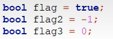
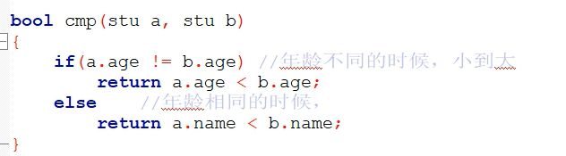

# 1.输入输出

cin   输入

cout  输出

endl    "\n"

# 2.头文件

#include\<cstring>                                             //等同#include<string.h>

#include\<cmath>												//等同#include\<math.h>

# 3.std::bool

输出时  true=1;false=0

赋值时  -1=true=1(非0的数都认定为true)

0=false

# 4.const

const int MAX=100                                   //#define MAX 100

# 5.std::string

拼接，s.length，s.substr

cin  遇到空格停止（单个单词）

getline 遇到空格不停止（一行句子）

# 6.结构

可以省略struct(例：(struct) stu a;)

# 7.引用

函数形参的引用会使函数中的操作改变原值（实参）

图示会输出5

# 8.STL(都要头文件)

v.size s.size

## 1.vector

vector \<int> v(10,2)相当于给每个位置赋初值2

vector \<int> v(10)=vector \<int> v(10,0)

2 4 6 8

c.begin()指向2，c.end()指向8后一位置

## 2.set

 

s.find( )未找到时返回s.end( )的位置

## 3.map

## 4.stack

 不再有迭代器

可以访问栈顶

## 5.queue

 不再有迭代器

可以访问队首和队尾

## 6.unordered_map/unordered_set

也需要头文件

注意：输出的顺序是不定的，和Hash表有关

# 9.bitset(头文件bitset)

 

即取bitset的下标是反着数的

这里的b(s,pos,n)取的是字符串下标，不反

# 10.sort(头文件algorithm)

 

## 1.sort(m.begin(),m.end())  把从m.begin()到m.end()-1的元素进行排序（从小到大）

## 2.sort(m.begin(),m.end(),cmp)  把元素按cmp规则排序（此处为从大到小）

bool cmp(int x,int y){
	return x > y;   //x>y时返回1，还是x在y前；x<y时返回0，交换顺序，y在x前
}

# 11.cctype头文件

 返回bool类型，但真时不一定是1

# 12.c++11

可能需要在设置中打开c++11的选项

## 1.auto

 必须赋初值

## 2.for遍历

 

## 3.to_string方法(头文件string)

string s=to_string(123); 返回字符串                   //不是.to_string

 

printf输出c++的字符串要用.c_str()转换

## 4.stoi(),stod()(头文件string)

int x=stoi("123");返回int                   

