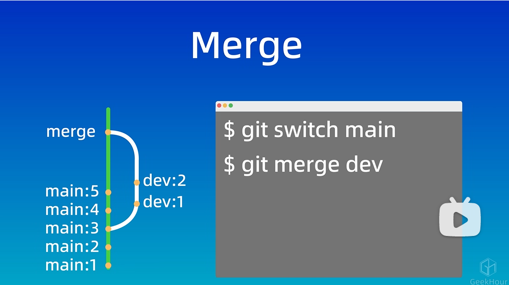
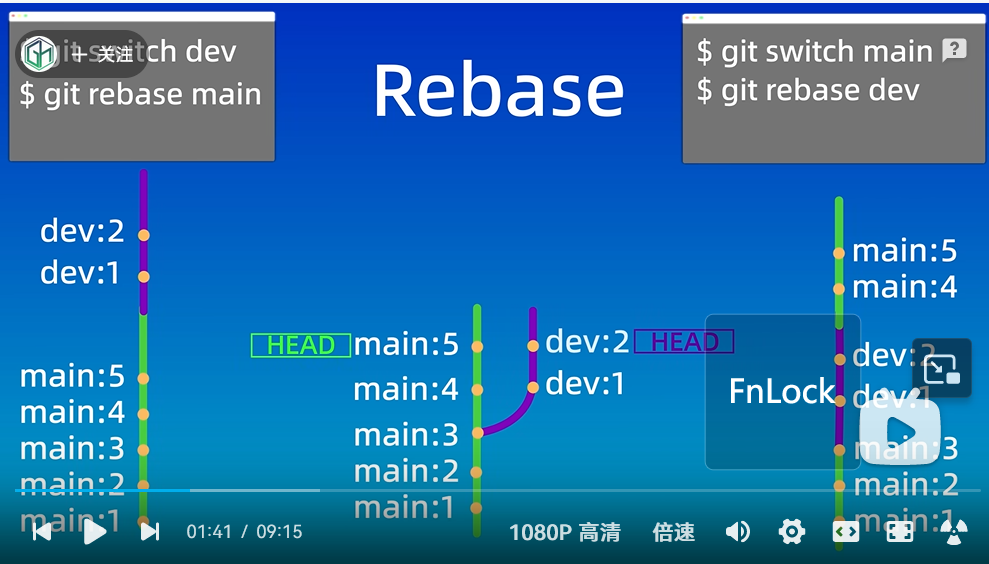

# 1.安装git后的初始化

git config --global user.name "  "

git config --global user.email " "

git config --global credential.helper store

(安装后软件后只需配置一次)

git config --global user.email "you@example.com"
git config --global user.name "Your Name"

会创建.gitconfig文件在user下

# 2.建立仓库

法1：git init                                         //将当前目录创建为**仓库**

法2：git clone github仓库地址           //在当前目录创建子目录作为**远程仓库**

注：工作区------------------------------>暂存区---------------------------->仓库

   库中git未跟踪的   														  库中git已跟踪的

# 3.添加提交文件

git add 文件										//添加到暂存区

git commit -m "提交的信息"				//提交到仓库

git commit -am " "								//将所有文件添加到暂存区并提交到仓库

注：git status                                      //显示仓库状态（未跟踪，在暂存区）

ls    查看库+工作区目录     git ls-files   查看暂存区目录

git add .												//将所有未跟踪文件添加到缓冲区

git add *.js											//将所有.js文件添加到暂存区

git commit 											//进入vim交互，i进入编辑模式，esc回到命令模式，wq退出

git log													//查看提交信息

# 4.git reset   版本回退

​																		工作区					暂存区				//保留删除指相对于上个版本的新内容

git reset --soft  id                                        保留								保留

git reset --hard	id									删除								删除

git reset --mixed(空)	id							保留								删除

注：id可改为HEAD^/HEAD~，指前一次的版本；

# 5.git diff	查看差异

git diff										//比较工作区和暂存区

git diff HEAD								//比较工作区和库

git diff --cached/staged						//比较暂存库和库

git diff id id  (文件名)                               //比较两版本，id可替为HEAD；HEAD:当前版本；HEAD~x,前x次版本

git diff  分支名 分支名

# 6.删除文件

法一：rm 文件名/手动删                                       //删工作区

​          git add 文件名(已删)									//删暂存区

​		  git commit -m " "											//删库

法二：git rm 文件名												//删工作区，删暂存区

​		   git commit -m " "											//删库

补：git rm --cached 文件名									//删暂存区

​		git rm -r *														//删工作区，删暂存区（包括所有子目录）

# 7.忽略文件（忽略工作区中的变换）

.gitignore文件中指明的文件类型

#该行是注释
\*.a  忽略所有.a文件
!file   不忽略所有file
/TODO   只忽略根目录下的TODO
build/ 忽略所有目录下的build文件夹
doc/*.txt 忽略所有doc文件夹下的一级内所有.txt文件
doc/**/*.txt 忽略所有doc文件夹下的所有子文件夹下的一级内所有.txt文件

可以直接找现成的各种语言应该忽略的文件类型

应该忽略日志文件，中间文件，缓存文件，临时文件，密码信息等文件(c->.o;java->.class(中间文件))(.log;.zip;)

# 8.远程仓库

远程仓库地址（https/ssh）

## **配置ssh密钥**

退到用户根目录，(建议创建个.ssh文件加并进入，方便管理所有ssh密钥),ssh-keygen -t rsa -b 4096(协议rsa大小4096),输入密钥文件名称，输入密码，（生成文件：文件名-私钥；文件名.pub-公钥），复制公钥文件内容到github,setting,ssh keys

.ssh目录下创建config文件，复制
Host github.com
 Hostname ssh.github.com
 Port 443
 User git                                                  -------------默认github的ssh端口为22，此处更改为443

第一次git push -u origin main会有提示，输入yes，会在.ssh下创建known_hosts和known_hosts.old文件

多ssh密钥config文件

```
# github
Host github.com
HostName github.com
PreferredAuthentications publickey
IdentityFile ~/.ssh/github_id_rsa

# gitlab
Host gitlab.com
HostName gitlab.com
PreferredAuthentications publickey
IdentityFile ~/.ssh/gitlab_id_rsa

# 如果生成多个 SSH-Key , 则按上面的格式继续往下写
```


## 将本地仓库和github关联

git remote add origin ssh地址
git branch -M main
git push -u origin main

# 9.vscode

在vscode中打开git管理的文件夹，左边选源代码管理，"+"按钮添加到暂存区，“提交”按钮提交，“同步更改”同步到云端

# 10.分支

git branch										//查看分支列表

git branch 分支名							//创建分支

git checkout 分支名                         //切换分支（可能与恢复文件冲突//当文件和分支同名）

git switch 分支名							//切换分支

git merge 分支名							//将分支名分支合并到当前所处分支



git rebase 分支名 							//将分支名分支作为基底，把当前分支移到分支名分支之后



git branch -d 分支名						//删除已经合并了的分支

git branch -D 分支名						//删除分支

## 合并冲突

**git merge 分支名**   后出现冲突，但实际上已经合并了，在合并之后的分支中的具体文件的冲突部分同时有两个分支的内容，手动修改即可

\<\<\<\<\<\<\<\<\<\<\<\<
内容一
=.....................=
内容二
\>\>\>\>\>\>\>\>\>\>\>\>

